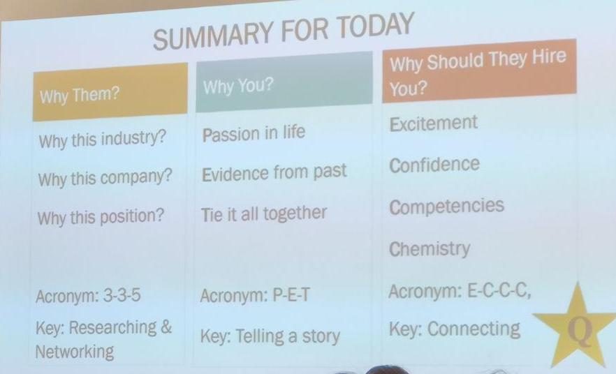

vmock

### RESUMES

#### 1. Header

Font size: 12-14

Name: go by English name / birth name; put the name you want to go by first

Address: put USA address

#### 2. Professional Qualifications

- Relevant skills

- Job description qualifications

- Certifications
  - Data management
  - Data mining
  - Decision analysis
  - Cost analysis
  - Statistical modeling
  - Etc
- software
  - softwares you wanna emphasize before the ones generally expected

#### 3. Experience

- Results > Activities

#### 4. Action Verbs

Start with an action verb

- coordinated
- Conserved 
- analyzed
- powered
- improved
- quantified
- designed
- standardized
- campaigned
- launched
- ……
  - Variants:
    - Worked: accomplished, facilitated, processed, employed, collaborated 
    - Created: designed, innovative, manufactured
    - Planned: organized, coordinated

#### 5. STAR experience

- SITUATION

- TASK

- ACTION

- RESULT

#### 6. Quantify and specify

How big the team is that you lead?

What's the result?

#### 7. MY STAR STORY

> I started a subtitle group in 2015 to translate music-related videos and fulfill the gap between electronic music fans in China and around the world. I worked with more than 20 core members in the areas of translation, graphic design for posters and videos, subtitle production, etc. In the meantime, I got the chance to network with people in the music festival industry. My team collaborated with domestic music festival organizations, such as ULTRA CHINA, SUGARLAND, jungle events and so on, to help them publicize music festivals through related music video production and translations. We were also responsible for video editing, subtitle production and publicizing on internet. Until now we attracted more than 10,000 fans in total on the releasing platforms, including 5,000 fans on the main releasing web *bilibili*.

#### 8. Activities / Interests

Interests is the most important to start conversations. 

First one is "are you smart?" Two, "you are fun person to have around, to fit in the company culture."

- Be genuine

- Share something exciting / memorable; when you feel confident

- Be specific (movies - Disney movies)

#### 9. Interests

> 1. travel by myself to explore different places
> 2. Harry potter
> 3. Explore and keep a track on new-coming electronic products

### NETWORKING

#### Sources of contacts:

1. Linkedin 
2. Facebook 
3. WeChat 
4. alumni association
5. Campus website
6. Family connections

#### Breaking up questions:

Personal: Think of some question that is personal but not too personal/areas of their profession

Position life: fit for the position; specific position you're interviewing for; what would be the employee like? Show you've done a lot of research

Professional

#### Great place to meet

Coffee shop: not too loud but not too quiet; won't be too embarrassed

Ask Stories you really love; people love stories; what stories people really love to keep the conversation going

Ways to help the other person: listening skills/listen well/share idea back; fast learner; 

Keep practicing *introductions* until you feel natural

In one year, what position will you be?

In five years what position do you want to be?

What will you do in those five years?

#### Self-introductions

Who are you?

​	hook the lecturer

​	what year are you in school and what do you study?

What do you do?

​	what are your areas of interest?

Why are you unique?

Where do you want to be?

#### Back-up Questions

Etiquette

- Initial connection - follow-up - 2nd follow-up

- Written thank-you or email after they get back to show your appreciation 

- Offer to help your contact

- Keep your contacts updated on your progress eery 2 to 3 weeks (especially after the first connection / say hi and check in / happy birthday)

#### INTERVIEW

#### 

#### COVER LETTER

##### FIRST PARAGRAPH

- I'm currently studying business analytics in olin business school in WashU
- I love the aspect of your company and make me exciting to work for you because...

##### SECOND PARAGRAPH

- Qualifications: use Three bulletpoints style 

##### LAST PARAGRAPH

- Thank you so much for your time. I'm looking forward to hearing from you in a couple of weeks. I'll contact you in 2 weeks....

##### LETTER STYLE

- Bullet style: most effective
- Paragraph style: most common

##### AVOID MISTAKES

1. Generic cover letter (why you are interested in this company in the first paragraph)
2. Misspelled words
3. Poor grammar and structure
4. Failure to research and answer
   1. Why the company
   2. Why you (results and differentiating points)
   3. What the employer needs
5. Repetition of the resume
6. Plagiarism

##### KEY SKILLS

##### STRUCTURE / EXAMPLE OF THE COVER LETTER

- Search for the recruiter: website/filter for job title (coordinator/ intern coordinator/ recruiter / recruiting office / recruiting manager ): if you cannot find the name then just go from the title and start with "dear recruiter/ms. Name "
- Major/ graduation year/ where studying
- Address the specific job title at the specific company; if networking, can refer to this person
- Highlight of the company
- Three skills
- Close 

##### JOB QUALIFICATIONS TEMPLATE

#### QUESTIONS

1. What if I find so many people who seem to be the recruiting person? 
2. If the same job that has many different locations, which address should I put?
3. There are already internships that are put on the website. But we probably haven't got the qualifications or abilities by the end of next year. How to address the skills that I'm going to learn on the resume and cover letter?

taylor.burns@wustl.edu

