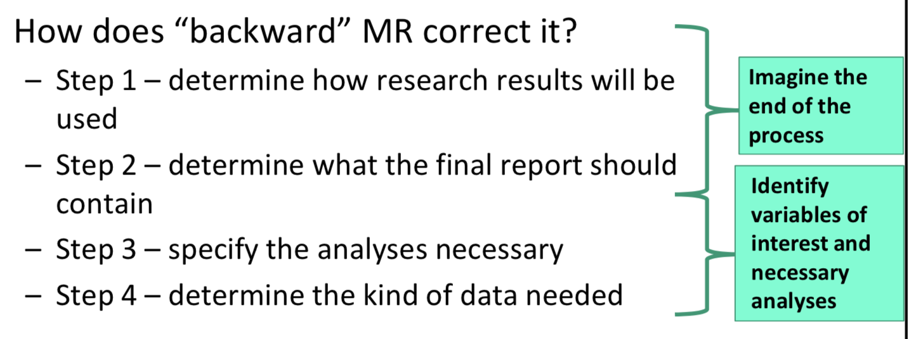
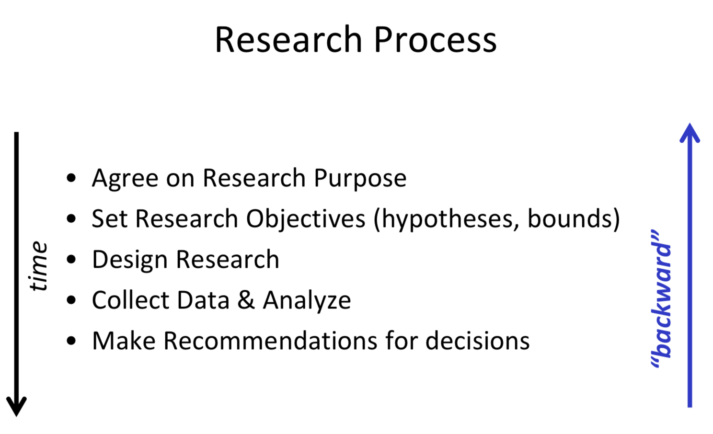
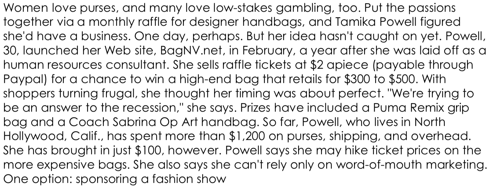

## I. “Backward” Marketing Research

#### How people often conduct research?

- Agree on Research Purpose
- Set Research Objectives (~~hypotheses~~, bounds)
- Design Research
- Collect **Data** & **Analyze**
- Make **Recommendations** for decisions

#### What is wrong with conventional MR?

- Intended action is left out
- Runs risk of providing useless information

Information that answers the questions, not just about the questions

#### How does “backward” MR correct it?

- Step 1 – determine how research results will be used
- Step 2 – determine what the final report should contain
- Step 3 – specify the analyses necessary
- Step 4 – determine the kind of data needed

#### Are the two approaches really different?

- Not really!
- Simply think about the outcomes you want at the beginning
- include that in problem formulation
- The rest is the same

#### Other takeaways?

- Always keep the final audience in the process!

## II. Action Steps: From Problems to Variables

1. **What is the decision we are making (proposing to make)?**
2. What should final report contain?
3. What data needed to carry out analyses?
4. Design data collection plan (survey; experiment)
5. Collect data
6. Do the analysis, write the report, **implement**

2-5: **information** that we need to make the decision

> 
>
> What is the managerial decision? (4Ps)
>
> - Sponsor fashion show - increase awareness
> - Increase ticket prices
> - Advertising 
>   - Which media / channels
>   - How much spent
>   - What "copy"
>   - ~~Targeted customers~~ (!!!! not managerial decision)
> - What purses to raffle? 
>
> Action Steps
>
> - What is the decision we are making?
>
>   - Which media / channels
>
> - What should final report contain?
>
>   - what are media choices
>
>   - conversion rate of each media / CTR (click-through rate)
>
>   - ~~what % audience is target mkt?~~ (If you got conversion rate and cost, you don't need this)
>
>   - Cost of each media
>
>     ​	*Conversion rate + cost - ROI*
>
>     ​	*Figure out how to use the numbers*
>
> - What data needed?
>   - What websites consider
>     - popular
>     - fashion
>     - Survey of users: question 3: come from a survey
>   - CTR & costs: come from experiment
>     - Best bidding strategy
> - Design data collection plan (survey; experiment)
> - Collect data
> - Do the analysis, write the report, implement

## Key: If you are given a project with ambiguous Steps 1 and 2

- Do not start the project
- Go clarify steps 1 and 2 with the decision maker or project sponsor
- Always know what decision you are making, and how you will use the results (in a specific manner) to make the decision

