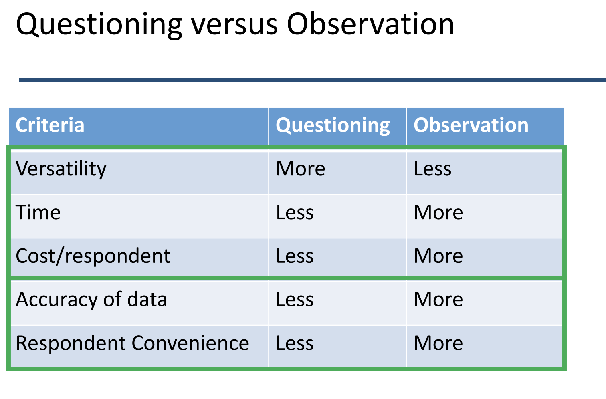
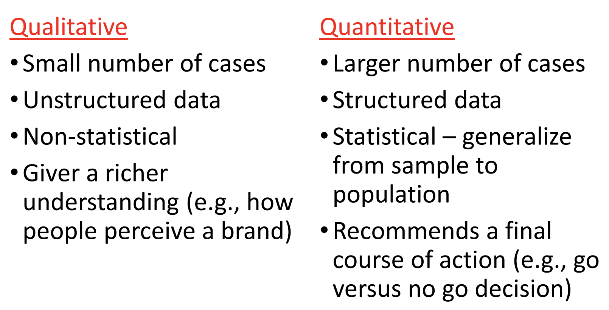

## Types of Data

- **Primary Market Research**  = collecting original data  for the specific question at  hand.
  - Focus groups/interviews
  - Surveys
  - Experiments

- Secondary Market Research = data collected (internally or  externally) for a different purpose than the specific question at hand
  - Internal records 
  - Scanner data (scanning the bar code)
  - Census data

## Types of Marketing Research:  What’s Your Research Question? 

- Exploratory Research
  - Ambiguous Problem
  - “Our sales are declining and we do not know why.”
- Descriptive Research
  - Aware of Problem
  - “Who is buying our products? Who is buying our competitors’ products?”
- Causal Research
  - Problem Clearly Defined
  - “Will buyers purchase more of our product in a new package?”

## Types of Primary Marketing Data

- Demographic/socioeconomic characteristics (Who are you?) 
- Attitudes and opinions (What are your views?) 
- Awareness (What do you know about our brand?)
- Intentions (How might you interact with our brand?)
- Motivation (Why do you care about our brand?) 
- Behavior (What decisions do you actually make about our  brand?)

## Types of Primary Data Collection

- Questioning (motivation)
  - Qualitative methods 
    - Focus groups and in‐depth interviews
  - Quantitative Methods
    - Surveys 
- Observation 
  - Direct observation – can be qualitative or quantitative 
  - Field Experiments 
- Judgment

### Ask vs. Observe

- OBSERVE (credible or not depends on the observee knows or not) (have results but don't know why)
  - you see what you see
  - may influence behavior
  - not all things can be observed 
  - good for ‘who, what, when and where’ questions
  - can be quicker and more accurate?!
- Ask 
  - potentially, can ask about  anything
  - Rely on consumer memory 
  - good for ‘why’ questions 
  - <u>Responses may not be accurate</u> 
    - Unwilling to fully reveal (price, personal) 
    - Unable (effect of ads)

|              | Questioning |        Observation         |
| :----------: | :---------: | :------------------------: |
| Qualitative  | Focus group | Unstructured; eye tracking |
| Quantitative |   Survey    |        Experiments         |

## When to Use Qualitative Research:  Exploratory Research

#### Seeking Opportunities

- Probe attitudes and behavior looking for new  opportunities 
- Establish basis for quantitative research 

#### New Product Development

- Understand a market and identify gaps 
- Reactions to new product concepts 

#### Diagnostic Studies

- Understand the consumer relationship to the brand 

#### Quantitative Information is hard to get

## Qualitative Research Methods

- Focus group

- In‐Depth Interviews
- Experience and Case Studies
- Other creative techniques
  - Role playing
  - Collages
  - Write obituaries
  - Word association 
  - Sentence completion

## Focus Groups (early research)

- **Rationale**: in‐depth probing, unstructured discussion, ability to observe dynamics (when we don't understand the results of survey so we ask questions to the customers)
- **Format**: 5‐10 individuals, 1‐2 moderators, about 1‐hr long, incentives for participants (game plan; what we gonna talk about )
- **Common** **Uses**: Products, product concepts, ad copy, script for further studies, <u>questionnaire design</u>

### Procedures

#### Choices: 

- Formal vs informal setting 
- One way mirror, video, etc. (obtain consent) (otherwise it has to depend on moderator's notes)
- Intrusiveness of moderator 

#### Steps: 

I. Introduction and ground rules 

II. Introduce and discuss materials based on a script 

III. Wrap up with summary 

IV. Any questionnaire at the end

### Ground Rules for Moderators

- Prepare questions and have contingency plans
- When an idea comes up for discussion, stick to that idea until  the group finishes with it
- One speaker at a time
- Airtime should be shared (and avoid groupthink) 
- Encourage participants to disagree, if they do 
- Build a rapport with the subjects 
- Follow the script (especially to avoid moderator <u>bias</u>)

### Pros and Cons

#### Pros

- Good for getting in‐depth information 
- Enables complex issues to be  discussed 
- !One person’s experiences or feelings can stimulate others (trade-off)
- Process highlights differences  between consumers 
- Allows for spontaneity 
- <u>Quick</u> and potentially <u>cheap</u>

#### Cons

- Results not directly quantifiable
- Not representative 
- Difficulty getting attendees
- Group process may inhibit frank exchange 
- Minority viewpoints may not  be heard
- Need for skilled and experienced moderator

#### Beware of Expectancy Effects!

- “Behavioral” expectancy effects are when you actually *change* a consumer’s behavior by interacting with him or her differently 
  - E.g., You expect a vegetable frozen dinner to be popular and talk to consumers more excitedly about that
- “Perceptual” expectancy effects are when you interpret same behavior as conforming with your  expectation
  - E.g., You expect a vegetable frozen dinner to be popular and you attend more to consumers who also want vegetable frozen dinner

## In‐depth Interviews (before survey design / very end of the process)

- **Rationale**: Mechanism for obtaining detailed insights,  flexible 
- **Format**: one‐on‐one (at place of business, home,  point of consumption, etc.) 
- **Tools needed:** Interview guide, schedule
- We will explore this further when we discuss “Voice  of the customer”

### Pros and Cons

#### Pros 

- Good for getting in‐depth information 
- Enables complex issues to be discussed 
- ~~One person’s experiences or feelings can stimulate others~~
- Process highlights differences between consumers 
- Allows for spontaneity 
- Quick and potentially <u>cheap</u> (? But Fewer responses)

#### Cons

- Results not directly quantifiable
- Not representative
- Difficulty getting attendees
- ~~Group process may inhibit frank exchange~~
- ~~Minority viewpoints may not be heard~~
- Need for skilled and  experienced moderator

> **Early** stage: possibilities
>
> **Late** stage: why we got the answers that we got

## Surveys 

- Rationale: To enable quantification of opinions, preferences, etc.  
- Format: Open‐ended questions, scaled questions, scenarios,  ongoing versus one‐shot
- Tools: telephone, email (tablet, mobile)
- Qualtrics: http://www.qualtrics.com/academic‐ solutions/washington‐university‐olin‐school‐of‐business/

## Qualitative versus Quantitative Research

## Summary

- Primary data is designed with the specific decision  in mind 
- Many types of data
  - Quantitative vs Qualitative
  - Ask vs Observe
- Each type of data has advantage and disadvantages
  - Cost and time
  - Accuracy (distortion)
  - Representativeness 
  - Usefulness to make decisions
- Basic outline of focus groups