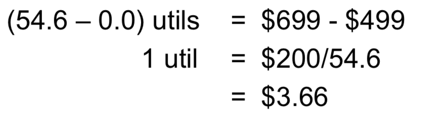

## Conjoint Analysis

- Survey-based research technique
- Survey asks respondents to compare products
  - Forces tradeoffs between attributes
  - Establishes which attributes are truly important
-  Output: <u>Each</u> respondent’s value system (utility)
- Key Advantages 
  - Avoids “Everything is Important”
  - Reveals consumer’s true wants and need
  - Measures preference on an individual level

## How we will use this survey

#### Understand the customer:

- Which attributes are important to which individual
- Translate utility into dollars: calculate willingness-to pay for specific attribute levels
- Segmentation 
  - A range of right answers and wrong answers; grey area results

#### Optimize marketing tactics

- Product design (Design new W Maui)
- Analyze competition & set price

## Basic concepts : Profile Space

- Profile: structured, summary description of product in terms of a certain set of attributes.
- Each attribute takes a value from a set of attribute-levels.

- 

## Types of Conjoint

- **Ratings-based**

  - This is the survey you took

- **<u>Choice-based</u>** (default for the final project)

  - Respondents choose option from a set menu

    

- Ranking-based (outdated)
- Adaptive (Special type of Choice-based)

## Dummy Variable Regression

#### Problem: redundancy within an attribute (perfect collinearity)

> repeated information in some columns; when using other columns  we can get the information about those columns; those are redundant

#### Solution: 

For each attribute:

- Pick any attribute level. Call this the “**base case**”
- Eliminate the dummy corresponding to the base case
- Run regression using remaining variables

### ★ \# of variables = 1+ {# attribute levels} – {# attributes}

It doesn't matter which base case were used. Standardization is used to eliminate the differences. 

### “Price” attribute gets special handling

## Assessing Attribute Importance

#### Process: Part-worths → each attribute’s “importance weight”

- Step 1 (**Part-worth range**): For each attribute, calculate the difference between the largest and smallest part-worth across all levels of the attribute (<u>most fav-least fav</u>)

  - 
  - Some softwares will translate the most fav into 0; get used to subtraction

- Step 2: The importance weights are just the part-worth ranges normalized to add up to 1

- Calculate sum of part-worth ranges, then divide each range by this sum

  - Example: sum of part-worth range is 9.2 + 37.3 + 54.6 = 101.1 

  - Thus, the importance weight for each attribute is:

    

## Idea behind willingness-to-pay (WTP)

**1) utility:** used by customer internally to compare different products (measured in “utils”)

**2) money**: used to express cost of the product (measured in dollars, <u>comparable across people</u>)

- **Definition**: WTP for an attribute level change is the max $ amount a customer would pay for the change
- **Example**: The WTP for a Motorola smart phone over an Apple smart phone:
  - The change represents an increase in utility value of 37.3 – 19.5 = 17.8 util	qwolj
  - WTP = 17.8 x **dollar value of 1 util** (how to calculate the part worth of dollar)
  - **reminder:** this is WTP for Motorola over Apple, not an absolute WTP for a Motorola phone

## Dollar value of a util

- The dollar value per util can be inferred by looking at extremes of the part-worths for the price attribute

  - 

  - Thus, WTP for Motorola instead of Apple:

    WTP = 17.8 * $3.66 = $65.20

  - Interpretation: value to the customer expressed in the more tangible and comparable dollar currency