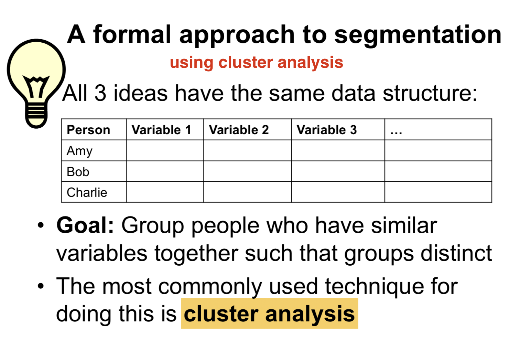
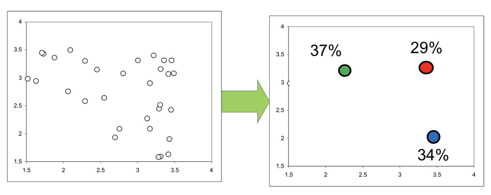
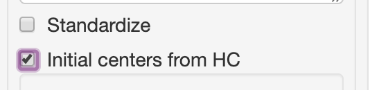
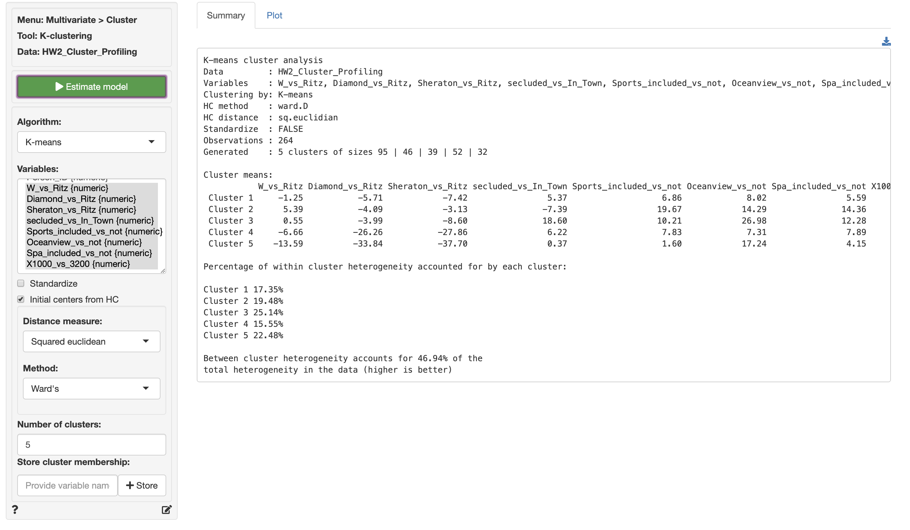
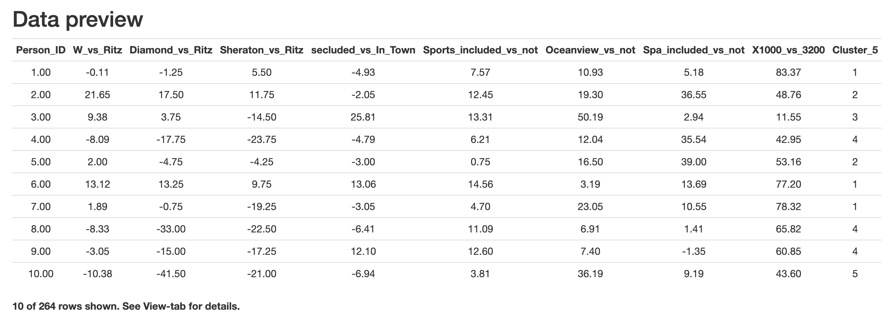
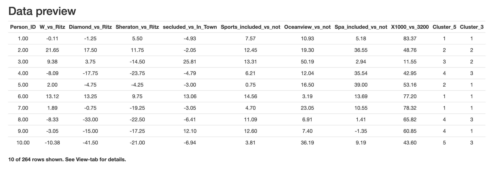
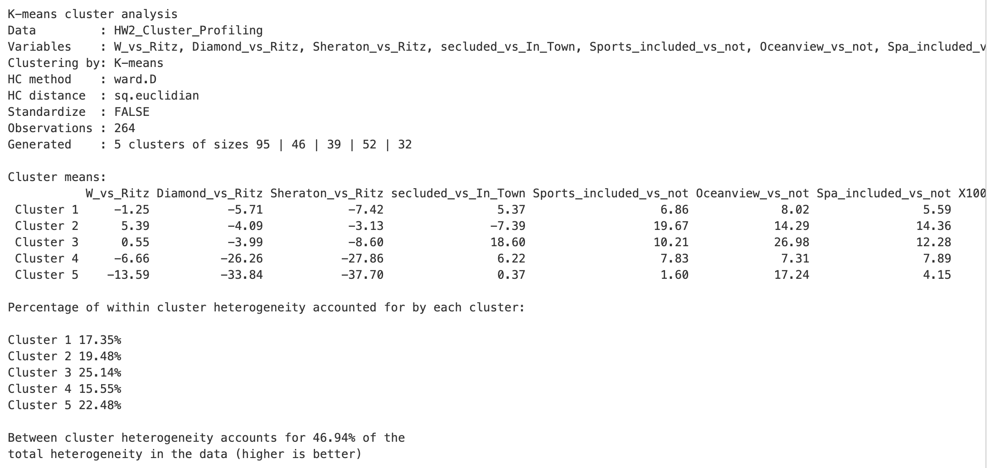

## An intro to cluster analysis

- Main Cluster analysis principle:
  - maximize the between-cluster variance
  - minimize the within cluster variance

- **Every** person is allocated to **one cluster**

#### Decisions to make

- Which clustering variables to include?
  - Age(narrow spread) and income(0-1000000); age won't matter that much; put the variables on same scale⬇︎
- How to scale the cluster variables?
- Which cluster method? (K-means, hierarchy, hybrid)
- How many clusters? 
- Profiling the clusters

## K-means clustering

- K-means clustering is most used technique

- Iterative approach
  - Allocate each observation to closest cluster center 
  - Find center of new clusters
  - Repeat until cluster division is stable

- The number of clusters is chosen by you

#### Procedures 

- Choose centers of 3 clusters randomly (take 3 seeds)
- Note: bad choice on purpose
- Allocate each point to its nearest center
- Find the centroids of the clusters from iteration 1
- Allocate each point to the centroid that is closest to it
- Find the centroids of the clusters from iteration 2.
- Nothing changed!!
- Voila, you’re done

#### Segmentation = simplification

**Segment locations** = centroids: The market is summarized with three “representative” customers

**Segment size**: We know how many real customers are similar to each representative

#### Technical problems

- K-means segmentation has a **random** seed
  - Output is somewhat random
  - Remedies
    - High number of trials (pick up the one statistically performed best)
    - **“Smart” choice of initial seeds** 
    - Start at Hierarchical Clustering outcome

## Hierarchical Clustering

- Each data point starts as its own cluster
- Combine the **2 closest** points into a cluster (with a **location at the centroid**)
- Continue until the desired number of clusters remain

#### Technical problems

- Stable – **no randomness**
- Works well in general
- However, in real data (vs. artificially divided data in picture), it can give clusters that are not the most compact
  - Advantage of K-means
- Our solution with the software:
  - **Use hierarchical to get starting seeds for K-means** – Run K-means from there
  - Gives us the best of both worlds

## Exercises 

- ~~Uncheck standardize~~ 
  - Standardize: Count every column equally
  - Both may work out; it's in the end a subjective problem
- Check initial centers from HC

- Store and go to data, there's a new column

- You can try cluster 3 and store it again

  

generated部分是cluster size

#### 批量快捷键：

全选要填的表格，command+d批量列，command+r批量行

#### 设置相对值和绝对值：

\$或f4

## Key use of segmentation

- **To customers who** (target summary), **our product offers** (state what the product does from the consumers' point of view), **relative to** (competitive alternative) **because** (support)

- Think of this as an internal statement, telling you how to sell your own product

- Key elements
  - Who is our product intended for
  - Who is the major competition, and what is our point of differentiation
  - What proof can we offer about our product/company?

- Execution: name and frame it

