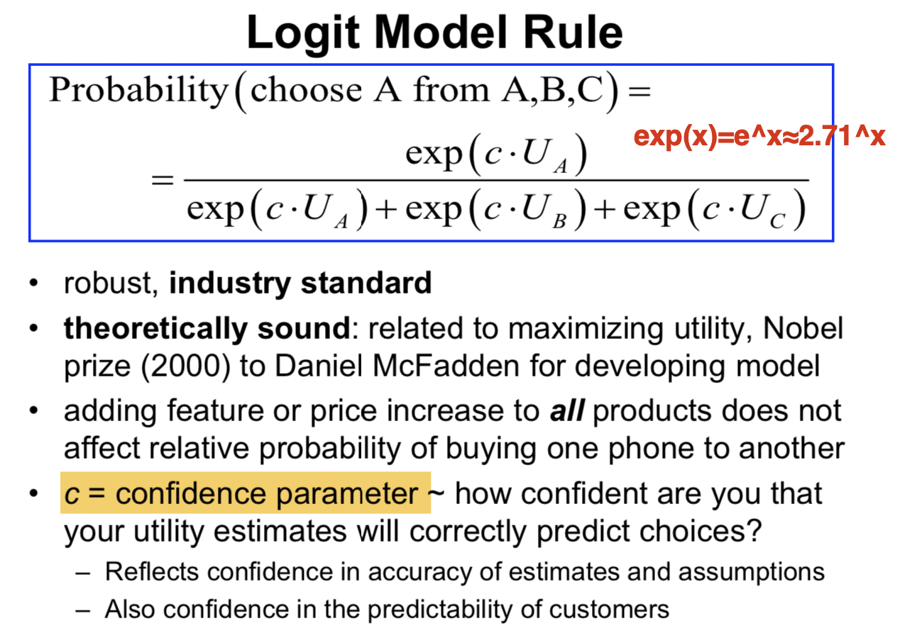
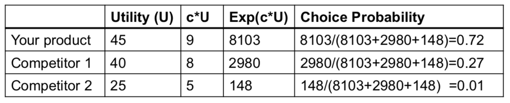
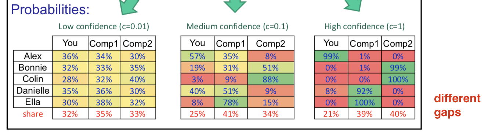

### When c=0.1

|              | u    | c*u  | exp(c*u)   | Choice Probability |
| ------------ | ---- | ---- | ---------- | ------------------ |
| your product | 45   | 4.5  | 90.0171313 | 0.574096993        |
| competitor 1 | 40   | 4    | 54.59815   | 0.348207428        |
| competitor 2 | 25   | 2.5  | 12.182494  | 0.077695579        |

### When c=0.2

### When c=0

Exp of any number is 1

Usually we use

$c = 100 / [12 * Max\ of\ Rating\ Scale]$ 