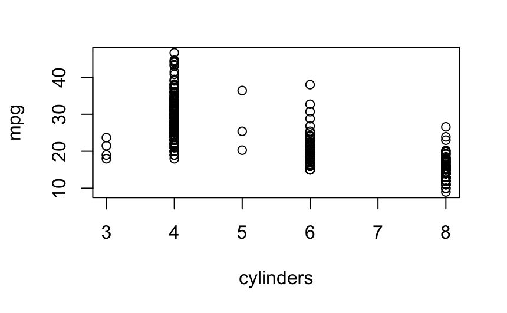
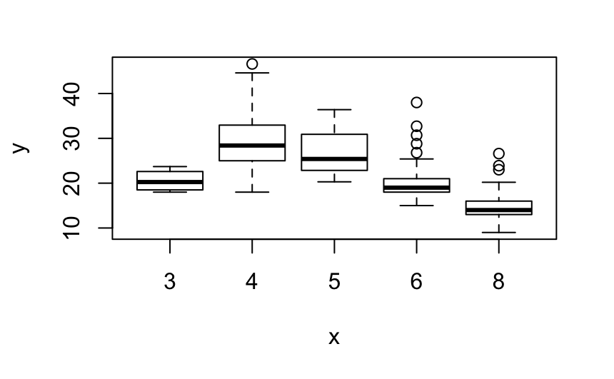
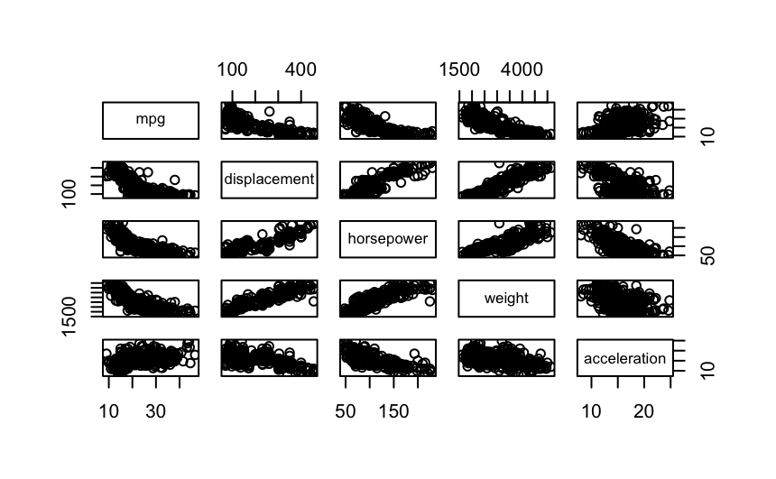
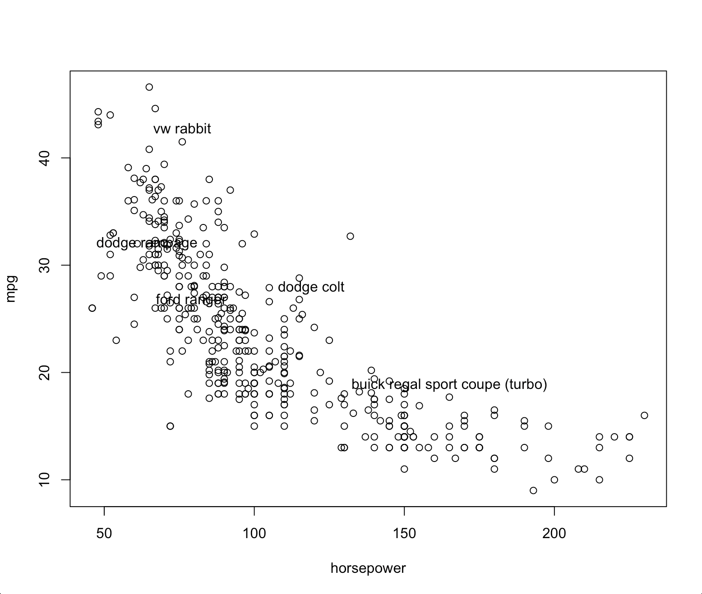

## I. Matrix 

- **先行后列定矩阵大小**

- **排序默认按列**，否则 ***byrow = TRUE***

- ```R
  matrix(data=..., nrow=..., ncol=...)
  
  matrix(c(1,2,3,4,5,6),2,3)
       [,1] [,2] [,3]
  [1,]    1    3    5
  [2,]    2    4    6
  
  matrix(c(1,2,3,4),2,2,byrow = TRUE)
       [,1] [,2]
  [1,]    1    2
  [2,]    3    4
  ```

## II. Random

- 在随机之前一般先

  ```R
  set.seed( )
  ```

  保证每次运行随机都一样

- rnorm() = multivariate normal random variates

  ```R
  x = rnorm(50)
  mean(x)
  sd(x)
  
  [1] 0.1004483
  [1] 0.8313939
  ```

  - 默认rnorm **平均数 mean() 约等于0**
  - 默认rnorm **标准差 sd() 约等于1**

- cor() = correlation 相关性

  ```R
  y = x + rnorm(50, mean=50,sd=0.1) 
  #sd very small=generated numbers are all close to mean≈add 50 to x
  cor(x,y) #calculate correlation of x & y
  
  [1] 0.9932279
  #expected correlation is high, close to 1
  #means y is big when x is big, vice versa
  ```

- var() = variance 方差 = $sd^2()$

  ```R
  y = rnorm(100)
  mean(y)
  var(y)
  sqrt(var(y))
  sd(y)
  ```

  sd(y) = sqrt(var(y))

## III. Datasets

```R
library(ISLR) #includes datasets in the introduction to statistical learning book
attach(Auto) #attach the dataset Auto to the session and use the data in the session

plot(cylinders,mpg)
```



## IV. Plot

```R
x = rnorm(100)
y = rnorm(100)

plot(x,y)

plot(x,y,xlab = "label for x-axis", ylab = "label for y-axis", main = "Plot of x vs y")

plot(x,y,col = "green")
```

#### 标题

- xlab / ylab / main x轴/y轴/大标题

#### 颜色

col = "green"

#### **boxplot** （当x是factor的时候，r自动变成boxplot）

```R
cylinders = as.factor(cylinders) #convert numerical to factors

plot(cylinders,mpg)
```



- change **color** of the box = **col**

  ```R
  plot(cylinders,mpg, col = "red")
  ```

- Change the **width** of the box according to the **sample size** of the category = **varwidth**

  ```R
  plot(cylinders,mpg, col = "red", varwidth = T)
  ```

- Vertical (default) ⇒ Horizontal

  ```R
  plot(cylinders,mpg, col = "red", varwidth = T, horizontal = T)
  ```

#### Histogram (numerical)

- 改变每个柱的宽度 breaks

  ```R
  hist(mpg,col = "red", breaks = 15)
  ```

#### Pairs (scatterplot for all possible combinations of variables)

- For preliminary data exploration

- 选其中几个variables画pairs: **~** 

  ```R
  pairs(~mpg + displacement + horsepower + weight + acceleration, Auto)
  ```

  

- #### identify()

  互动，可以在plots中点击点并identify

  操作：click on the interesting points - esc to finish

  

#### Summary ()

- Min.
- 1st Quartile.
- median
- mean
- 3rd Quartile.
- Max.

## V. Index 

```R
A = matrix(1:16,4,4) #sorted by column
A
     [,1] [,2] [,3] [,4]
[1,]    1    5    9   13
[2,]    2    6   10   14
[3,]    3    7   11   15
[4,]    4    8   12   16

A[c(1,3),c(2,4)] #排列组合
     [,1] [,2]
[1,]    5   13
[2,]    7   15

A[-c(1,3),] #exclude 排除
     [,1] [,2] [,3] [,4]
[1,]    2    6   10   14
[2,]    4    8   12   16
```

## VI. Table

```R
Auto = read.table("C:/C/DAT500S/Data/Auto.data",header = T, na.strings = "?")
fix(Auto)

Auto = read.csv("C:/C/DAT500S/Data/Auto.csv",header = T, na.strings = "?")
fix(Auto)

Auto = na.omit(Auto)

names(Auto)
```

- header=T: 让r不自己新建一行表头，第一行作为表头
- na.strings="?" : 让r知道，？字符相当于na, 并正常显示na
- na.omit() : 省略掉有na的行
- names() : 得到变量的名字

## VII. **Qualitative Versus Quantitative**

1. #### **Quantitative Variables** 

   ​	Variables whose values result from **counting** or measuring something.

   ​	Examples: height, weight, time in the 100 yard dash, number of items sold to a shopper

2. #### **Qualitative Variables**

   Variables that are not measurement variables. Their values do not result from measuring or counting.

   Examples: hair color, religion, political party, profession

3. **Designator ** 

   Values that are used to identify individuals in a table. Designator values usually do not repeat in a table, but variable values often do repeat.

   Examples: name, rank, jersey number of a team member, cell phone number, license number.