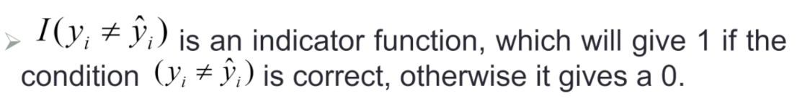
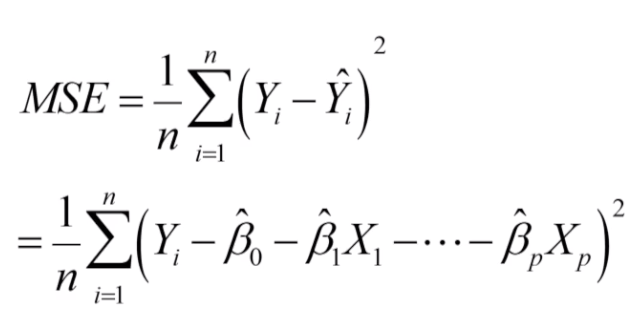

Quiz: Exercise 2.4: Problems 3 & 7. Exercise 3.7: Problems 3a, 3b & Problem 4.

> Lab: Exercise 3.7: Problem 9

## Model Accuracy

#### 2a.1 Quality of Fit

- Regression problem
- One common measure of accuracy is the <u>**mean squared error (MSE)**</u> 
- Most methods make MSE **small** on the **training data**
- How small is MSE on the test data?
  - No guarantee; **algorithm with the smallest training MSE need not have the smallest test (i.e. new data) MSE**

#### 2a.2 Training vs. Test MSE

- **More flexible a method is, the lower its training MSE** will be
  - More flexible methods (splines...) can generate a wide range of possible shapes to estimate f as compared to less flexible and more restrictive methods (linear regression...). the less flexible the method, the easier to interpret the model. Thus, there is a **trade-off** between **flexibility** and **model interpretability**. 

- **Test MSE may in fact be higher for a more flexible method** if the underlying data is not non-linear.
- Small training MSE + large test MSE = <u>*OVERFITTING*</u> the data

####  2a. 3 Bias-Variance Tradeoff

##### Two competing forces: **Bias and Variance**

- Bias 
  - Refers to the **error** that is introduced by modeling a real life problem (that is usually extremely complicated) by a much simpler model
  - For example: linear regression assumes that there is a linear relationship between X and Y. It is unlikely that, in real life, the relationship is exactly linear so some bias will be present
  - **The more flexible/complex a method is, the less bias it will generally have.**
- If you restrict the model more, the more bias it has
  
- Variance 
  - Refers to **how much** your estimate for *f* would **change** by if you had a different training data set.
  - **Generally, the more flexible a method is, the more variance it has.**
  - More predictors will make the model easily changed when data is changed. So variance will increase. 

##### The trade-off

- It can be shown that for any given, $X=x_0$ , the expected test MSE for a new Y at $x_0$ will be equal to 

  

  - As a method gets more **complex**, the **bias** will **decrease** and the **variance** will **increase** but **expected test MSE** may go **up or down**!
  - We have to try all the known function 
  - We **cannot calculate** bias or variance because:
    - we usually don't know the true function
    - we only have one data set (one estimated model). We cannot get expected estimate without infinite data set.  

#### 2a.4 Classification setting

- For <u>regression</u>, the <u>MSE</u> is used to assess the accuracy

- For <u>classification</u>, the <u>error rate</u> can be used

  

  

  

- Thus the error rate represents the fraction of incorrect classifications or misclassifications 

###### Bayes Error Rate

- Refers to the **lowest possible error rate** that could be achieved if somehow we knew exactly what the "true" probability distribution of the data looked like
- On test data, no classification (machine-learning method) can get lower error rates than the Bayes error rate
- In real life problems, the Bayes error rate **can't be calculated** exactly
- #### ***Bayes decision boundary***: 
  
  - In a <u>binary</u> classification problem, the **boundary** between the classes are drawn at the points where the **probability** of both classes are **equal**.

#### 2a. 5 K Nearest Neighbors (KNN)

- K Nearest Neighbors is a flexible approach used for classification
- For any given X, we find the **k closest neighbors** to X in the training data, and examine their corresponding Y.
- If the majority of the Y's are orange we predict orange otherwise guess blue.
- **The smaller that k is, the more flexible the method will be**
  - K grows, the method becomes less flexible and produces a decision boundary that is close to linear. 
    
    - Low variance but high-bias classifier
    
    

##### Training vs. test error rates on the simulated data

- Notice that training error rates keep going down as k decreases or equivalently as the flexibility increases
- However, the test error rate at first decreases but then starts to increase again **U-SHAPE**

#### 2a. 6 The fundamental picture

- In general training errors will always decline
- However test errors will decline at first (as reductions in bias dominate) but will then start to increase again (as increases in variance dominate)
- Test error: U-SHAPE

## Linear Regression

### The linear regression model


- The **parameters** in the linear regression model are very **easy to interpret**
- $ß_0$ Is the intercept. It is the **average value for Y if all the X's are zero**.

- $ß_j$ Is the slope for the jth variable $X_j$ . It is the average increase in Y when $Xj$ is increased by one and all other X's are held constant. 

#### Least squares fit

- We estimate the parameters using least squares i.e. minimize 

  - **MSE: Mean Squared Error** (mean of the sum of the squared errors)

  

  - **SSE: Sum of Squared Errors** (MSE*n)
  - **RSS: Residual sum of squares** 

#### Relationship between population and least squares lines

- Population line

  

- Least squares line

  

- We would like to know $ß_0$ through $ß_p$ i.e. the population line. Instead we know $\hat{ß}_0$ through $\hat{ß}_p$  i.e. the least squares line.

- Hence we use $\hat{ß}_0$ through $\hat{ß}_p$ as guesses for $ß_0$ through  $ß_p$ and $\hat{Y_i}$ as a guess for $Y_i$ 

#### Inference in regression

What we want to do:

- Assess **how well** the line describes the plot
- Guess the **slope** of the population line
- Guess what **value Y** would take for a given X value

Measures of fit: $R^2$ 

- $R^2$ Tells you the **fraction of variance in Y that can be explained by X**. $R^2$ ∈ **(0,1)**

  - $R^2$ =1 means it perfectly fits the data
  - $R^2$ =0 means relationship between x and y is completely random. Linear regression is no good to the data

- $$
  \begin{align}
  R^2 &= \frac{Explained\ Variability}{Total\ Variablility}\\
  &=\frac{Total\ Variability-Unexplained\ Variability}{Total\ Variability}\\
  &=1-\frac{Unexplained\ Variability}{Total\ Variability}\\
  &=1-\frac{SSE}{\sum(y_i-\bar{y})^2}
  \end{align}
  $$

  

### Hypothesis testing in linear regression

1. Is $ß_j=0$ Or not?
   1. We can use a **hypothesis test** to answer
   2. If we can't be sure that $ß_j≠0$ Then there is no point in using $X_j$ as one of our predictors
2. Can we be sure that at least one of our X variables is a useful predictor i.e. is it the case that $\beta_1=\beta_2=...=\beta_p=0$ ?

##### Is $\beta_j$ =0 i.e. is $X_j$ an important variable?

- Null hypothesis $H_0$ : $\beta_j$=0 vs. alternative hypothesis $H_a: \beta_j≠0$ 

- Calculate test statistic

  - How many standard deviations between the estimated slope and hypothesized value of 0 for the slope away from 0

  $$
  \begin{align}
  t&=\frac{\hat{\beta_j}}{SE(\hat{\beta_j})}
  \end{align}
  $$

  - If t-value is **big** then the estimated slope is **far from 0**
  - If **t-value is large** (equivalently **p-value is small**) we can be sure $\beta_j≠0$ and there is a **relationship** 

##### Testing individual variables

Multicollinearity 

##### Is the whole regression explaining anything at all?

Test for

- $H_0$: all slopes =0
- $H_a$: at least one slope ≠0
- Answer comes from the **F test** in the **ANOVA** (ANalysis Of VAriance) table


- #### A big F-value and a small p-value indicates we reject the null hypothesis and accept the alternative hypothesis

##### p-value

The probability of observing any value equal to |t| or larger, assuming $\beta_1=0$.

- A small p-value indicates that it is unlikely to observe such a substantial association between the predictor and the response due to chance, in the absence of any real association between the predictor and the response. 
- **Small** p-value = there is an **association** between the predictor and the response. We reject the null hypothesis if p-value is small enough
- Typical p-value cutoffs for rejecting the null hypothesis are 5 or 1%. 


### Qualitative Predictors

Indicator/ dummy variables are used to deal with qualitative predictor linear regression

Suppose we want to include income and gender


<u>Baseline</u> 

Other coding schemes


### Interaction Effect

- When the effect on Y of increasing $X_1$ depends on another $X_2$ 


**Synergy** effect / interaction effect

- Look for whether the lines are parallel

- Parallel lines say that promotions have the same salary benefit for men as for women. 

- If lines aren't parallel then promotions affect men and women salaries differently

- ```R
  summary(lm(medv~lstat*age,data=Boston))
  #把两个单独的variable以及interaction都进行了计算
  summary(lm(medv~lstat:age,data=Boston))
  #只把interaction进行了计算
  ```

  

### Potential Problems

1. Non-linearity of the data
2. Correlation of the error terms
3. Non-constant variance of error terms
4. Outliers 
5. High leverage points
6. Collinearity 

#### Non-Linearity of the data

Diagnosis: residual plots (残差图)


Fix: Variable Transformation (log X, SQRT (x), $X^2$) 

#### Correlation of error terms

Diagnosis: residual as a function of time


Fix: Good design of experiment

#### Non-constant variance of error terms

When error variance is not constant, the standard errors, confidential interval, hypothesis tests associated with the linear regression make use of this assumption.

Diagnosis: residual plots 


Fix: transform Y (log Y or SQRT(Y))

#### Outliers (unusual Y values)

Diagnosis: scatter plot, residual plot, and studentized residual plot(residuals are standardized)

Fix: remove that data point? Maybe no. we may not want to lose a genuine data because there may be a reason behind it

#### High leverage points (unusual X values)

Diagnosis: scatter plot, residual plot, and studentized residual plotted against leverage (we have to look at two dimensions)


Always between 1/n and 1

If leverage level is significantly **higher** than the average for an observation, we can conclude observation is a **high-leverage** point.

Fix: remove the data point? Maybe 

#### Collinearity

If certain X variable's effect on Y is already explained by another variable.

Problem: unstable estimates of parameters

**Variance inflation factor (VIF)**


If VIF >5, we have to think about keeping that variable in the model

Fix: remove variable; average of standardized variables


## Confidence Interval vs. Prediction Interval

#### Confidence Interval

- How close $\hat{Y}$ to $f(x)$ ?

- How far apart the estimated plane from the true population regression plane? 

- Confidence Interval (reflects uncertainty on  $\hat{\beta}$’s) 

- ```R
  confint(lm(formula, data))
  ```

  

#### Prediction Interval

- How close $\hat{Y}$ to Y ?

- Incorporate the error in estimating *f(X)* (reducible error) and the uncertainty in where the actual point from *f(X)* (irreducible error).

- In other words, it reflects uncertainty on $\hat{\beta}$  and the random error.

- **Prediction Interval is always wider than Confidence Interval** 

  

  

- Confidence interval and prediction interval have the same center

### KNN Regression

- kNN Regression is similar to the kNN classifier.

- To predict Y for a given value of X, consider k closest points to X in training data and take the average of the responses. i.e.

  

- If **k is small**, KNN is much **more flexible** than linear regression
- Is that better? Depends on the data. 

### Linear Regression vs. KNN Regression

If the true function is linear, then linear regression outperforms the KNN model

If the true function is slightly non-linear, then when you choose K carefully, then KNN might outperform linear regression on some intervals of K

If the true function is clearly non-linear, KNN is clearly **better** than linear regression regardless of K

If the true function is **highly non-linear**, the boundary becomes inflexible (linear), so we would expect the best value for K to be **small**.


**KNN is not good in high dimensional situations.** It's better to use linear regression when high dimension


