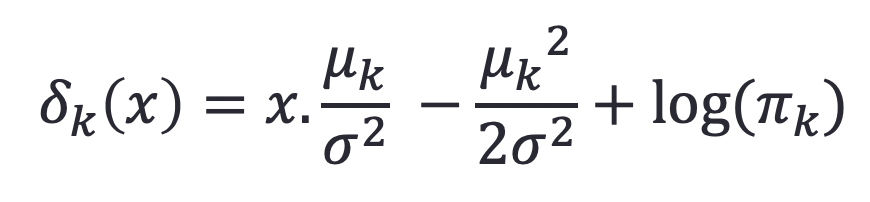

## 3b.1 Bayes' Theorem

$P_k(x)$ Posterior probability of the class k 后验概率

$\pi_k$ Prior probability of class k 先验概率

$f_k(x)$ Likelihood of X for the class k

Denominator: marginal;

> Example: Predict gender based on weight
>
> Y: two classes, male and female (k)
>
> ​	1=female; 2=male
>
> K: total number of classes (in this case it's 2)
>
> X: weight
>
> $\pi_1$ Prior probability of being a female 
>
> $\pi_2$ Prior Probability of being a male
>
> $f_1(x)$ : weight distribution of females
>
> $f_2(x)$ : weight distribution of males

#### Bayes' classifier

- Bayes’ classifier is the golden standard. Unfortunately, it is unattainable.
  - Often we don't know the prior and the likelihood on the right side of equation
- So far, we have estimated it with two methods: 
  - KNN classifier
  - Logistic Regression

## 3b.2 LDA vs. Logistic Regression

### Linear discriminant analysis 线性判别分析

##### LDA undertakes the same task as Logistic Regression. It classifies data based on **<u>categorical</u> variables** 

- Making profit or not
- Buy a product or not
- Satisfied customer or not
- Political party voting intention

##### Why linear? Why discriminant?

- LDA involves a **linear** equation (just like linear regression) that will predict which group the case belongs to.
- The function takes in X values and mathematically **discriminates to identify the class**

##### **<u>Assumptions</u>** of LDA 

- Each predictor variable is **normally** distributed with the same **variance** 

  

  - We get closer to using bayes' rule assuming normal distribution

- The observations are a **random** sample

##### Why not Logistic Regression?

- LDA is more popular when we have **more than two response **classes
  - For a binary problem, s-shaped going from 0 to 1 is perfectly suitable
  - ✷   When there are more than two classes, we have to build several logistic regression models for every category by grouping other categories together
- In the case where <u>n is small</u>, and the distribution of predictors **X is approximately normal**, then LDA is more <u>stable</u> than Logistic Regression
- Logistic regression is <u>unstable</u> when the **classes are well separated** 
  - S-shaped function may not know when to move from the bottom to the top because there is no overlap between those lines representing different classes
  - 

## 3b.3 Estimating LDA from Bayes' Rule

- With Logistic Regression we modeled the probability of Y being from the $kth$ class as

  

- However, Bayes’ Theorem states

  

  

#### LDA from Bayes’ Theorem

- The most common model for $f_k(x)$ is the **Normal Density** 正态分布
  - Because the true density function is not known
  - 
  - $\sigma_k$ Standard deviation of the normal distribution for kth class: assume the same for different target classes 
  - $\pi$ =3.1415926
  - $\mu_k$ The mean of the normal distribution for kth class: not same for different target classes
  - exp 以自然常数e为底的指数函数
- Assume, $$σ_1=σ_2=… =σ_K=σ$$ have the same standard deviation
- 

#### Discriminating Function

- Simplify the **bayes' rules** by using the **normal likelihood functions** to get discriminating function for all classes

- Assign the observation to the class for which $δ_k (x)$ is **largest**

  - 
  - $δ_k(x)$ Discriminating function for every class k
  - $\mu_k$ The mean of the normal distribution for kth class
  - $\sigma_k$ Standard deviation of the normal distribution for kth class
  - $\pi_k$ Prior for the class k

- Among all the discriminating functions, whichever gives the **biggest** value, the corresponding class will be declared as the **predicted value** for Y for that value of X.

- For example, if K = 2 and $π_1= π_2$, then assign an observation to class 1 if $δ_1(x)> δ_2(x)$ 

  i.e. if $2 x(μ_1- μ_2) >μ_1^2- μ_2^2$ 

  ##### Bayes’ decision boundary: Draw the **boundary** between classes at $δ_1 (x)= δ_2 (x)$ 

  - There are two discriminating functions, one for male, one for female. 
  - Female: Plug in the person's weight, the mean weight of the females, the standard deviation of weights, the prior probability that the person is a female
  - Out of the two functions, one which gives the biggest value will indicate the gender of the person

  > R is different. Traditionally, for each class we'll calculate the discriminant function and better if the function value is higher, like the posterior probabilities. **R calculates only one discriminant function**, so it's hard to decide which class is better with only one discriminant value.
  
  > Discrimant analysis: continuous [independent variables](https://en.wikipedia.org/wiki/Independent_variables) and a categorical dependent variable; groups are known a priori 
  >
  > ANOVA: [categorical](https://en.wikipedia.org/wiki/Categorical_variable) [independent variables](https://en.wikipedia.org/wiki/Independent_variables) and a [continuous](https://en.wikipedia.org/wiki/Continuous_variable) [dependent variable](https://en.wikipedia.org/wiki/Dependent_variable) 

#### Use Training Data set for Estimation

- Mean 

  - average of all training observations from the kth class
  - 

- Variance

  - weighted average of variances of all K classes.
  - 

- Priors 

  - **proportion** of the training observations that belong to the kth class.       

  - 

    

## 3b.4 LDA Example with One Predictor

#### A Simple Example with One Predictor (p =1)

- Suppose we have only one predictor (p = 1)
- Two normal density function$ f_1(x)$ and $f_2(x)$, represent two distinct classes
- The two density functions overlap, so there is some uncertainty about the class to which an observation with an unknown class belongs
- The dashed vertical line represents **Bayes’ decision boundary**  
- 

#### Apply LDA

- LDA starts by assuming that each class has a <u>normal</u> distribution with a <u>common variance</u> 
- The mean and the variance are <u>estimated</u> 
- Finally, Bayes’  theorem is used to compute $p_k$ and the observation is assigned to the class with the <u>maximum probability</u> among all k probabilities. (We'll use probabilities instead of values from discriminating functions)

## 3b.5 When p is Greater than 1

#### LDA for p > 1

- **Multivariate gaussian densities** 

  

  - $\Sigma$ Variance-covariance matrix (variance of height, variance of weight, covariance between height and weight)
  - **x and $\mu_k$ are vectors**
  - $\pi$ Constant 

- Discriminant Function

  

  - $\pi_k$ Prior to class k 

## 3b.6 Default Example: Adjusting the Threshold

Even the model with the least misclassification error rate will not essentially help us make the best decisions.

Sometimes we have to change the threshold below .5 even when misclassification error rate is higher.

## 3b.7 Compare LDA with kNN and Logistic Regression

#### Logistic Regression vs. LDA

##### Similarity:

- Both Logistic Regression and LDA produce **linear boundaries** 
  - Boundaries when the probabilities for both classes are equal

##### Difference:

- LDA assumes that the observations are drawn from the **normal distribution** with **common variance** in each class, while logistic regression does not have this assumption. **LDA** would do **better** than Logistic Regression **if the assumption of normality hold**, otherwise logistic regression can outperform LDA

#### KNN vs. (LDA and Logistic Regression)

- KNN takes a completely different approach
- KNN is completely non-parametric: **No assumptions** are made about the shape of the decision boundary! 
- **Advantage** of KNN:  flexible; We can expect KNN to dominate both LDA and Logistic Regression when the decision boundary is highly **non-linear**
- **Disadvantage** of KNN: KNN does **not** tell us **which predictors** are important (no table of coefficients)

|      |               |           |                 |       |
| :--: | :-----------: | :-------: | :-------------: | :---: |
|      |               | - or Null |  + or Non-null  | Total |
|      |   - or Null   |           | False Pos. (FP) |   N   |
|      | + or Non-null |           |                 |   P   |
|      |               |           |                 |       |

|       Name       | Definition |                  Synonyms                   |
| :--------------: | :--------: | :-----------------------------------------: |
| False Pos. Rate  |    FP/N    |         Type I error, 1-Specificity         |
|  True Pos. Rate  |    TP/P    | 1-Type II error, power, sensitivity, recall |
| Pos. Pred. value |   TP/P*    |   Precision, 1-false discovery proportion   |
| Neg. Pred. Value |   TN/N*    |                                             |

[^Table ]: important measures for classification and diagnostic testing

