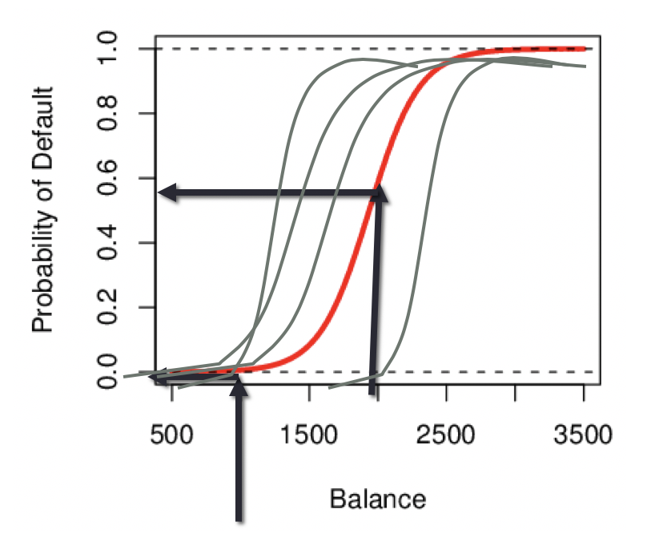

> *Quiz: Exercise 4.7: Problems 1 & 4*
>
> **Group Assignment: Exercise 4.7; Problems 11 (leave out part e) & 12**
>
> **Individual Assignment: Exercise 4.7; Problem 10 (leave out part f)**

## 3a.1: Case 1: Brand Preference for Orange Juice

- We would like to predict what customers prefer to buy: Citrus Hill or Minute Maid orange juice?

- The **Y (Purchase)**variable is **categorical**: **0 or 1**

- The **X (LoyalCH) **variable is a **numerical** value (between 0 and 1) which specifies the how much the customers are loyal to the Citrus Hill (CH) orange juice 

- Can we use Linear Regression when Y is categorical? 

  - Y has to be continuous or numerical to use linear regression

  - Otherwise 

    

    - Linear regression will go beyond 0 or 1 in the vertical axis. We cannot interpret such.
    - It's also not possible for y to be between 0 and 1

  - Linear regression Problems 

    - The regression line $\beta_0+\beta_1X$ can take on any value between **negative and positive infinity**
    - In the orange juice classification problem, Y can only take on two possible values: 0 or 1.
    - Therefore the regression line **almost always predicts the wrong** value for Y in classification problems.

- Solution: use logistic function

  - Instead of trying to predict Y, let’s try to **predict P(Y = 1)**, i.e., the **probability** a customer buys Citrus Hill (CH) juice.

  - Thus, we can **model P(Y = 1)** using a function that gives outputs between 0 and 1.

  - **Logistic function** 

  - Fitting a model like this is called **logistic regression**

    

    

> Logistic function is not sinusoidal. (不是正弦) it's sigmoid function（s函数）双曲正切/反正切函数也是s函数

## Logistic regression

- Logistic regression is very similar to linear regression
- We come up with estimates for $\beta_0$ and $\beta_1$.
- We have similar problems and questions as in linear regression
  - e.g. Is $\beta_0$  **equal to 0**? **How sure **are we about our guesses for $\beta_0$ and $\beta_1$ ?
  - 

## 3a.2 Case 2: Credit Card Default Data

- We would like to be able to predict customers that are likely to **default**

- Possible X variables are:
  - Annual Income
  - Monthly credit card balance
- The **Y** variable (Default) is **categorical**: **Yes or No**
- How do we check the relationship between Y and X?
- 
  - Figure left
    - Most default takes the right side of the figure; balance is a good indicator 
  - Figure right
    - Balance is good indicator, income is not

#### Why not Linear Regression?

If we fit a linear regression to the Default data, then for very low balances we predict a <u>negative</u> probability, and for high balances we predict a probability <u>above 1</u>! Not possible.

#### Logistic Function on Default Data

Now the probability of default is close to, but not less than zero for low balances. And close to but not above 1 for high balances

- S-shaped
- Fit for binary variables
- Not the only function that can fit 

## 3a.3 Using Logistic Regression

#### Are the coefficients significant?

- We still want to perform a hypothesis test to see whether we can be sure that are $\beta_0$ and $\beta_1$ significantly different from zero. 

- We use a **Z test instead of a T test**, but of course that doesn’t change the way we interpret the **p-value**

- Here the **p-value** for balance is very **small**, and the **estimate of $\beta_1$ is positive**, so we are sure that if the balance increase, then the probability of default will increase as well.

  

#### Making Prediction

- Suppose an individual has an average balance of $1000. What is their probability of default?
  

- The predicted **probability of default** for an individual with a **balance of $1000 is less than 1%.** 

- For a balance of $2000, the probability is much higher, and equals to 0.586 (58.6%).
  - The probability doesn't just get doubled when we doubled the balance. It may increase a lot because of S-Shaped

#### Interpreting $\beta_1$ 

- **Interpreting what $\beta_1$ means is not very easy** with logistic regression, simply because we are predicting P(Y=1/X) and not Y.
- If **$\beta_1$ =0**, this means that there is **no relationship** between Y and X. 
- If **$\beta_1$ >0**, this means that when X gets **larger** so does the **probability** that Y = 1.
- If **$\beta_1$ <0**, this means that when X gets **larger**, the probability that Y = 1 gets **smaller**.
- **But how much** bigger or smaller **depends** on where we are on the s-shape. (We don't know the magnitude of increase or decrease in probability of Y=1 with an increase of X because of S-shaped. )

#### Qualitative Predictors in Logistic Regression

- We can predict if an individual default by checking if she is a student or not. Thus we can use a qualitative variable “Student” coded as (Student = 1, Non-student =0). 
- Estimated $\beta_1$ is positive: This indicates students tend to have higher default probabilities than non-students
- 

## Multiple Logistic Regression

- Predict Default using:
  - Balance (quantitative)
  - Income (quantitative)
  - Student (qualitative)
  - 

#### Why contradiction? 

- A student is riskier than non students if no information about the credit card balance is available
- However, that student is less risky than a non student with the same credit card balance! 

#### Odds & Log-Odds

##### Odds

- **Probability of success divided by probability of failure**

- Very common in betting world, especially in horse race betting
- Ratio tells us how many times more likely to succeed than fail

##### Log-Odds or logit

- Right side looks like exactly linear regression
- Why not build linear regression using logic?
  - Because we do not observe the log-odds in the real world; we don't have data on that

