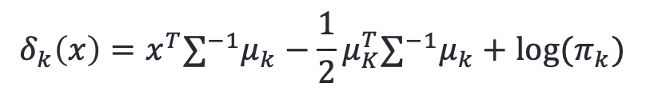
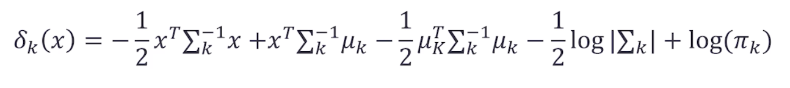
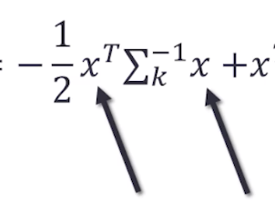
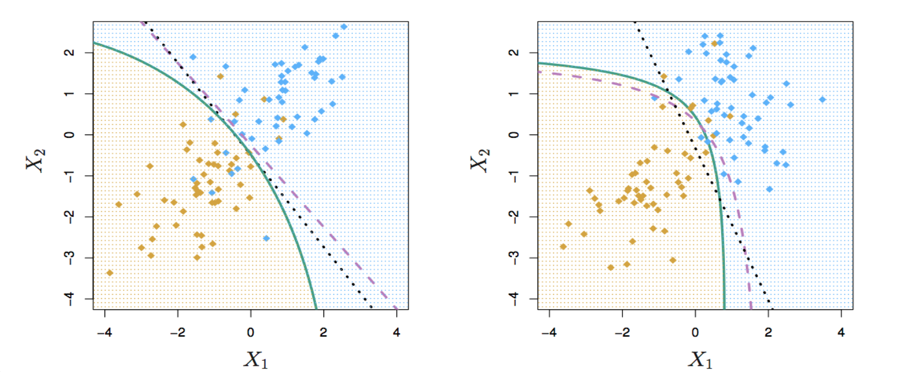
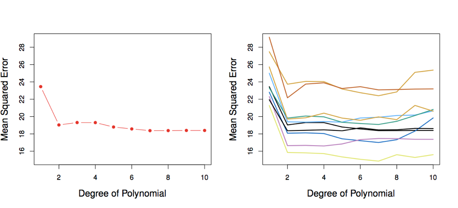
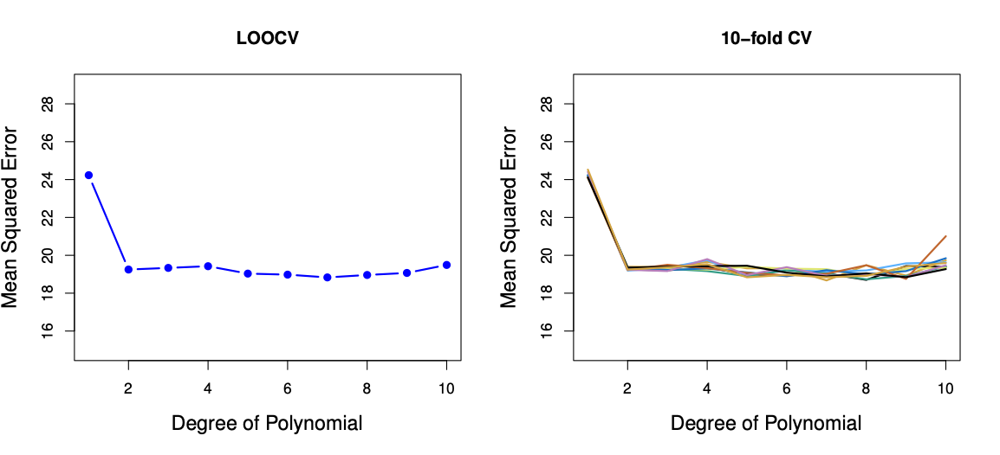
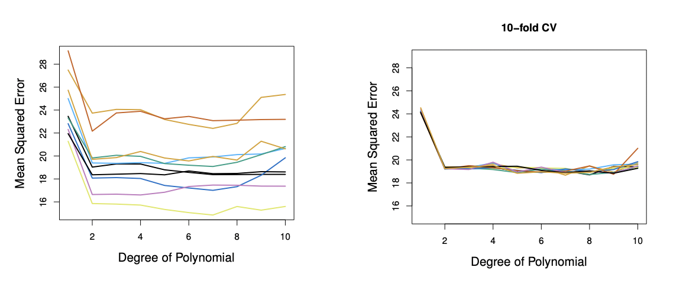

##  4a.1 Bayes' Theorem and LDA



## 4a.2 Discriminating Functions in QDA

#### Quadratic Discriminant Analysis (QDA)

- **LDA** assumed that every class has the **same variance/ covarianc**e
- However, LDA may perform poorly if this assumption is far from true
- QDA works identically as LDA except that it estimates separate variances/ covariance for each class
  - Start with bayes' rule, plug in normal densities for the likelihood functions, but the normal densities will have their own variance and covariance for every class

#### Discriminating function for QDA



- Since QDA allows for **different variances** among classes, the resulting boundaries become **quadratic**
  - We have quadratic terms of the predictor in the discriminant function
  - 
- Assign the observation to the class for which $δ_k (x)$ is **largest**

## 4a.3 Comparison of QDA, LDA, kNN, and Logistic Regression

Different distribution between two classes: indicating different variance and covariance between different classes



- Black dotted: LDA boundary
- Purple dashed: Bayes’ boundary
- Green solid: QDA boundary
- Left: variances of the classes are equal (LDA is better fit)
- Right: variances of the classes are not equal (QDA is better fit)

#### QDA vs. (LDA, Logistic Regression, and KNN)

- QDA is a compromise between non-parametric KNN method and the linear LDA and logistic regression
- If the true decision boundary is:
  - Linear: LDA and Logistic Regression win
  - Moderately Non-linear: QDA outperforms
  - More complicated, very non-linear: KNN is superior

### 在r中的计算和lda一样的步骤，将fit出的class与test data做比较

## 4b.1 What Are Resampling Methods?

- Tools that involves <u>repeatedly</u> drawing samples from a training set and refitting a model of interest on each sample in order to obtain more information about the fitted model

- #### **2 REASONS TO RESAMPLE:**

  - Model Assessment: estimate **test error rates** 
  - Model Selection: select the appropriate level of model **flexibility**

- They are computationally expensive! But these days we have powerful computers 

- #### **Two resampling methods:** 

  - **Cross Validation** 
  - **Bootstrapping** 

## 4b.2: The Validation Set Approach (most common)

- Suppose that we would like to find a set of variables that give the lowest test (not training) error rate
- If we have a large data set, we can achieve this goal by **randomly splitting** the data into **training** and **validation**(testing) parts
- We would then use the **training part to build** each possible model and choose the model that gave the **lowest error rate** when applied to the **validation data** 



- Left: Validation error rate for a single split 
  - Drop when using squared predictor
- Right: Validation method repeated 10 times, each time the split is done randomly! 
- There is a lot of **variability among the MSE’s** 
  - We should use 2 degree because test MSE doesn't decrease much beyond the square term

- Advantages:
  - Simple
  - Easy to implement
- Disadvantages:
- The validation **MSE can be highly variable**
- **Only a subset of observations** are used to **fit the model** (training data). Statistical methods tend to perform worse when trained on fewer observations

## 4b.3 Leave-One-Out Cross-Validation (LOOCV)

- This method tries to address the Validation Set approach’s disadvantages 
  - Training data set (blue) size: n -1 
  - Validation data set (beige) size: 1
- Fit the model using the training data
- Validate model using the validation data, and compute the corresponding MSE 
- **Repeat** this process n times

- $CV_{(n)}=\frac{1}{n}\sum\limits_{i=1}^NMSE_i$ 

#### LOOCV vs. the Validation Set Approach

- LOOCV has l**ow bias**
  - We repeatedly fit the statistical learning method using training data that contains n-1 obs., i.e. almost all the data set is used
- LOOCV produces same MSE
  - The validation approach produces different MSE when applied repeatedly due to randomness in the splitting process. LOOCV will always yield the same results because we split ‘n’ times leaving-out a different observation every time. There is no difference at the end because of randomness in the split.
- LOOCV is **computationally intensive** (<u>disadvantage</u>) 
  - We fit the each model n times! 

## 4b.4 k-fold Cross-Validation

- k-fold Cross Validation addresses the issues of LOOCV and Validation Set approach.
- In k-fold Cross Validation, we divide the data set into **k different parts** (e.g. k = 5, or k = 10, etc.)
- We then remove the first part, fit the model on the **remaining k-1 parts**, and see how good the **predictions are on the left out part** (i.e. compute the MSE on the first part)
- We then **repeat** this k different times taking out a different part each time
- By **averaging the k different MSE’**s we get an estimated validation (test) error rate for new observations 
- $CV_{(k)}=\frac{1}{k}\sum\limits_{i=1}^kMSE_i$ 


[^True answer]: True; 

<u>k-fold cross-validation average MSE can be vary based on the random seed</u> 

<u>Leave-one-out cross-validation average MSE don't vary based on the random seed.</u> 

## 4b.5 Cross-Validation Comparison

#### LOOCV vs. K-fold CV

- Left: LOOCV  error curve
- Right: 10-fold CV was run many times, and the figure shows the slightly different CV error rates
- LOOCV is a special case of k-fold, where k = n
- They are both stable, but LOOCV is more computationally intensive!
- 

#### Validation Set Approach vs. K-fold CV Approach

- Left: Validation Set Approach
- Right: 10-fold Cross Validation Approach
- Indeed, 10-fold CV is more stable!
- 

The choice of the model can be impacted by the cross-validation approach but not very different between the cross-validation approach. 

## 4b.6 Bias-Variance Trade-off

- Putting aside that LOOCV is more computationally intensive than k-fold CV… Which is better LOOCV or K-fold CV?
  - **LOOCV** is **less bias** than k-fold CV (when k < n)
  - But, **LOOCV** has **higher variance** than k-fold CV (when k < n)
  - Thus, there is a **trade-off** between what to use
- Conclusion:
  - We tend to use k-fold CV with **(k = 5 and k = 10, 20...)**
  - These are the magical k’s !!!
  - K fold balance those two and would be a great choice usually
  - It has been empirically shown that they yield test error rate estimates that suffer neither from excessively high bias, nor from very high variance

> In 𝑘-fold cross-validation we partition a dataset into 𝑘 equally sized non-overlapping subsets 𝑆. For each fold 𝑆𝑖, a model is trained on 𝑆∖𝑆𝑖, which is then evaluated on 𝑆𝑖. The cross-validation estimator of, for example the prediction error, is defined as the average of the prediction errors obtained on each fold.
>
> While there is no overlap between the test sets on which the models are evaluated, there is overlap between the training sets for all 𝑘>2. The overlap is largest for leave-one-out cross-validation. This means that the learned models are correlated, i.e. dependent, and the variance of the sum of correlated variables increases with the amount of covariance ([see wikipedia](https://en.wikipedia.org/wiki/Variance#Sum_of_correlated_variables)):
>
> $Var(\sum\limits_{𝑖=1}^N𝑋_𝑖)=\sum\limits_{𝑖=1}^N\sum\limits_{j=1}^NCov(𝑋𝑖,𝑋𝑗)$ 
>
> Therefore, leave-one-out cross-validation has large variance in comparison to CV with smaller 𝑘.
>
> However, note that while two-fold cross validation doesn't have the problem of overlapping training sets, it often also has large variance because the training sets are only half the size of the original sample. A good compromise is ten-fold cross-validation.

## 4b.7 Cross-Validation in Classification

- We can use cross validation in a classification situation in a similar manner
  - **Divide** data into **k** parts
  - **Hold out one part**, fit using the remaining data and compute the error rate on the hold out data
  - **Repeat k times**
  - **CV error rate** is the average over the k errors we have computed

## 4b.8 Choose the Level of Flexibility in Classification


## 4b.9 One Standard Error Rule

#### Choose the simplest model whose CV error is no more than one standard error above the model with the lowest CV error.

## Lab

计算linear regression的test mse

```R
lm.fit = lm(mpg~horsepower,data=Auto,subset = train)
##test MSE
mean((mpg-predict(lm.fit,Auto))[-train]^2)

lm.fit2 = lm(mpg~poly(horsepower,2),data = Auto, subset = train)
mean((mpg-predict(lm.fit2,Auto))[-train]^2)

lm.fit3 = lm(mpg~poly(horsepower,3),data = Auto, subset = train)
mean((mpg-predict(lm.fit3,Auto))[-train]^2)
```

#### LOOCV available in library(boot): cv.glm() average MSE存在delta里

```R
library(boot)
glm.fit=glm(mpg~horsepower,data=Auto)
cv.err = cv.glm(Auto,glm.fit)
cv.err$delta
```

会出两个结果，第一个是视频里讲的，第二个是bias-corrected one，两个值基本相等，一般用第一个

#### LOOCV for models with different degrees 

```R
cv.error = rep(0,5)
cv.error

for(i in 1:5){
  glm.fit = glm(mpg~poly(horsepower,i),data = Auto)
  cv.error[i] = cv.glm(Auto,glm.fit)$delta[1]
  }
cv.error  

plot(1:5,cv.error,xlab = "Degree", ylab = "LOOCV MSE", type = "l")
points(cv.error, cex = 1, col = "dark red")
```

#### k-Fold Cross-Validation (e.g., 10-fold)

```R
set.seed(17)

cv.error.10 = rep(0,8)

for (i in 1:8){
  glm.fit = glm(mpg~poly(horsepower,i),data=Auto)
  cv.error.10[i] = cv.glm(Auto,glm.fit,K=10)$delta[1]
}
cv.error.10

plot(1:8,cv.error.10,xlab = "Degree", ylab = "K-fold CV MSE", type = "l")
points(cv.error.10, cex = 1, col = "dark red")
```

