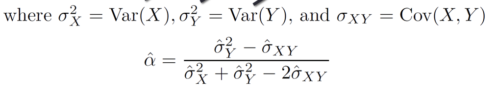

Quiz: **Exercise 5.4: Problem 2 (leave out g & h);** **Exercise 6.8: Problem 1.** 

## 5a.1: Purpose of Bootstrap

- Cross Validation: primarily used for estimating test error

- Bootstrap: principally used to estimate **various measures of error** or uncertainty of parameter estimates; for example, **standard error of parameter estimates**, confidence intervals for parameters.
  - One of the most important techniques in all of machine-learning
  - Widely applicable, extremely powerful, computer intensive method.
  
- #### CALCULATE STANDARD ERROR WITHOUT BIAS

- Standard deviation $sd(\bar{x})=\frac{sd()}$ 


[^answer]: it should be true instead of false 

## 5a.2 Classical Approach for Estimating Standard Errors

- **Sample Variance**: $\hat{σ}^2=\frac{1}{n-1}\sum\limits_{i=1}^n(x_i-\bar{x})^2 $

- What is the Standard Error (SE) of $\hatσ^2$?

- **Assume** that $x_1, …, x_n$ are i.i.d.(independent, identical) normally distributed.
- $Var(\hatσ^2 )=  \frac{2σ^4}{n-1}$
- $SE(\hatσ^2 )=  \frac{\sqrt{2}σ^2}{\sqrt{n-1}}$

- Those formulas are **good only under the assumed conditions**

- The <u>classical</u> approach works for certain statistics under specific modeling <u>assumptions</u>. However, what happens if:
  - The modeling assumptions — for example, $x_1, …, x_n$ are i.i.d being normal — break down?
  - The estimator does not have a simple form and its sampling distribution cannot be derived analytically?

Bootstrap is always the better solution.

## 5a.3 Bootstrap Process

#### Example: Two Financial Assets

- Two Financial Assets: Yield Returns of *X* and *Y*.
- α in *X* (fraction of the money invested in X) and 1- α in *Y* ()
- *Minimize* Risk or Variance of the investment.
- i.e.,*Minimize*
- Solution:

- 


#### Standard Error Calculation

Mean of the alpha’s:

$\bar{a}=\frac{1}{B}\sum\limits_{i=1}^B\hatα^{∗i}$

Standard Error of the alpha’s:

$SE(\hatα)=\sqrt{\frac{1}{B-1}\sum\limits_{i=1}^B{(\hatα^{∗I}-\bar{a})^2}}$

## 5b.1 Purpose of Subset Selection

#### Improving on the Least Squares Regression Estimates? 

We want to improve the Linear Regression model, by replacing the least square fitting with some alternative fitting procedure, i.e., the values that minimize the test mean square error (MSE)

There are 2 reasons we might not prefer to just use the ordinary least squares (OLS) estimates

**1. Prediction Accuracy**

**2. Model Interpretability** 

#### 1. Prediction Accuracy

- The **least squares** estimates have relatively **low bias and low variability** especially when the relationship between Y and X is **linear** and the **number** of observations n is way **bigger** than the number of predictors p 
- But, when **n≈p** , then the least squares fit can have **high variance **and may result in over fitting and poor estimates on unseen observations
- And, when n<p , then the variability of the least squares fit increases dramatically, and the **variance **of these estimates is **infinite** 

#### 2. Model Interpretability

- When we have a large number of variables X in the model there will generally be many that have **little or no effect **on Y
- Leaving these variables in the model makes it harder to see the “**big picture**”, i.e., the effect of the “**important variables**”
- The model would be easier to interpret by removing (i.e. setting the **coefficients to zero**) the unimportant variables

#### Solution

- Subset Selection
  - Identify a subset of p predictors and then fit the model using the subset
  - e.g. best subset selection and stepwise selection
- Shrinkage/Regularization
  - Involves shrinking the estimates **coefficients towards zero**
    - Effective in reducing the variance of the model at the cost of increasing the bias
  - This **shrinkage reduces the variance**
  - Some of the coefficients may shrink to exactly zero, and hence shrinkage methods can also perform variable selection
  - e.g. Ridge regression and the Lasso
- Dimension Reduction
  - Involves projecting all p predictors into an **M-dimensional space where M < p**, and then fitting linear regression model
  - e.g. Principle Components Regression  

## 5b.2 Measures for Model Comparison

- Traditionally, $R^2$ is used in Linear Regression
  - $R^2$ Will get bigger when adding more predictors so we need more approaches that are sensitive to the number of predictors to compare models with different numbers of predictors in it
- To **compare models with different number of predictors**, we can use **other approaches**:
  - Adjusted $R^2$
  - AIC (Akaike information criterion)
  - BIC (Bayesian information criterion)
  - $C_p$ 

- These methods add penalty to **RSS** for the number of variables (i.e. complexity) in the model
  - Because when we add more predictors RSS will go down
- None are perfect

#### Adjusted $R^2$ 

- $Adjusted\ R^2=1-\frac{RSS/(n-d-1)}{TSS/(n-1)}$ (Only difference is "d")
- ***d -* number of predictors in the model**
- **Maximizing** Adjusted $R^2$ is equivalent to **minimizing** $RSS⁄(n-d-1)$
- ✭✭**Adding** insignificant predictors will increase d and increase $RSS⁄(n-d-1)$ resulting in a **decrease** of Adjusted $R^2$
- We want a **<u>large</u>** value for an adjusted $R^2$ 

#### $C_p$, AIC, and BIC

-  $C_p=\frac{1}{n}(RSS+2d\hat\sigma^2)$ 
- $AIC=\frac{1}{n\hat\sigma^2}(RSS+2d\hat\sigma^2)$ 
- $BIS=\frac{1}{n}(RSS+log(n)d\hat\sigma^2)$ 

- When adding predictors, RSS will drop. But adding insignificant predictors will reduce RSS only a little bit. The term with d will increase. Overall, we want $C_p$, AIC, and BIC to be **<u>small</u>**, so adding insignificant predictors will be discouraged by using these measures.
-  Cp and AIC are proportional to each other; $\frac{1}{\hat\sigma^2}$  
-  Since log(n) > 2 (ln(n), 一般指自然底数，有时指2或10) for any n >  7, BIC generally places a heavier penalty on models with many variables

#### Credit Data: $C_p,\ BIC\ \&\ Adjusted\ R^2$ 

- A **small** value of $C_p$ and BIC indicates a **low error**, and thus a better model
- A **large** value for the Adjusted $R^2$ indicates a better model
- 


## 5b.3 Best Subset Selection

- In this approach, we run a linear regression for each possible combination of the *p* predictors 
- Suppose, we have $X_1, X_2, …, X_p$ potential predictors
- First, we find the best **one predictor model** based on **smallest RSS or the largest $R^2$ **
  - There are **p** possible one predictor models (因为有p个predictor，用单个predictor去fit model，所以最后有p种)
- Then, we find the best two predictors model smallest RSS or largest $R^2$
  - There are $(p-1)p/2$ two predictors models 
- Keep doing the same for **all possible number of predictors** in the model until we build the full model. 

-----------

- One simple approach is to take the subset with the smallest RSS or the largest R2
- **Unfortunately, one can show that the model that includes all the predictors will always have the largest $R^2$ (and smallest RSS)** 
  - So we cannot choose the final model using **$R^2$ (and RSS)** 

- To compare models with **different number of predictors**, we should use: (choose the final model)
  - Test MSE
  - Adjusted $R^2$ 
  - AIC (Akaikeinformation criterion)
  - BIC (Bayesian information criterion)
  - $C_p$ 

## 5b.4 Forward Stepwise Selection

#### Why Not Best Subset Selection

- Best Subset Selection is **computationally intensive** especially when we have a large number of predictors (large *p*)
- Other Faster Options:
  - Forward Stepwise Selection
  - Backward Stepwise Selection

#### Forward Stepwise Selection

- Suppose, we have *$X_1$*, *$X_2$*, …, $X_p$ potential predictors. We add one predictor at a time that improves the model the most until no further improvement is possible. **Predictors that are added will stay in the model.**  
- First, we find the best one predictor model based on smallest RSS or largest $R^2$
  - There are **p** possible one predictor models
- Then, we add another predictor to the existing model that most decreases RSS or increases $R^2$ 
  - There are $(p-1)p/2$ two predictors models 
  - 
- Keep adding one predictor at a time that most improves the model until we build the full model. 
  - 

- To compare models with **different number of predictors**, we should use: (choose the final model)
  - Test MSE
  - Adjusted $R^2$
  - AIC (Akaikeinformation criterion)
  - BIC (Bayesian information criterion)
  - $C_p$ 

## 5b.5 Backward Stepwise Selection 

- Suppose, we have *$X_1$*, *$X_2$*, …, $X_p$ potential predictors. Starting from the full model, we **remove** one predictor at a time that causes the **least deterioration to the model accuracy**.

- First, we start with the full model.
  - 

- Then, we remove a predictor from the existing model that causes **the least decline in the accuracy** of the model
  - There are **p** possible one predictor models
- Keep removing one predictor at a time that causes the least deterioration to the model until we have only one predictor in the model. 
  - 

- To compare models with **different number of predictors**, we should use: (choose the final model)
  - Test MSE
  - Adjusted $R^2$
  - AIC (Akaikeinformation criterion)
  - BIC (Bayesian information criterion)
  - $C_p$ 

**Backward** selection requires that **the number of samples n is larger than the number of variables p**  (so that the full model can be fit). In contrast, **forward** stepwise can be used even when **n < p** , and so is the only viable subset method when p  is very large.

## Lab

#### Bootstrap 

```R
store=rep(NA, 10000)

for(i in 1:10000) { 
  store[i]=(sum(sample (1:100, rep=TRUE)==4) >0)
  #by default size = n=(100), sampling under numbers, in this case, it would sample 100 times
  #样本容量100，bootstrap出的样本也是100，但每次放回取样，如果取到4就返回true，再将是4的次数想加求和看是否大于0，如果大于0说明有4，返回true；重复10000次实验得到最终平均概率。
}

mean(store)
```

```R
library(boot)
#bootstrap using alpha function
boot(Portfolio,alpha.fn, R=1000)
```

#### Best subset selection

```R
library(leaps)
#best subset selection
regfit.full = regsubsets(Salary~.,Hitters) #number of default predictors is 8

regfit.full = regsubsets(Salary~.,Hitters,nvmax = 19) ##default nvmax is 8
reg.summary = summary(regfit.full)

names(reg.summary)
>>[1] "which"  "rsq"    "rss"    "adjr2"  "cp"     "bic"    "outmat" "obj" 
```

rsq=$R^2$ 

rss=Residual sum of squares $\sum\limits_{i=1}^n(y_i-f(x_i))^2$ 

adjr2=adjusted $R^2$

cp=$C_p$ 

bic=BIC

##### Remember to set "nvmax" to the number of variables

#### Choose the best number of predictors (e.g. by Bic)

```
plot(reg.summary$bic,xlab="Number of Predictors", ylab = "BIC", type = "l")

which.min(reg.summary$bic)

points(6,reg.summary$bic[6],col="red",cex=2,pch=20)

#show the coefficients
coef(regfit.full,6)
```

```R
plot(regfit.full,scale="r2") #r2越大，参与的参数越多
plot(regfit.full,scale="adjr2") #当没用的参数添加进来之后adjr2会下降
plot(regfit.full,scale="Cp") 
plot(regfit.full,scale="bic")
```


[^注意]: scale的内容一定要打引号


[^Cp / bic]: 值越小，越top，model越准确

#### Forward and Backward Stepwise Selection

```R
regfit.fwd = regsubsets(Salary~.,data = Hitters, nvmax = 19, method = "forward")
regfit.bwd = regsubsets(Salary~., data = Hitters, nvmax = 19, method = "backward") #but summary shows in a reversed selection order

#seven predictor model
coef(regfit.full,7)

coef(regfit.fwd,7)

coef(regfit.bwd,7)
```

We will not get the consistent result by 3 model selection methods.

-----------------------

```R
#best selection 
#data = Hitters[train,] to filter out test data
regfit.best = regsubsets(Salary~.,data = Hitters[train,], nvmax = 19)

#data=Hitters[test,] to filter out train data
#there's no built in predict function so we have to build our own matrix to show the results
test.mat = model.matrix(Salary~.,data=Hitters[test,])

test.mat
```

```R
#to store errors
val.errors = rep(NA,19)
val.errors

#get the coefficients best one predictor model
coefi = coef(regfit.best, id = 1)
coefi
names(coefi)

#only intercept column and the one predictor chosen
test.mat[,names(coefi)]

#prediction by multiplying coefficient
#%*% is used in multiplying two matrices
pred = test.mat[,names(coefi)]%*%coefi
pred

#different number of predictors
for(i in 1:19){
  coefi = coef(regfit.best, id = i)
  pred = test.mat[,names(coefi)]%*%coefi
  
  #calculate and store MSEs
  val.errors[i] = mean((Hitters$Salary[test]-pred)^2) #虽然有偏差，mean除的是n不是n-1
}

val.errors
#find the least error
which.min(val.errors)
coef(regfit.best,10)

#determine the final model, using all data to select 
regfit.best=regsubsets(Salary~.,data=Hitters,nvmax=19)
coef(regfit.best,10)

#may not be consistent
```

If they are not consistent?

#### Write our own function to predict

```R
predict.regsubsets = function(object,newdata,id,...){
   #extract target variable
   form=as.formula(object$call[[2]])
   mat=model.matrix(form,newdata)
   coefi=coef(object,id=id)
   xvars=names(coefi)
   mat[,xvars]%*%coefi
}
```


#### K-fold 

```R
#10 fold validation
k = 10

set.seed(1)


folds = sample(1:k, nrow(Hitters),replace=T)

folds

summary(folds)

#10 rows*19 columns
cv.errors = matrix(NA,k,19,dimnames=list(NULL,paste(1:19)))

cv.errors
```

```R
for(j in 1:k){
   best.fit = regsubsets(Salary~.,data = Hitters[folds!=j,], nvmax=19)
   for(i in 1:19){
      #id: how many predictors to use
      pred=predict(best.fit,Hitters[folds==j,],id = i)
      cv.errors[j,i]= mean((Hitters$Salary[folds==j]-pred)^2)
   }
}

cv.errors
```

```R
#column means=2; row means=1
mean.cv.errors = apply(cv.errors,2,mean)

mean.cv.errors

#find the size of the model that produces the smallest 10-fold validation MSE
which.min(mean.cv.errors)

plot(mean.cv.errors,type='b')
```

```R
#use full data to perform best selection again
reg.best = regsubsets(Salary~.,data = Hitters, nvmax = 19)

coef(reg.best,11)

contrasts(Hitters$Division)
```

bootstrap和几种subset其实解决的不是一种问题 bootstrap用在数据集小的时候 如果用传统方法se可能会不准 因为只有很少的数据是可以用来regression的 而相对应的应该是cross validation 数据量小的话没办法cross validation； subset是用在选variables 看到底哪些variables是值得研究的

#### $poly(x,x^2,raw=TRUE)$ 

https://stackoverflow.com/questions/29999900/poly-in-lm-difference-between-raw-vs-orthogonal