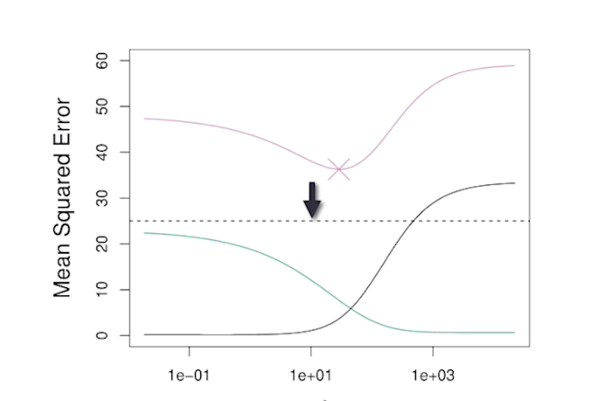
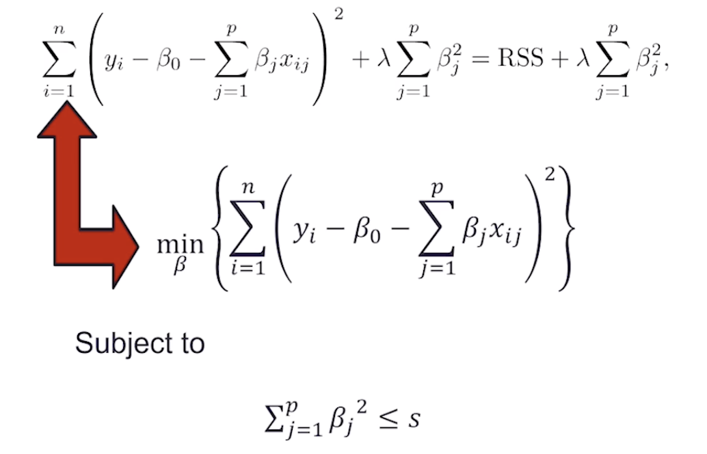

> Quiz: Exercise 6.8: Problems 2 & 3

## 6a.1 Ridge Regression and Effect of Penalty

### Ridge Regression

- **Ordinary Least Squares (OLS)** estimates $\beta's$ by <u>minimizing RSS</u>
  - 
- **Ridge Regression** uses a slightly different function 
  - 
  - $\lambda$ : **tuning parameter** for a given data set $\lambda≥0$ 
  - We have to try several $\lambda$ to find out the best $\lambda$ value
  - Have a tendency to make $\beta$ to become small because the goal of minimization is to find the smallest value for the function. The idea of shrinking is to make some $\beta$ to become zero so that insignificant predictors will leave the model.
  - If $\lambda=0$, ridge regression will reduce to the traditional linear regression obtained from ordinary least squares method
  - If $\lambda$ is very big, that will make all the slope estimates to be 0, only the y intercept in the model

### Effect of Penalty

- This has the effect of “shrinking” large values of $\beta $ towards zero
- It turns out that such a constraint should **improve the fit**, because shrinking the coefficients can significantly **reduce their variance** 
- Notice that when $\lambda=0$ , we get the OLS!  

## 6a.3 Ridge Regression and Bias/Variance Trade-off

- OLS estimates can be **highly variable with many predictors**. In particular when n and p are of **similar** size or when **n < p,** then the OLS estimates will be extremely variable (we cannot build OLS unless we use ridge regression)
- The penalty term makes **the ridge regression estimates biased** but can also substantially **reduce variance** 
- Thus, there is a bias/ variance trade-off

#### Bias/variance trade-off depends on $\lambda$ 

- Black: Bias
- Green: Variance
- Purple: MSE
- **Increase** in $\lambda$ **decreases** variance but **increases** bias
- Usually use a grid search

- When model complexity increases, training MSE will decrease because of overfitting
- The bottom of U-shape is at the optimal trade-off between the bias and variance
- The graph needs to be reversed because when $\lambda$ increases, the **complexity would decrease**
- In general, the ridge regression estimates will be **more biased** than the OLS ones but have **lower variance**
- Ridge regression will work best in situations where the OLS estimates have high variance

## 6a.4 Computational Advantages in Ridge Regression

- If **p is large**, then using the **best subset selection** approach requires searching through **enormous** numbers of possible models (<u>not good</u>)
- With Ridge Regression, for any given $\lambda$ , we only need to fit one model and the computations turn out to be very simple
- **Ridge Regression can even be used when p > n, a situation where OLS fails completely** 

## 6a.5 LASSO

- **LASSO = least absolute shrinkage and selection operator**, a <u>modern</u> method
- Ridge Regression isn’t perfect, <u>classical</u> method
- One significant <u>problem</u> is that the penalty term will almost **never force** any of the coefficients to be **exactly zero**. (Variables with very very small coefficients) Thus, the final model will include most of the variables, which makes it harder to interpret 
- The LASSO works in a similar way to Ridge Regression, except it uses a **different penalty term**  
- **Trade-off**: Lasso restricts the size and number of regression coefficients, more betas are knocked off, so the model is less flexible; more bias because you are forcing a model into the data set; less variance because data changes while the model will not change a lot

#### Formula 

- Ridge Regression minimizes
  - 
- The LASSO estimates the $\beta$ by minimizing (using absolute value)
  - 

## 6a.6 Advantage of LASSO

- This seems like a very **similar idea** but there is a **big difference** 
- Using this penalty, it could be proven that some **coefficients** end up being set to exactly **zero** 
- With LASSO, we can produce a model that has **high predictive power** and it is **simple to interpret** (few predictors in it)

> Problem with ridge regression: either almost all predictors hang in the model with small coefficients or leave the model at the same time
>
> LASSO makes the predictors leave the model sequently 

## 6a.7 Equivalent Formulations for Ridge Regression and LASSO

### Prescriptive Analytics or Optimization 

- Objective: maximize something desired, or minimum something not desirable 
  - 
- Constraint(s)
  - **Feasible solution**: all the x values that satisfy the constraints
    - Sometimes the problem is infeasible
  - **Optimal solution** 
- Decision Variable(s)

### Equivalent formulation

#### Ridge regression

- When $\lambda=0$ and then $s=\infin$, the constraint doesn't restrict $\beta$ and the formulation reduces to the traditional linear regression
- When $s=0$ / $\lambda=\infin$ , $\beta=0$, the new formulation for Ridge Regression will give the same solution. 

#### LASSO 

#### Feasible region

- Green area=feasible region
- LASSO: Rhombus region
- Ridge Regression: circular region
- The best solution for the ordinary least squares is black dot, which has no constraints on $\beta$ so it can exist outside of the region. 
- When it's circular, it's easy to have $\beta$s very small and stay in the model

## 6a.8 Tuning Parameter $\lambda$ 

- **Grid searc**h: Select a **grid** of potential values, use cross validation to estimate the error rate on test data (for each value of $\lambda$) and select the value that gives the least error rate

- Cross validation error:
  - It initially decreases when $\lambda$ increases and eventually shoots up
- Standardized coefficients:

## 6a.9 Bias and Variance

Shrinking the variance but we want to make it close to the average value

## Lab

The name of the first column produced by the **model.matrix**() function is ‘**Intercept**’.

#### Ridge regression