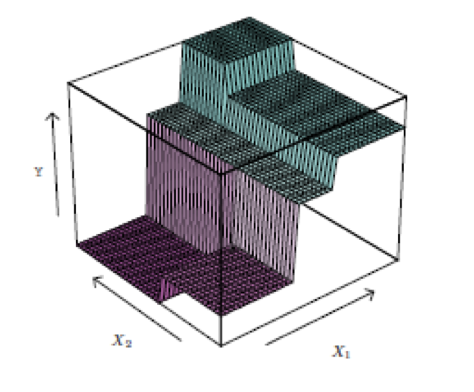
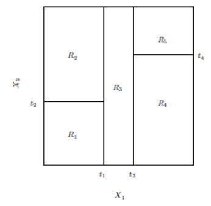
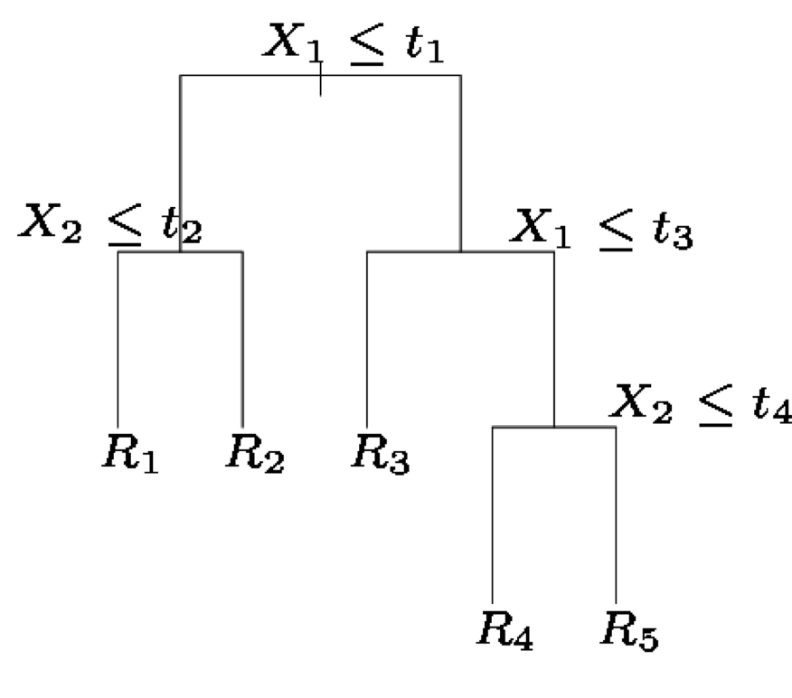
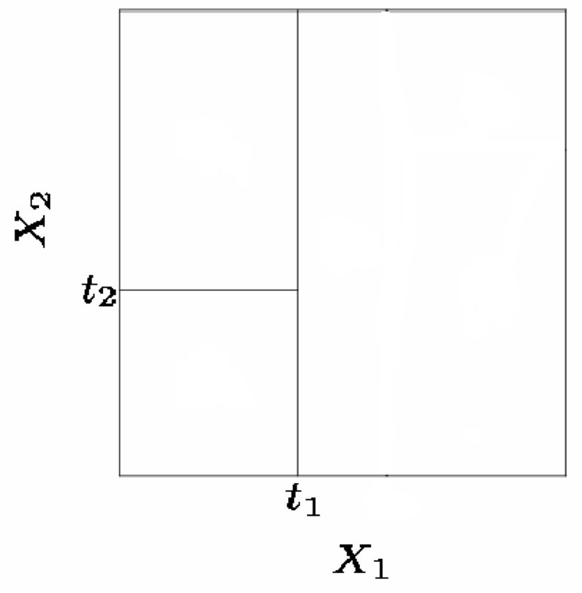
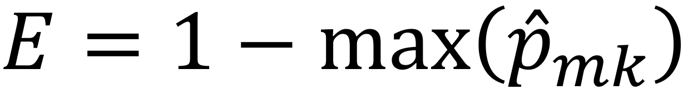
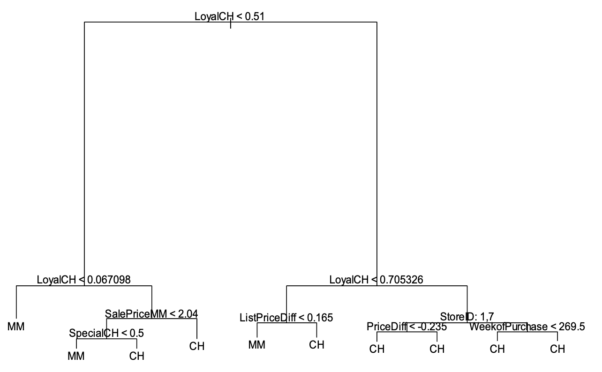
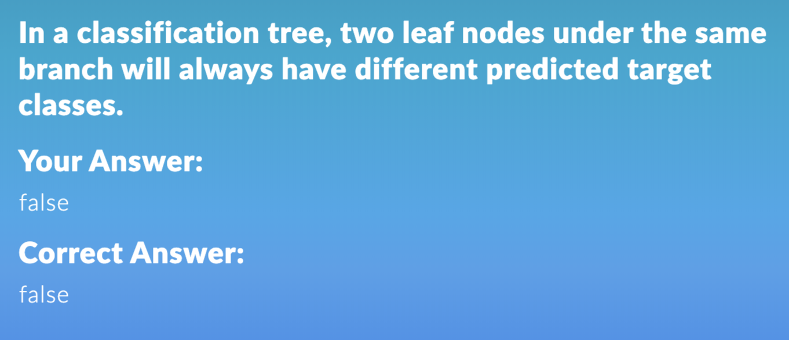
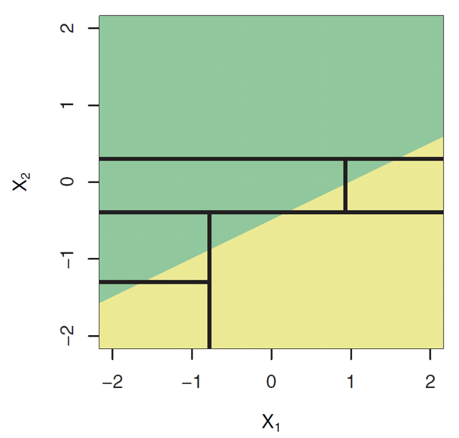
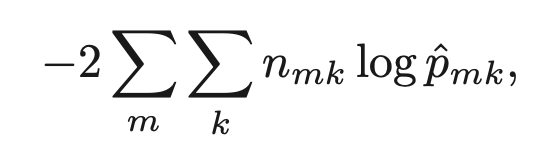

**Quiz: Exercise 8.4: Problems 1, 3, & 4**

**Group Assignment: Exercise 8.4: Problem 9**

**Individual Assignment: Exercise 8.4: Problem 8 (parts a, b, & c)**

### 7a.1: Advantages of trees  

- Easy to use, understand
- Produce rules that are easy to interpret & implement (if... then...)
- Variable selection & reduction is automatic
- Do not require the assumptions of statistical models
- Can work without extensive handling of missing data

### 7a.2 Tree Model: Rules, Structure, and Predictor Space

- **Goal: Classify or predict** an outcome based on a set of predictors
- The output is a set of **rules**
- **Example:** 
  - Goal: classify a record as “will accept credit card offer” or “will not accept”
  - Rule might be “IF (Income > 92.5) AND (Education < 1.5) AND (Family <= 2.5) THEN Class = 0 (nonacceptor)
  - Also called <u>CART</u>, <u>Decision Trees</u>, or just Trees
  - Rules are represented by tree diagrams

####   Partitioning Up the Predictor Space  

- One way to make predictions in a regression problem is to **divide the predictor space** (i.e. all the possible values for for X1,X2,…,Xp) into distinct regions, say R1, R2,…,Rk
  - Non-overlapping small boxes
- Then for every X that falls in a particular region (say Rj) we make the same prediction, 



### 7a.3: Regression Trees  

- Suppose for example we have two regions R1 and R2 with $\hat{Y_1}=10, \hat{Y_2}=20$ 
- Then for any value of X such that $X \in R_1$ we would predict 10, otherwise if $X \in R_2$  we would predict 20. 
- Here we have **two predictors** and five distinct regions
- Depending on which region our new X comes from we would make one of five possible predictions for Y.
- 
- 

### 7a.5 Regression Tree Algorithm

#### What values should we use for $\hat{Y_1}, \hat{Y_2}...\hat{Y_k}$   ?  

For region $R_j$, the best prediction is **simply the average** of all the responses from our training data that fell in region $R_j$. 

#### Where to Split?  

- We consider splitting into two regions, Xj>s and Xj<s for **all possible values of s and j.**
- We then choose the s and j that results in the **lowest MSE** on the training data.
- Here the optimal split was on X1 at point t1.
- Now we repeat the process looking for the next best split except that we must also consider whether to split the first region or the second region up.
- Again the criteria is smallest MSE.
- Here the optimal split was the left region on X2 at point t2. 
- This process continues until our regions have **too few observations** to continue e.g. <u>all regions have 5 or fewer points.</u> 

 

### 7a.6 Classification Tree Algorithm

- A classification tree is very similar to a regression tree except that we try to make a prediction for a categorical rather than continuous Y.
- For each region (or leaf) we <u>predict the most common category among the training data within that region.</u> 
- The tree is grown (i.e. the splits are chosen) in exactly the same way as with a regression tree except that <u>minimizing MSE no longer makes sense</u>.
- There are several possible different criteria to use such as the “**gini index**” and “**cross-entropy**” but the easiest one to think about is to minimize the **error rate**.

#### Classification tree

A classification tree is very similar to a regression tree. However, we cannot use the mean value of the response, so we now predict the most commonly occurring class in a region. Of course, RSS cannot be used as a criterion. Instead, each split is done to minimize the **classification error rate**.

The classification error rate is simply the fraction of training observations in a region that do not belong to the most common class.

 

#### Gini Index

$G= \sum\limits_{k=1}^K\hat{p}_{mk} (1 -\hat{p}_{mk})$ 

K: the number of target classes

m: the leaf of which the "gini index" is calculated

k: the class for which the calculations are performed

$\hat{p}$: proportion of data that belongs to class "k" in the leaf "m"

Seeks for the one giving the smallest training "gini index"; when $\hat{p}=0,1,\ G=0$ 

#### Cross-Entropy

$D=-\sum\limits_{k=1}^K\hat{p}_{mk}log(\hat{p}_{mk})$ 

Seeks for the one giving the smallest training "cross-entropy" 

### 7a.7 Classification Tree Example



 

### 7a.8 Tree Pruning

- A large tree (i.e. one with many terminal nodes) may tend to **over fit** the training data.
- Generally, we can <u>improve accuracy</u> by “pruning” the tree i.e. cutting off some of the terminal nodes.
- How do we know how far back to prune the tree? We use **cross validation** to see which tree has the lowest error rate. 

### 7a.9 Tree vs. Linear Models 

#### Which model is better?

- If the relationship between the predictors and the response is linear, then classical linear models such as linear regression would outperform regression trees
- On the other hand, if the relationship between the predictors is non-linear, then trees would outperform classical approaches

The true decision boundary is linear

- linear model (good)
- decision tree (not good)

The true decision boundary is non-linear

- linear model (not good) 
- decision tree (good)

 

### 7a.10 Pros and Cons of Trees

#### Pros: 

- Trees are very easy to explain to people (probably even easier than linear regression)
- Trees can be plotted graphically, and are easily interpreted even by <u>non-expert</u>
- They work fine on both classification and regression problems

#### Cons:

- Trees don’t have the same prediction accuracy as some of the more advanced approaches like random forest, boosted trees, and neural network.

### Lab

#### Classification tree

Deviance: like error, smaller better (FUN=prune.misclass can change the way to calculate deviance, instead using misclassification) page 325

 

```R
library(tree)

tree.carseats = tree(High~.-Sales,Carseats)

summary(tree.carseats)
>>Number of terminal nodes:  27 
>>Residual mean deviance:  0.4575 = 170.7 / 373 
>>Misclassification error rate: 0.09 = 36 / 400 

plot(tree.carseats)
text(tree.carseats,pretty=0) #draw the text and the tree

tree.carseats #number of observations satisfy the branch

tree.pred=predict(tree.carseats,Carseats.test,type="class") #predictions of class

table(tree.pred,High.test)

mean(tree.pred==High.test) #accuracy rate

set.seed(3)
#cross validation
cv.carseats=cv.tree(tree.carseats,FUN=prune.misclass)
#to use the classification error rate to guide the pruning process

names(cv.carseats)
"size"   "dev"    "k"      "method" #size:leaf nodes, dev: number of misclassification, k=lambda,penalty

cv.carseats

prune.carseats=prune.misclass(tree.carseats,best=9)
#prune to have only 9 leaves

plot(prune.carseats)

text(prune.carseats,pretty=0) #add more details, branching variables, branching rules, and predicted classes
```

#### regression tree

```R
tree.boston=tree(medv~.,Boston,subset=train)

summary(tree.boston)
#there are only few variables used in the prediction

plot(tree.boston)

text(tree.boston,pretty=0) #median value mostly decrease from left to right


yhat = predict(tree.boston,newdata=Boston[-train,]) 

boston.test=Boston[-train,"medv"]

mean((yhat-boston.test)^2) #test MSE


set.seed(1)

cv.boston=cv.tree(tree.boston)

plot(cv.boston$size,cv.boston$dev,type='b') #decide the tree size

prune.boston=prune.tree(tree.boston,best=7) #best is 7, unpruned tree is 8, not necessary

plot(prune.boston)

text(prune.boston,pretty = 0)
```

