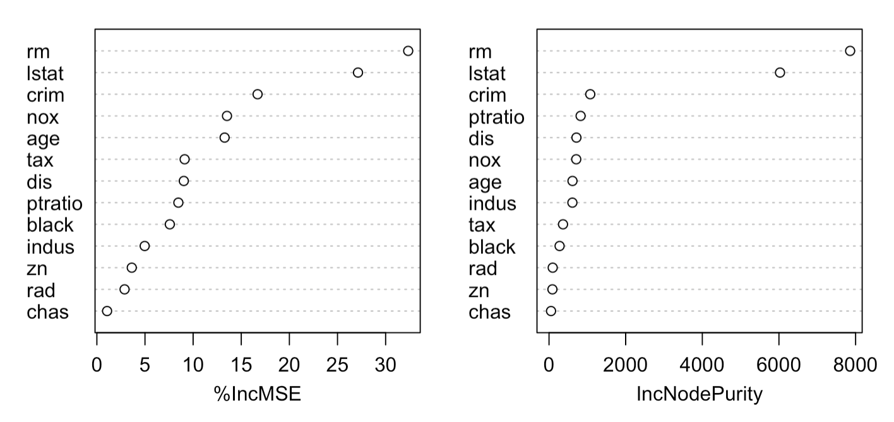
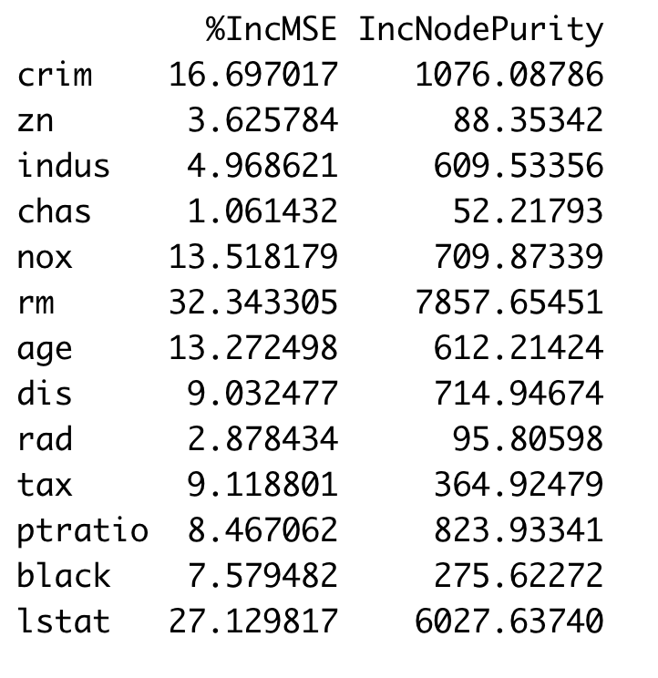

> **Quiz: Exercise 8.4: Problems 2 & 5**
>
> **Group Assignment: Exercise 8.4: Problem 12**
>
> **Individual Assignment: Exercise 8.4: Problem 8 (parts d & e); Problem 10** 

### 8a.1 Problem with Trees and Solution

- Tree models discussed earlier suffer from <u>high variance</u>!
  - If we randomly split the training data into 2 parts, and fit decision trees on both parts, the results could be quite different (2 trees are different)

- We would like to have models with low variance
- To solve this problem, we can use bagging (**b**ootstrap **agg**regat**ing**).     

#### Bootstrapping is simple!   

- Before, we use bootstrapping 
- Resampling of the observed dataset (and of equal size to the observed dataset), each of which is obtained by random sampling with replacement from the original dataset. Let us see the Bootstrapping idea with an example.
-  

### 8a.2 Bagging for Classification and Regression

- **Bagging** is an extremely powerful idea based on two things: 
  - **<u>Averaging: reduces variance</u>!** 
  - **<u>Bootstrapping</u>**: plenty of <u>training datasets</u>! 

- Why does averaging reduces variance?
  - Averaging a set of observations reduces variance. Recall that given a set of n independent observations $Z_1, …, Z_n$, each with variance $\sigma^2$, the variance of the mean $\bar{Z}$ of the observations is given by $\frac{\sigma^2}{n}$ 

- Generate B different bootstrapped training datasets
- Train the statistical learning method on each of the B training datasets, and obtain the prediction 
- For **prediction**:
  - <u>Regression</u>: **average** all predictions from all B trees
  - <u>Classification</u>: <u>**majority vote** among all B trees</u> 

#### Bagging for Regression Trees  

- Construct B regression trees using B bootstrapped training datasets
- **Average** the resulting predictions
- Note: These trees are **not pruned**, so each individual tree has **high variance** but **low bias**. Averaging these trees <u>reduces variance</u>, and thus we end up lowering both variance and bias (so we could reduce the bias and also the variance)

#### Bagging for Classification Trees  

- Construct B classification trees using B bootstrapped training datasets
- For prediction, there are two approaches: 
  - Record the class that each bootstrapped data set predicts and provide an overall prediction to the most commonly occurring one (<u>majority vote</u>).
  - If our classifier produces probability estimates we can just <u>average the probabilities</u> and then predict to the class with the highest probability.
  - Outperforms the single tree but these two are alike
- Both methods work well. 

### 8a.3 Examples: 


- Here the green line represents a simple majority vote approach
- The purple line corresponds to averaging the probability estimates.
- Both do far better than a single tree (dashed red) and get close to the Bayes error rate (dashed grey).

#### Bagged tree models always come out among the top 

> If the trees are highly correlated, bagging is not effective reducing the variance. 

### 8a.4 Out-of-Bag Error Estimation

- Since bootstrapping involves random selection of subsets of observations to build a training data set, then the remaining non-selected part could be the testing data. 
- On average, each bagged tree makes use of around **2/3** of the observations, the remaining **1/3** of the observations not used for a given tree are referred to use as **out-of-bag observations**. 
- For a given observation *i*, we can **predict** or classify the target using the trees in which that observation is **out-of-bag**. Then we can **average** those predictions to get a single prediction for the observation *i*. We repeat this same process for every observation.
- Avoid the separate procedure to <u>estimate the error</u> 

### 8a.5: Variable Importance Measure  

- Bagging typically improves the accuracy over prediction using a single tree, but it is now **hard to interpret** the model! 
- We have hundreds of trees, and it is no longer clear which variables are used in the model
- Thus bagging improves **prediction accuracy** at the expense of **interpretability**
- But, we can still get an overall summary of the importance of each predictor using **Relative Influence Plots** 

#### Relative Influence Plots  

How do we decide which variables are most useful in predicting the response?

- We can plot something called relative influence plots.
- These plots give a score for top variables. 
- These scores indicate the **effectiveness** of the predictor in decreasing the MSE when splitting on it.
- A number **close to zero** indicates the variable is not important and could be **dropped**.
- The **larger** the score the more influence the variable has. 

##### Example: Boston Data  


- Median Income is by far the most important variable.
- Longitude, Latitude and Average occupancy are the next most important.

### 8a.6: Random Forests  

> Restrict the predictors; reduce the variance better than bagging especially when there's a dominating predictor
>
> No pruning; grow many trees 

- It is a <u>very efficient</u> machine learning method
- It builds on the idea of bagging, but it provides an improvement because it **de-correlates** the trees
- How does it work?
  - Build a number of decision trees on bootstrapped training sample, but when building these trees, each time a split in a tree is considered, a random sample of *m* predictors is chosen as split candidates from the full set of *p* predictors (Usually $m≈\sqrt{p}$ ) 

#### Why are we considering a random sample of m predictors instead of all p predictors for splitting?  

- Suppose that we have a very strong predictor in the data set along with a number of other moderately strong predictor, then in the collection of bagged trees, most or all of them will use the very strong predictor for the first split!
- All bagged trees will look similar. Hence all the predictions from the bagged trees will be highly correlated
- **Averaging many highly correlated quantities does not lead to a large variance reduction**, and thus random forests “de-correlates” the bagged trees leading to more reduction in variance

#### Random Forest with different values of “m”  


Notice when random forests are built using m = p, then this amounts simply to bagging.

------------------------

### 8b.1 History of Ensemble Ideas

#### Initial Ideas on Combining Trees  

- **Ensemble**: Idea that **combining** good methods could yield promising results was suggested by researchers more than a decade ago
  - In tree-structured analysis, suggestion stems from:
    - Wray Buntine (1991)
    - Kwok and Carter (1990)
    - Heath, Kasif and Salzberg (1993)

- Notion is that if the trees can somehow get good at **different aspects of the data**, the combination will be “better”
  - Better in this context means more <u>accurate in classification and prediction</u> for future cases

#### Past Development  

- The original approaches relied on **sampling with replacement** techniques to obtain a new modeling dataset
- Most important variants (and dates of published articles) are:
  - **M**ultiple **A**dditive **R**egression **T**rees (Friedman, 1999, aka **MART**™ or TreeNet™)
    - Evolved into "<u>Boosted trees</u>"
  - **RandomForests**™ (Breiman, 2001)
    - "adaboost" package
- Work continues

> <u>**Bagged Trees, Random Forest, and Boosted Trees are examples of ensemble models.**</u>

### 8b.2 Building Boosted Trees Mode

> First tree: predict y (500); 4/6 nodes, very small 
>
> Second tree: predict the residual (250)
>
> Third tree: predict the residuals of second tree(125)
>
> Try to collect the mistakes before
>
> And then cut the tree, ignore the remaining, avoid overfitting
>
> Can tune the number of trees, the number of terminal nodes on each tree, tune shrinkage (e.g., 500+$\lambda$*250) (slow or fast, most important parameter in boosted trees)

- Boosted Trees is a new approach to machine learning and function approximation developed by Jerome H. Friedman at Stanford University
  - Co-author of CART® with Breiman, Olshen and Stone
  - Author of MARS®, PRIM, Projection Pursuit, COSA, RuleFit™ and more

- Also known as Stochastic Gradient Boosting and MART (Multiple Additive Regression Trees)
- Naturally supports the following classes of predictive models
  - Regression 
  - Binary classification 
  - Multinomial classification 

- **Committees of experts** and **boosting**

#### Process  

- Begin with **one** very small tree as initial model
  - Could be as small as **ONE split** generating **2 terminal nodes**
  - Default model will have **4-6 terminal nodes**
  - Final output is a **predicted target** (regression) or **predicted probability** 
  - First tree is an intentionally “weak” model
- Compute “residuals” for this simple model (**prediction error**) for every record in data (even for classification model)
- Grow **second** small tree to predict the **residuals** from first tree (correct the errors made by the first tree)
- New model is now:  Tree1 **+** Tree2
- Compute **residuals** from this new **2-tree model** and grow 3rd tree to predict revised residuals


#### Key Control  

- Trees are kept small (2-6 nodes common)
  - **Interaction.depth** = 4
- Updates are small – can be as small as .01, .001, .0001 (learning rate)
  - **shrinkage** = 0.01 (default is 0.001; smaller then slower)

- distribution = “**Gaussian**” or “**Bernoulli**” (binary classification question) or "**multinomial**" (other classification)
- Number of trees
  - n.trees = 5000 (500-5000)

### 8b.3 Boosted Trees Model Advantages Strength & Success

#### Strengths  

- Built on CART (classification and regression trees) trees and thus 
  - immune to outliers
  - selects variables 
  - handles missing values automatically

- Resistant to **mislabeled** target data
- Resistant to over training – **generalizes** very well (learning rate ensures the model learns the patterns slowly from the data)
- Can be remarkably accurate with little effort
- Trains very **rapidly**; comparable to CART

#### Interpretation  

- As Boosted Trees consist of hundreds or even thousands of trees there is no useful way to represent the model via a display of one or two trees
- However, the model can be summarized in a variety of ways
  - **Partial Dependency Plots**: These exhibit the **relationship** between the target and any predictor – as captured by the model
    - The partial dependence plot will show the marginal effect of a predictor on the target after integrating out the effect of other predictors.
  - **Relative Importance Plots**: These scores give an excellent assessment of the **relative importance** of predictors

### Lab

#### Bagged trees

```r
library(randomForest)

set.seed(1)

bag.boston = randomForest(medv~., data=Boston, subset=train, mtry=13, importance=TRUE) 
#mtry: we want to use all 13 predictors in the data as candidates
#importance=TRUE: calculate the variable importance scores

bag.boston
```

```R
bag.boston = randomForest(medv~.,data = Boston, subset=train, mtry=13, ntree=25)
#ntree=25: we only need 25 tree models 

yhat.bag = predict(bag.boston,newdata = Boston[-train,])

mean((yhat.bag-boston.test)^2)
```

#### random forest

```
set.seed(1)

rf.boston = randomForest(medv~.,data=Boston,subset=train,mtry=6,importance = TRUE)

yhat.rf = predict(rf.boston,newdata = Boston[-train,])

mean((yhat.rf-boston.test)^2)
```

#### Variance importance plot

```R
varImpPlot(rf.boston)
#left: based on how much accuracy will be lost if the variable is removed from the model
#right: based on how much node impurity is reduced by splitting on the predictor
#rm and lstat are both important
```



```
importance(rf.boston)
```



### boosted trees

```R
library(gbm)

set.seed(1)

boost.boston = gbm(medv~.,Boston[train,],distribution = "gaussian", n.trees=5000,interaction.depth=4)
#distribution = "gaussian": target variable is numeric
#n.trees=5000: we want 5000 trees in the model
#interaction.depth=4: restrict the number of leaf nodes in each tree to be at most 4

summary(boost.boston)

yhat.boost=predict(boost.boston,newdata=Boston[-train,],n.trees=5000)

boston.test=Boston[-train,"medv"]

mean((yhat.boost-boston.test)^2)
```

        Relative importance scores


#### Partial importance plot

```R
par(mfrow=c(1,2))

plot(boost.boston,i="rm")

plot(boost.boston,i="lstat")

par(mfrow=c(1,1))
```


```R
boost.boston = gbm(medv~.,data=Boston[train,],distribution="gaussian",n.trees=5000,interaction.depth=4,shrinkage=0.2,verbose=F)
#shrinkage: learning rate
#verbose=F: not to output the progress report to the screen while building the model

yhat.boost=predict(boost.boston,newdata=Boston[-train,],n.trees=5000)

mean((yhat.boost-boston.test)^2)

yhat.boost=predict(boost.boston,newdata=Boston[-train,],n.trees=500)
#only use first 500 trees

mean((yhat.boost-boston.test)^2)
```

