## Support vector classifier

### Separable Hyperplane 

- Imagine a situation where you have a two class classification problem with **two predictors** X1 and X2.
- Suppose that the two classes are “**linearly separable**” i.e. one can draw a straight line in which all points on one side belong to the first class and points on the other side to the second class.
- Then a natural approach is to find the **straight line that gives the biggest separation between the classes** i.e. the points are as far from the line as possible
- This is the basic idea of a **support vector classifier**.

#### Its Easiest To See With A Picture  

- C is the minimum perpendicular distance between each point and the separating line.
- We find the **line which maximizes C**.
- This line is called the “**optimal separating hyperplane**”
- The classification of a point depends on which side of the line it falls on. 

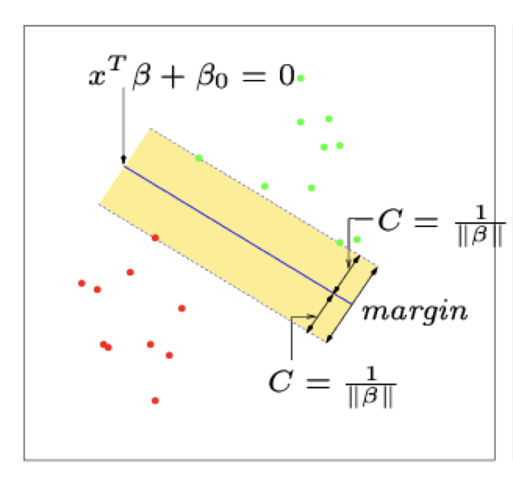

#### More Than Two Predictors  

- This idea works just as well with more than two predictors. 
- With more than two dimensions it becomes hard to visualize a plane but it still exists. In general they are caller hyper-planes. 

### Non-Separating Classes  

- In practice, it is **not usually possible** to find a hyper-plane that perfectly separates two classes.
- In other words, for any straight line or plane that I draw there will always be **at least some points on the wrong side** of the line.
- In this situation we try to find the plane that gives the best separation between the points that are correctly classified subject to the points on the wrong side of the line not being off by too much.
- It is easier to see with a picture!

- Let ξ*i represent the amount that the ith point is on the **wrong side of the margin (the dashed line).**
- Then we want to maximize C subject to 
- 
- The **constant (budget) is a tuning parameter** that we choose.

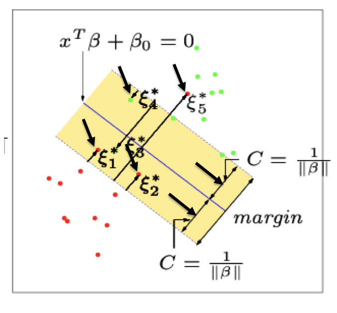

### A Simulation Example With A Small Constant  

- Simulation example
- The purple lines represent the Bayes decision boundaries
- The distance between the dashed lines represents the margin or 2C.

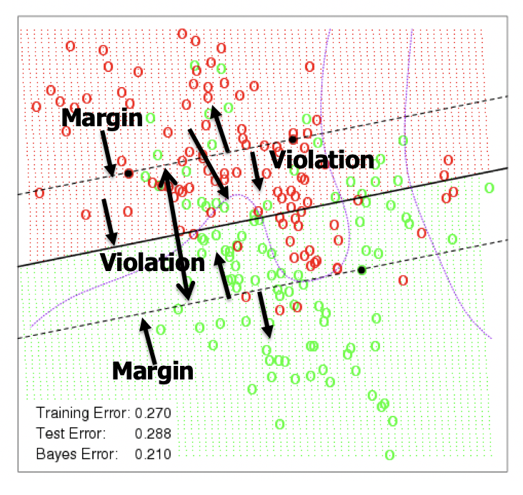

- Using a **larger constant** allows for a **greater margin** and creates a different classifier model.
- Notice, however, that the decision boundary must always be linear.

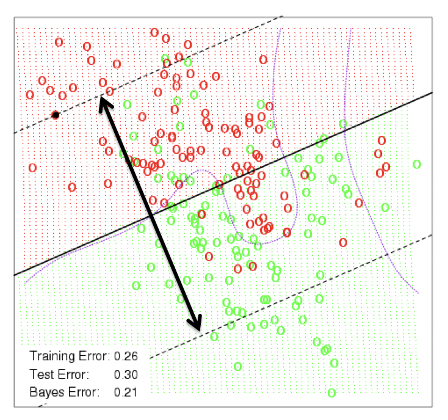

## **Maximal margin classifier**

When there's no violation in support vector classifier

## Support vector machine

### Non-Linear Classifier  

- The support vector classifier is fairly easy to think about. However, because it only allows for a linear decision boundary it may not be all that powerful.
- Recall how we extend linear regression to non-linear regression i.e.


### A Basis Approach  

- The support vector classifier finds the optimal hyper-plane in the space spanned by X1, X2,…, Xp.
- Instead we can create **transformations** (or a basis) b1(x), b2(x), …, bM(x) and find the optimal hyper-plane in the space spanned by b1(**X**), b2(**X**), …, bM(**X**).
- This approach produces a **linear plane in the transformed space but a non-linear decision boundary in the original space**. 
- This is called the **Support Vector Machine Classifier**.
-  It should be true

### Inner Product  

- **We don’t actually choose b1(x), b2(x), …,** **bM(x)**.
- Instead we choose something called a **Kernel function** which takes the place of the basis.
- Only the **inner product of observations matters** 
- 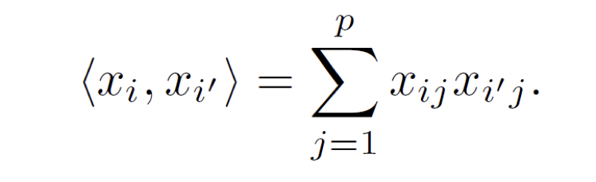
- Linear Support Vector Classifier:

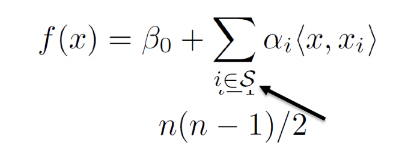

- Replace inner products with **a general form of inner products**
- This is called a **Kernel function** 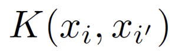

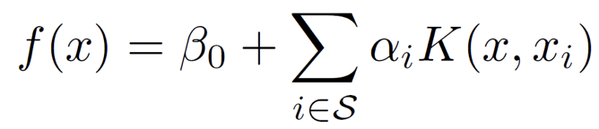

- Common kernel functions include
- 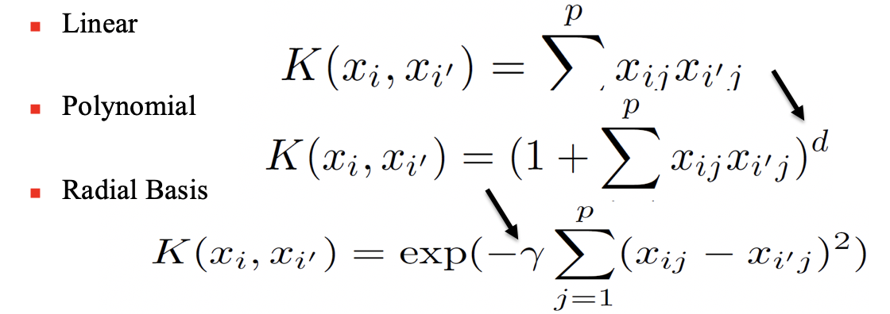
  - determined by cross validation

### Polynomial Kernel On Sim Data  

- Using a polynomial kernel we now allow SVM to produce a non-linear decision boundary.
- Notice that the test error rate is a lot lower.

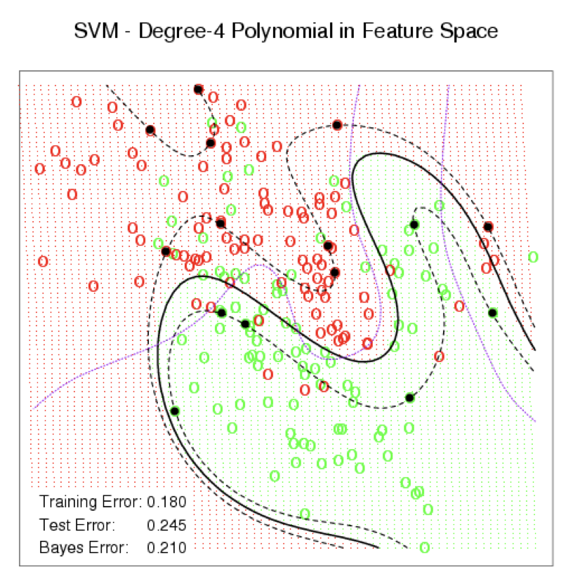

### Radial Basis Kernel  

Using a Radial Basis Kernel you get an even lower error rate.

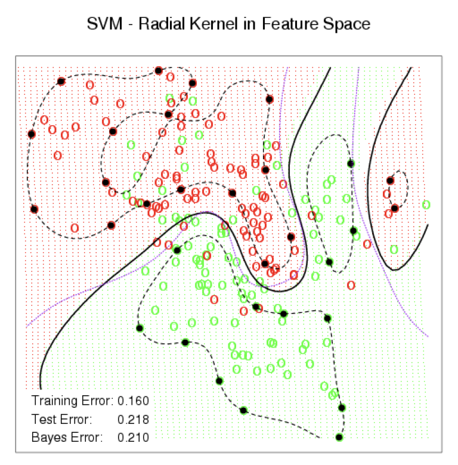

### Error Rates on S&P Data  

- Here, book used a Radial Kernel and calculated the error rate for different values of the **tuning** parameter.
- The results on this data were not as good as Boosting

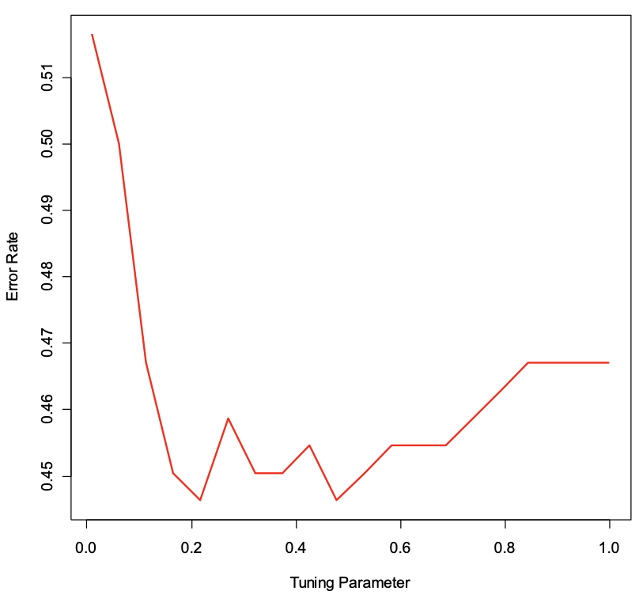

### Lab

```R
library(e1071)

svcfit=svm(y~.,data = dat, kernel = "linear", cost=10,scale = FALSE) 
#kernel = "linear": support vector classifier, not machine
#cost of violation, small then allow more violations, big then allow fewer violation, control the number of violations; in contract of "budget" 

plot(svcfit, dat)

svcfit$index

summary(svcfit)

## Cross-Validation to find cost
set.seed(1)

tune.out = tune(svm,y~.,data = dat, kernel = "linear", ranges = list(cost = c(0.001, 0.01, 0.1, 1, 5, 10, 100))) #10-fold cross validation

summary(tune.out) #standard deviation of error

bestmod = tune.out$best.model

summary(bestmod) 

train = sample(200, 100)

svmfit = svm(y~., data = dat[train,], kernel ="radial", gamma = 1, cost = 1) #support vector machine

plot(svmfit, dat[train,])

summary(svmfit)
```

