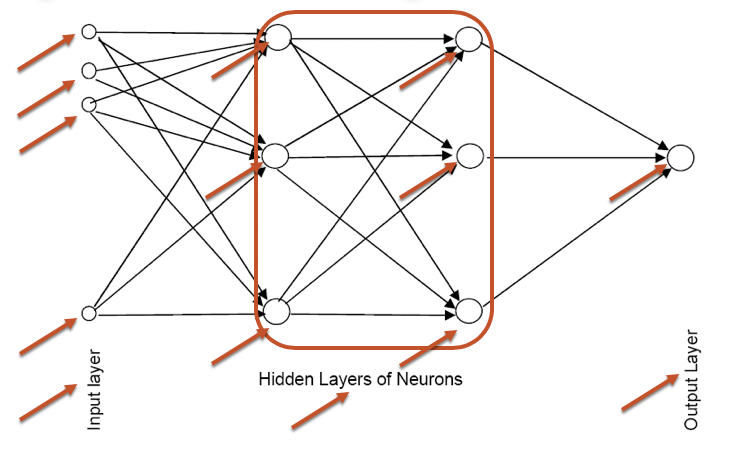
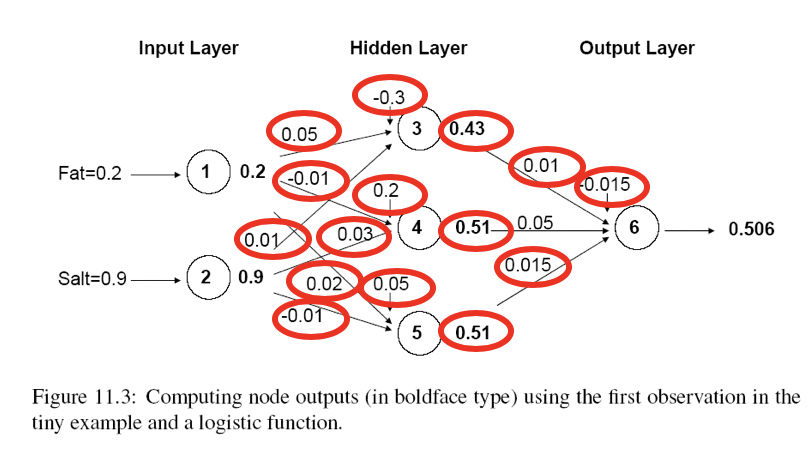
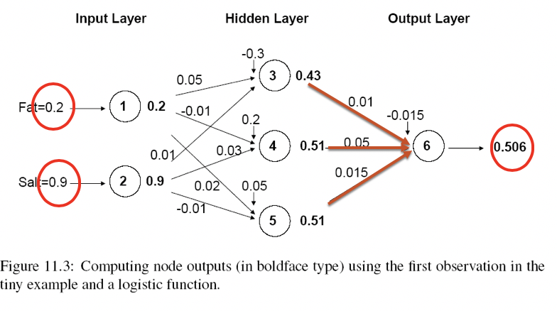
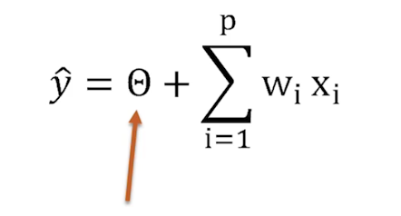
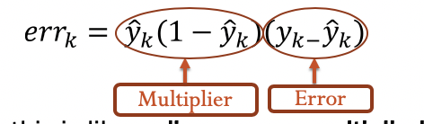
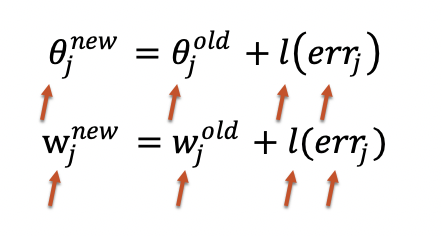

### 10.1a: Basic Idea   

- —Combine input information in a **complex & flexible** neural net “model”
- Model “**coefficients**” are continually **tweaked** in an iterative process
- The network’s **interim performance** in classification and prediction informs successive **tweaks**

### 10.2a: Network Structure  

- —Multiple layers
  - —Input layer (data get fed)
    - The output of the input layer is the same as the input
  - —Hidden layers (usually at least one)
  - Output layer 
- Nodes
- Weights (like coefficients, subject to iterative adjustment)

#### Schematic Diagram  

- **More nodes** and layers: more **non-linear** 
- **Regression** problem: only one node in the output layer

- **Classification** problem: one node for each class

- **Big** data sets are **preferred** for building the neural network models.

- Building network may be problematic when the number of predictors are large

  

### 10.5a: The Weights  

- The weights **$\theta$** **(theta) and** **w** are typically initialized to random values in the range **-0.05 to +0.05**
- Equivalent to a model with **random prediction** (in other words, no predictive value)
- These **initial weights** are used in the **first round of training**

#### Initial Pass of the Network  

​     Output of Node 3, if *g* is a **Logistic Function**  (one of the activation function)

### 10.6a: The output node  

Use same function used in the hidden layer, i.e. a **function** **g** of the **weighted average**

#### Relation to Linear Regression  

- No Hidden Layer
- One Output Node
- Activation Function – Identity Function
- 
  - We can have even a linear model 

### 10.8a: Preprocessing Steps  

- —**Scale variables** to 0-1(numerical predictors)
- —**Categorical Predictors**
  - —Create **dummy variables**
  - —If **equidistant categories**, map to equidistant interval points in 0-1 range
- —Transform (e.g., log) **skewed variables**

### 10.9a: Initial Pass Through Network  

- **Goal:** Find **weights that yield best predictions**
- —The process we described before is repeated for all records
- —At each record, **compare** **prediction to actual**
- —Difference is the **error** for the output node
- —**Error is propagated back** to the architecture to **update the weights**

#### Back Propagation (“back-prop”)  

- —Output from output node k:  
- —Error associated with that node: 
  -  
- Note: this is like **ordinary error**, **multiplied by a correction factor**

#### Error is Used to **Update Weights**   

*l* = constant between 0 and 1, reflects the “**learning rate**” or “**weight decay parameter**”

### **10.10a: Case Updating**  

- —Weights are updated **after each record** is run through the network
- Completion of all records through the network is one **epoch** (also called **sweep** **or** **iteration**)
- —**After one epoch** is completed, **return to first record** and **repeat the process**

### 10.10a: Batch Updating  

- —**All records** in the training set are fed to the network before updating takes place
- —In this case, the error used for updating is the **Average of all errors** from all records

#### Why It Works  

- —**Big errors** lead to **big changes** in weights
- **Small errors** leave weights **relatively unchanged**
- —Over thousands of updates, a given weight keeps changing until the error associated with that weight is negligible, at which point weights change little

###  10.11a: Common Criteria to Stop the Updating  

- —When **weights change very little** from one iteration to the next
- When the **misclassification rate/prediction accuracy** reaches a required threshold
- When a **limit on runs** is reached

#### Avoiding Overfitting  

- With sufficient iterations, neural net can **easily** **overfit** the data
- To avoid overfitting:
  - Track error in **validation** data
  - Limit **iterations** 
  - **Limit complexity** of network

### 10.12a: Specify Network Architecture  

- **Number of hidden layers**
  - Most popular – one hidden layer
- **Number of nodes in hidden layer(s)**
  - —More nodes capture complexity, but increase chances of overfit
- **Number of output nodes**
  - For classification, **one node per class (in binary case can also use one)**
  - For numerical prediction use one

#### Network Architecture, cont.  

- **“Learning Rate”** (*l)*
  - —**Low values** “downweight” the new information from errors at each step.  
  - This slows learning, but reduces the tendency to **move out of local structure**
- **“Momentum”** 
  - —**High values** keep weights changing
  - Moves out of local structures quickly

### 10.13a: Advantages  

- —Good **predictive ability**
  - Deep learning
- Can capture **complex relationships** 
  - Highly non-linear
- —No need to specify a model
  - Choose the architecture and tune the rate

#### Disadvantages  

- —Considered a “**black box**” prediction machine, with no insight into relationships between predictors and outcome
- No **variable-selection** mechanism, so you have to exercise care in selecting variables
- Heavy **computational requirements** if there are many variables (additional variables dramatically increase the number of weights to calculate)

### Summary  

- —Neural networks can be used for **classification and regression**
- —Can capture a very **flexible/complicated relationship** between the outcome and a set of predictors
- —The network **“learns” and updates** its model iteratively as more data are fed into it
- Major danger: **overfitting**
- Requires **large amounts of data**
- Good **predictive performance**, yet “black box” in nature (poor interpretability)

