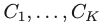

### 11a.1: Supervised vs. Unsupervised Learning  

- Supervised Learning: both X and Y are known
- Unsupervised Learning: only X

### 11a.2: Clustering  

- Clustering refers to a set of techniques for finding **subgroups, or clusters**, in a data set.
- A **good clustering** is one when the observations within a group are similar but between groups are very different
- For example, suppose we collect p measurements on each of **n breast cancer patients**. There may be different unknown types of cancer which we could discover by clustering the data

#### Different Clustering Methods  

- There are many different types of clustering methods
- We will concentrate on two of the most commonly used approaches
  - K-Means Clustering
  - Hierarchical Clustering

### 11a.3: K-Means Clustering  

- To perform K-means clustering, one must first specify the **desired number of clusters K**
- Then the K-means algorithm will assign each observation to exactly one of the K clusters

#### How does K-Means work?  

- We would like to partition that data set into K clusters
- Each observation belong to **one** of the K clusters
- The clusters are **non-overlapping**, i.e. no observation belongs to more than one cluster
- The objective is to have a **minimal “within-cluster-variation**”, i.e. the elements within a cluster should be as similar as possible
  - *The objective of the K-Means Clustering is to minimize the within pair-wise squared Euclidean distances between observations.*
- One way of achieving this is to minimize the sum of all the **pair-wise squared Euclidean distances** between the observations in each cluster. 


### 11a.4: K-Means Algorithm  

- Step 1: **Randomly assign each observation** to one of K clusters
- Step 2: Iterate until the cluster assignments stop changing: 
  - Step 2a: For each of the K clusters, compute the **cluster centroid**. 
    - May be a vector if multi-dimensional
  - Step 2b: Assign each observation to the cluster whose **centroid is closest** (where “closest” is defined using Euclidean distance.

#### An Illustration of the K-Means Algorithm   


#### Local Optimums  

- The K-means algorithm can get stuck in “local optimums” and not find the best solution
  - *Depend on the initial assignment at the beginning* 
- Hence, it is important to **run the algorithm multiple times** with random starting points to find a good solution


### 11a.5: Hierarchical Clustering  

-  K-Means clustering requires **choosing the number of clusters**.
  - *High dimension, we cannot determine the number of k* 
- If we don’t want to do that, an alternative is to use Hierarchical Clustering
- Hierarchical Clustering has an added advantage that it produces a **tree based** **representation** of the observations, called a Dendogram

### 11a.6: Dendograms  

- First join closest points (5 and 7)
- Height of fusing/merging (on vertical axis) indicates how similar the points are
  - **On a Dendogram, the height of the fusion indicates the similarity of the fusing clusters.** 
- After the points are fused they are treated as a single observation and the algorithm continues
- 

### 11a.7: Interpretation  

- Each “leaf” of the dendogram represents one of the 45 observations
- At the bottom of the dendogram, each observation is a distinct leaf. However, **as we move up the tree, some leaves begin to fuse**. These correspond to observations that are similar to each other.
- As we move higher up the tree, an increasing number of observations have fused. The earlier (lower in the tree) two observations fuse, the more similar they are to each other.
- Observations that fuse later are quite different


#### Choosing Clusters  

- To choose clusters we **draw lines across** the dendogram
- We can form any number of clusters depending on where we draw the break point.
  - *Depend on where we cut the dendrogram*


### 11a.8: Algorithm (Agglomerative Approach)  

- The dendogram is produced as follows:
  - Start with **each observation as a separate cluster** (n clusters)
  - Calculate a **measure of dissimilarity between all points**/ clusters
  - **Fuse two clusters that are most similar** so that there are now n-1 clusters
  - **Fuse next two most similar clusters** so there are now n-2 clusters
  - **Continue until there is only 1 cluster**

#### An Example  

- Start with 9 clusters
- Fuse 5 and 7
- Fuse 6 and 1
- Fuse the (5,7) cluster with 8.
- Continue until we have only one cluster.


### 11a.9: How do we define dissimilarity?  

- Implementing hierarchical clustering involves one obvious issue
- How do we define the dissimilarity, or linkage, between the fused (5,7) cluster and 8?
- There are four options:
  - Complete Linkage
  - Single Linkage
  - Average Linkage
  - Centroid Linkage

#### Linkage Methods: Distance Between Clusters  

- **Single Linkage:** Smallest distance between observations (train-like, more far away; not ideal)
- **Complete Linkage:** Largest distance between observations 
- **Average Linkage**: Average distance between observations
- **Centroid:** distance between centroids of the observations 

#### Linkage Can be Important  

- Here we have three clustering results for the same data
- The only difference is the linkage method but the results are very different
- **Complete and average linkage** tend to yield **evenly sized clusters** whereas single linkage tends to yield extended clusters to which single leaves are fused one by one.


### 11a.10: Comparing Dissimilarity Measures  

- In this example, we have 3 observations and p = 20 variables
- In terms of Euclidean distance obs. 1 and 3 are similar
- However, obs. 1 and 2 are highly correlated so would be considered similar in terms of correlation measure


#### Choice of Dissimilarity Measure  

- So far, we have considered using **Euclidean distance** as the dissimilarity measure
- However, an alternative measure that could make sense in some cases is the **correlation based** **distance**

### 11a.11: Shopping Example  

- Suppose we record the number of purchases of each item (columns) for each customer (rows)
- Using **Euclidean distance, customers who have purchases very little** will be clustered together
- Using c**orrelation measure, customers who tend to purchase the same types of products** will be clustered together even if the magnitude of their purchase may be quite different

#### Standardizing the Variables  

- Consider an online shop that sells two items: socks and computers
  - Left: In terms of quantity, socks have higher weight
  - Center: After standardizing, socks and computers have equal weight
  - Right: In terms of dollar sales, computers have higher weight


### 11a.12: Practical Issues in Clustering   

- In order to perform clustering, some decisions must be made: 
  - Should the features first be **standardized?** i.e. Have the variables centered to have a mean of zero and standard deviation of one.
  - In case of hierarchical clustering:
    - What **dissimilarity measure** should be used?
    - What type of **linkage** should be used?
    - Where should we **cut** the dendogram in order to obtain clusters?
  - In case of K-means clustering:
    - How many **clusters** should we look for the data?
- In practice, we try several different choices, and look for the one with the most useful or interpretable solution. There is no single right answer! 

#### Final Thoughts  

- Most importantly, one must be careful about how the results of a clustering analysis are reported
- These results should **not be taken as the absolute truth** about a data set
- Rather, they should constitute a **starting point** for the developments of a scientific hypothesis and further study, preferably on independent data

### Lab 

#### k-means

```R
set.seed(4) ## setting seed is important because the random starts involved in the k-means clustering

km.out = kmeans(x,2,nstart=20) ## 2 clusters, 20 random starts

km.out$cluster ## which data went to which cluster

km.out$tot.withinss ## total within sum of squares

plot(x, col=(km.out$cluster+1), main = "K-Means Clustering Results with K = 2", xlab="", ylab="", pch=20,cex=2)
```

#### hierarchical clustering

```R
hc.complete = hclust(dist(x), method = "complete") ## complete linkage

hc.average = hclust(dist(x), method = "average") ## average linkage

hc.single = hclust(dist(x), method = "single") ## single linkage

par(mfrow=c(1,3))
plot(hc.complete,main="Complete Linkage", xlab = "", sub="", cex=0.9)
plot(hc.average,main="Average Linkage", xlab = "", sub="", cex=0.9)
plot(hc.single,main="Single Linkage", xlab = "", sub="", cex=0.9)
par(mfrow=c(1,1)) ## reset output window one by one

## cut tree
cutree(hc.complete,2) ##into 2 clusters
cutree(hc.average,2)
cutree(hc.single,2)
```

```R
set.seed(2)

x = matrix(rnorm(30*3), ncol = 3)

transPdata = t(x)

Similarity = cor(transPdata)

Dissimilarity = 1-cor(Similarity) ## calculate dissimilarity

DissimilarityDistance = as.dist(Dissimilarity)

plot(hclust(DissimilarityDistance,method = "complete"), main = "Complete Linkage with Correlation-Based Distance", xlab = "", sub="")
```


