### 12a.1: Principal Components Analysis  

- **Goal:** Reduce the **dimension** of **numerical data**.
- **The idea**: When faced with a large set of **correlated variables**, principal components allow us to summarize this set with a smaller number of representative variables that **collectively explain** most of the variability in the original data set. Focuses on the direction along which the original data are **highly variable.**
- **Final product:** A **smaller number of numerical variables** that contain most of the information

#### Scatter Plot Matrix

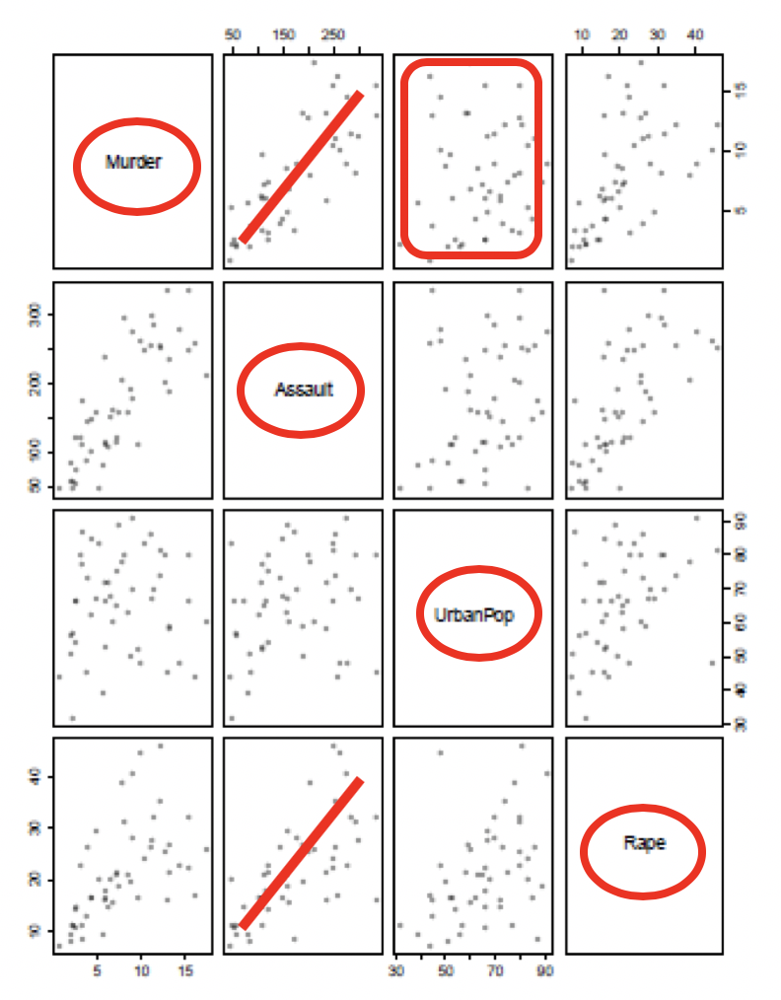

- —Create new variables that are **linear combinations of the original variables** (i.e., they are weighted averages of the original variables). 
- These new variables are **uncorrelated** (no information overlap), and **only a few** of them contain **most of the original** information.
- —The **new variables/dimensions are called** **principal components**.

### 12a.2: How It Works

**How does PCA do this?** 

—The *first principal component* of a set of features $X_1, X_2, …, X_p$ is the normalized linear combination of the features

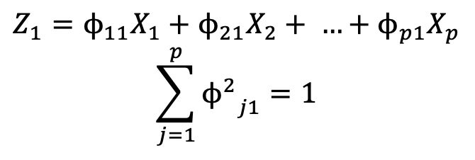

$ϕ_{11}, ϕ_{21}, …, ϕ_{p1}$ are the **loadings** of the first principal component

- —Given a *n* * *p* data set **X, how do we compute the first principal component?**

- —Center variables in **X** to have <u>mean zero</u> i.e. column means are zero

- —We are looking for linear combinations of the form

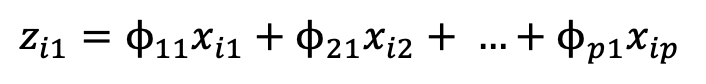

​		that has the <u>largest variance</u>, subject to the constraint that 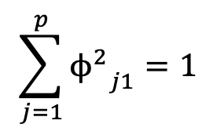

- (To avoid the loadings to become arbitrarily **big**)

- To get first principal component loading vector, solve  
  - x: mean of 0
  - <u>Maximize the variance</u> of the data

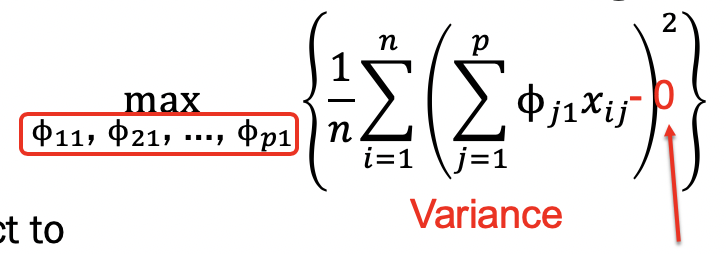

- Subject to 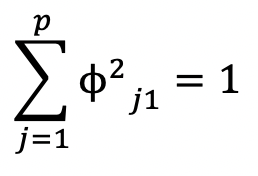

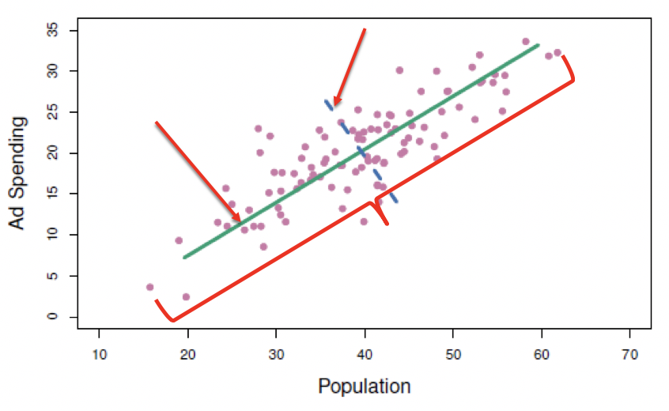

- The **objective** of the PCA enables finding the principal components with the maximum possible information.

### 12a.3: Biplot  

- **First** principle component value is **horizontal** 
- **Second** principle component value is **vertical** 
- **Arrows** indicate the **magnitude and direction** of the loadings

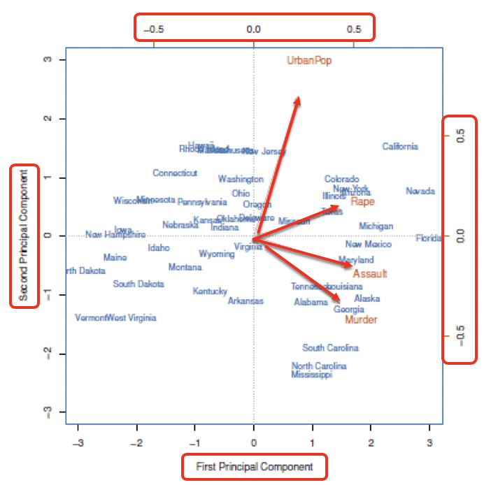

#### Scaled vs. Unscaled Variables  

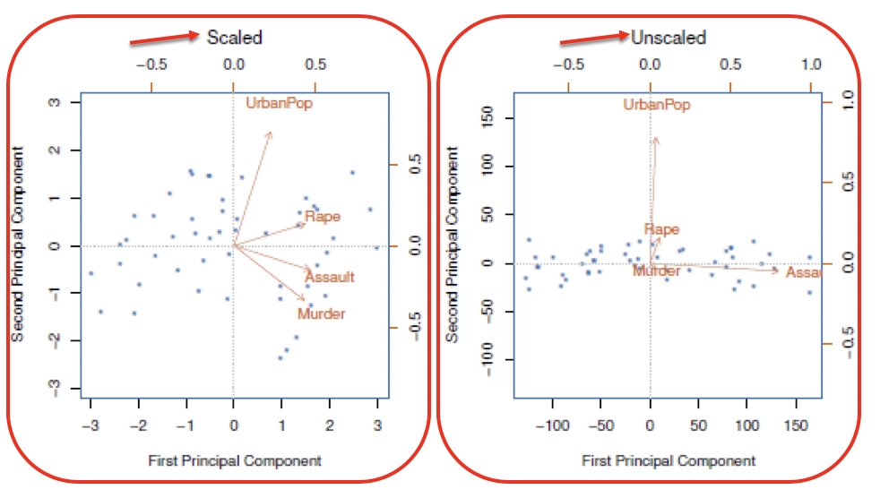

#### Screeplot

- x: the sequence of principle components
- Y: the **proportion of variance** explained by the corresponding principal component
  - For example, the proportion of variance explained by the first corresponding principal component is about 60%. The second component explains about 25% of the variability.
- On the right, the y axis of the plot is **cumulative proportion** of the variance explained by the corresponding principal component. 
  - For example, by including the first component and second, about 85% of the variance is explained. 
  - The proportions of the variance explained by the principal components are shown in screeplot 

##### How many Principal Components?  

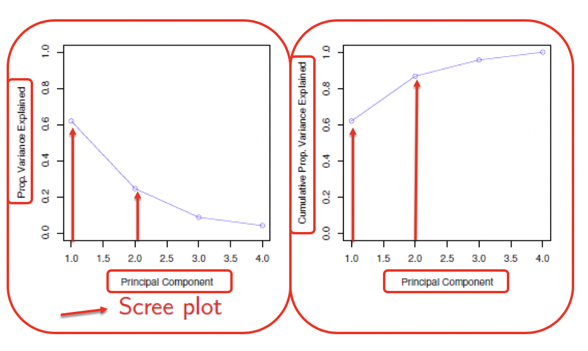

### 12a.4: PCA in Classification/Prediction  

- —Apply **PCA to training data** 
- —**Decide how many PC’s** to use
- —Use loadings in those PC’s with **training /** **validation data**
- This creates a new **reduced set of predictors** in **training /** **validation data**
- —**Create classification or regression model(s) with the transformed predictors**

#### Principal Components Analysis  

- —Create new variables that are **linear combinations of the original variables** (i.e., they are <u>weighted averages</u> of the original variables). 
- —These new variables are **uncorrelated** (no information overlap, orthogonal to each other), and **only a few** of them contain **most of the original** information.
- The **new variables/dimensions are called** **principal components**.

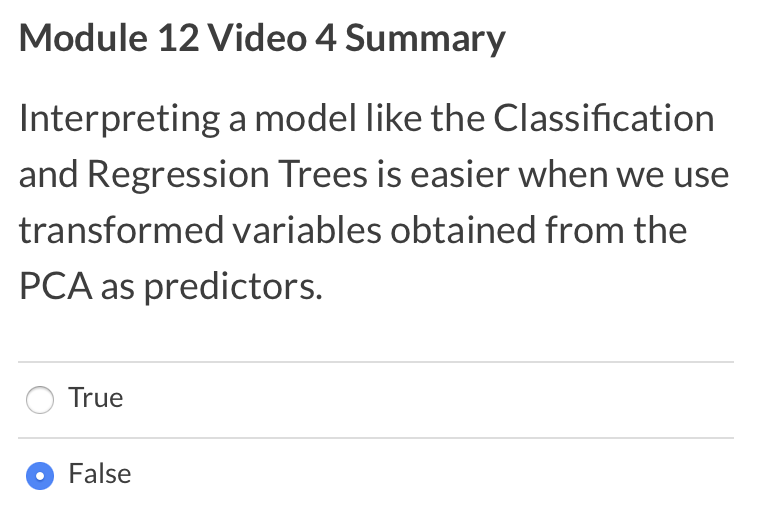

Why? 

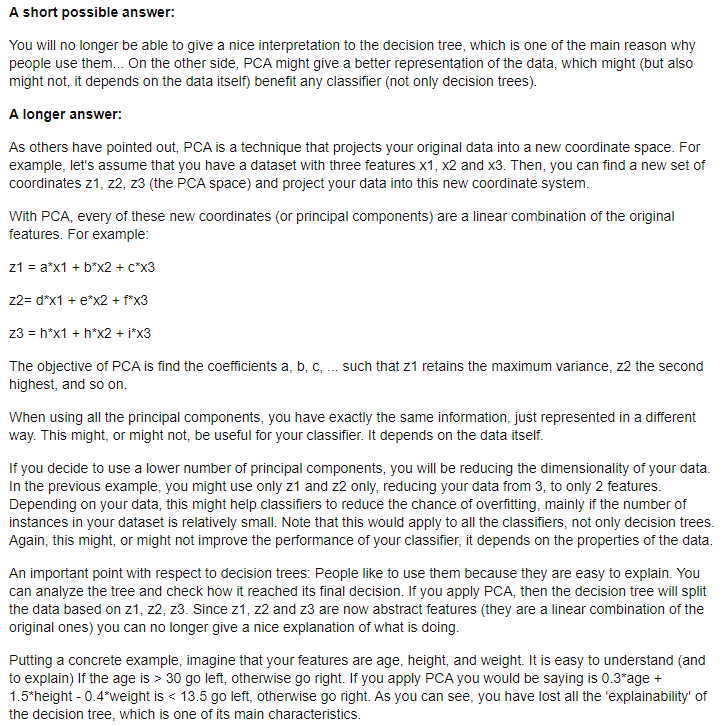

### Lab

#### biplot

```R
##prcomp by default centers the variables to have mean zero

##scale = TRUE standardizes variable i.e. standard deviation = 1
pr.out=prcomp(USArrests,scale=TRUE)

names(pr.out)
# "sdev"     "rotation" "center"   "scale"    "x"
pr.out$center #mean of the original variables

pr.out$scale #standard deviation of the original variables

pr.out$scale^2 #variance of the original variables

##The following is a matrix
##It give PC Loadings (directions)
##Matrix-multiplying X matrix by pr.out$rotation gives coordinates of the data in the rotated coordinate
##produces minimum of (n-1,p) PCAs

pr.out$rotation #loadings

##dimension of x from prcomp function
dim(pr.out$x)

biplot(pr.out,scale=0) #scale=0 ensures that the arrows on the plot represent the loadings

##sign of PCAs can be changed
pr.out$rotation = -pr.out$rotation #reverse the direction of the loadings which produces an equivalent solution

pr.out$x=-pr.out$x

biplot(pr.out,scale=0) #based on reversed loadings and scores
```

#### screeplot

```R
##prcomp function also outputs standard deviation of each principal component
pr.out$sdev #standard deviation

pr.var=pr.out$sdev^2 #variance

##variance in each PC
pve=pr.var/sum(pr.var) #proportion of variance explained by each of the components

##Scree Plot
plot(pve,xlab="principal Component", ylab="Proportion of Variance Explained", ylim=c(0,1),type='b') #usually an elbow shape

## Cumulative proportions
plot(cumsum(pve),xlab="principal components", ylab="Cumulative Proportion of Variance Explained", ylim=c(0,1),type='b')
```

#### cumsum

```R
##cumsum is a function to calculate cumulative sum
a=c(1,2,3,4)
cumsum(a)
```

