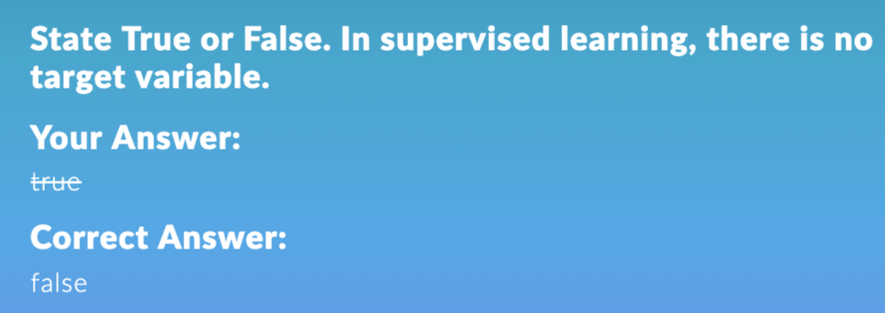

## I. What is machine learning?

- Relationship between *Yi and Xi*,

- **Goal** of Machine Learning: Estimate *f*,
- **Estimated** function is $\hat{f}$
- Other Names for Machine Learning: Statistical Learning, Data Mining, etc.
- Hope the random error not too big

- [x] 

## II. Effects of Standard Deviation 

The **irreducible error**: The **variance** of random error 

The difficulty of estimating f will depend on the **standard deviation of the ε’s**.

## III. The Purpose of Machine Learning

- Estimate unknown (True) function *f*.
- Machine-Learning “<u>learns</u>” about *f* from data.
- **Why do we care about estimating** ***f***?
- 2 **reasons** for estimating *f*,
  - **Prediction**: forecast 
  - **Inference**: generalize the system

1. ### Prediction 

   1. **Good estimate for *f***
   2. **Variance of ε is not too large**
   3. Accurate predictions for the response, Y, based on a new value of X

2. ### Inference 

   1. Alternatively, we may also be interested in the type of relationship between Y and the X's.
   2. For example,
      1. **Which particular predictors actually affect the response**? 
      2. Is the relationship **positive or negative**? 
      3. Is the relationship a simple **linear one or is it more complicated** etc.?

### Example: Housing Inference

- **Accurate in predicting**
- **But not good for inferences** (because of the black box)

- [x] 

- [ ] 

## IV. Learning Methods

#### 1. How Do We Estimate f?

- Training data
  - 
- **Use the training data** and **a learning method** to estimate *f*.
- Learning Methods:
  - **Parametric Methods (pre-determined structure)**
  - **Non-parametric Methods (flexible, algorithm allows any shape)**

#### 2. Parametric methods

- Shape is **predetermined**.

- To Estimate *f*, we estimate a set of parameters.

- They involve a two-step model based approach

  - STEP 1

    Make some **assumption about the functional form** of *f*, i.e. come up with a model. 

    Linear model i.e. (Linear regression)

    

  - STEP 2

    - Use training data to estimate *f* or equivalently the unknown **parameters** such as *β0*,*β1*,*β2*,…,*β*p.
    - Estimated Betas are "$\hat{β}_0,\hat{β}_1,\hat{β}_2,…,\hat{β}_p.$"
    - The most common approach for estimating the parameters in a linear model is ordinary least squares (OLS).
    - For the same data, we get the same estimate.

#### 3. Non-parametric methods

- No **assumptions about function** **form **of *f*.
- There are **tuning parameters**.
- <u>Advantages</u>: They **accurately fit** a wider range of possible shapes of f.
  - Avoid the assumption of a particular functional form for f
- <u>Disadvantages</u>: A very **large number of observations** is required to obtain an accurate estimate of f. They can also over fit the data. 
- Non-linear regression methods are **more flexible** and can potentially provide more accurate estimates. But sometimes it will fit for all the data but perform poorly to predict

## V. Prediction Accuracy vs. Model Interpretability

- **Why not just use a more flexible** method?

  - **Linear** **regression** is much **easier to interpret** (the Inference part is better). For example, in a linear model, *β*j is the average increase in *Y* for a one unit increase in *X*j holding all other variables constant.
  - It is often possible to get more **accurate** predictions with a **simple**, instead of a complicated, model because it **is harder to fit a more flexible model**.

  The flexible model will touch every data point = **overfitting** 

## VI. Supervised vs. Unsupervised Learning

- Two learning problems: Supervised and Unsupervised

#### Supervised Learning

- Both the **predictors, Xi,** and the **response, Yi,** (<u>target variable</u>) are observed. 
- Learning is <u>guided</u> by *Y* variable.
- Example: Linear Regression.
- Primary focus is supervised learning.

#### Unsupervised Learning

- In this situation only the ***X****i*’s are observed. 

- **No response** *Y* variable.

- A common unsupervised learning is **clustering**.

- Example: **Market Segmentation** - divide potential customers into groups.

  

## VII. Regression vs. Classification

#### Supervised Learning: **Regression and Classification**

#### Regression

- ***Y*** **is continuous/numerical**. *X* can be <u>continuous or categorical</u>

- Example: 

  - Boston Data Set

       *Y*: Median value of owner-occupied homes

       ***X***: per capita crime rate, average number of rooms, pupil-to-teacher ratio, etc.

  - Hitters Data Set (baseball, 1986 and 1987) 

       *Y*: 1987 annual salary on opening day

       ***X***: number of home-runs in 1986, number of hits in 1986, number of runs in 1986, etc.  

#### Classification

- ***Y*** **is categorical**. *X* can be <u>continuous or categorical</u>

- Examples:

  - Orange Juice Data

       *Y*: Whether the customer bought Citrus Hill or Minute Maid (Binary)

       ***X***: store id, price of CH, price of MM, etc.

  - Credit Card Default Data

       *Y*: Whether the customer defaulted on their Debt or not

       ***X***: whether the customer is student, average balance on the credit card, and income.   

#### Algorithms

- Regression and Classification: **Trees, Random Forest, Boosted Trees, Neural Network**, etc.
- Regression: **Linear Regression, Ridge Regression**, least absolute shrinkage and selection operator (**LASSO**), etc.
- Classification: **Logistic Regression**, Linear Discriminant Analysis (**LDA**), Quadratic Discriminant Analysis (**QDA**), etc.

## VIII. Training vs. Test Data

#### Classical Approach

- Use **all** data for **Training**
- Use **Model** fit measures to measure accuracy
- Example: $R^2$

#### Modern Approach

- Training **part** is used to build model 
- **<u>Validation data</u>** is used to access the model performance
- Example: **MSE** (Training MSE; Test MSE) = mean square error (calculated both the training side and test side of data, whichever model ends up with the **least test error** will be declared as the winner); 

## IX. Different Names for the Same Things

- *Y* variable: **Response, Target, Outcome, and <u>Dependent</u> Variable**. 

- *X* variable: **<u>Independent</u> and Predictor** 

- Machine-Learning: **Statistical Learning** (Statisticians), Data Mining (engineers and analysts), Artificial Intelligence (computer scientists), etc.

