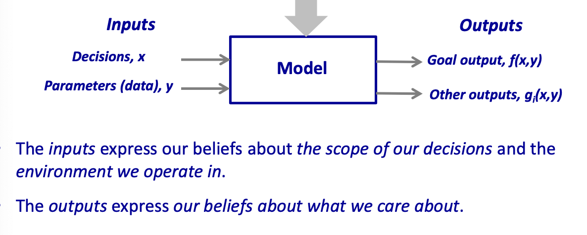
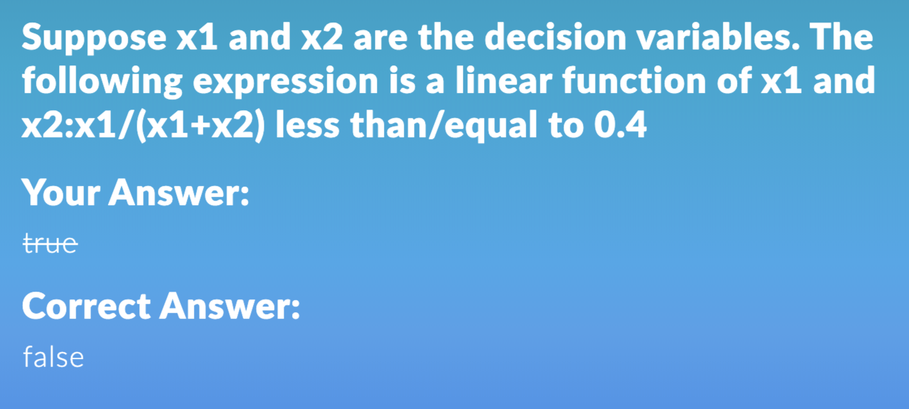
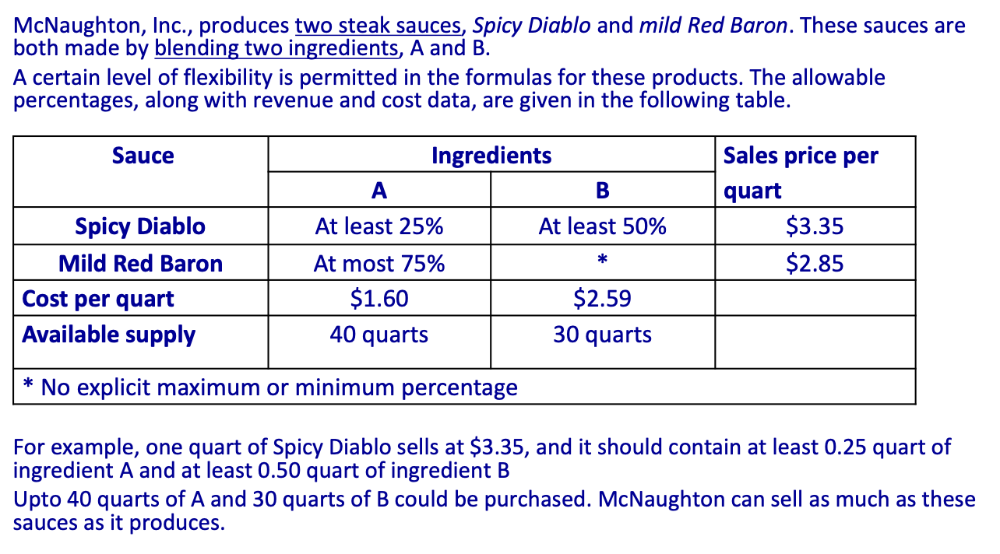
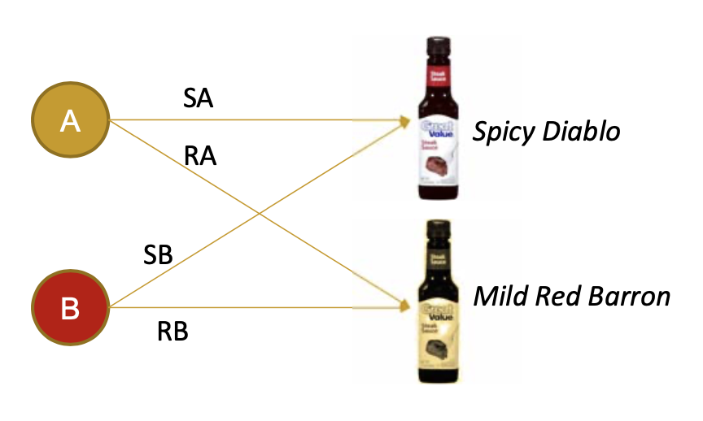
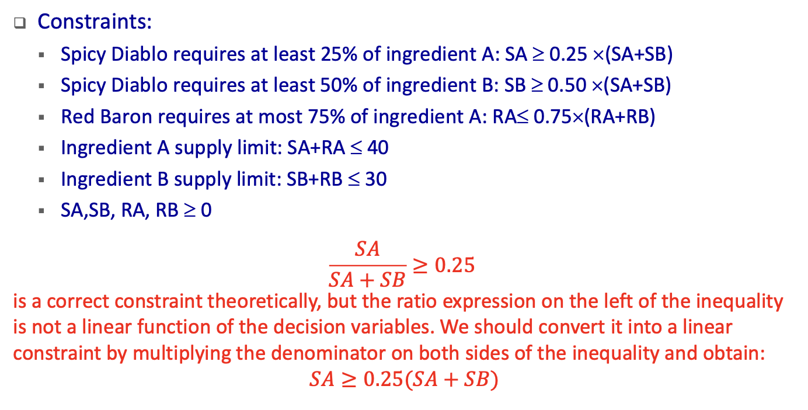
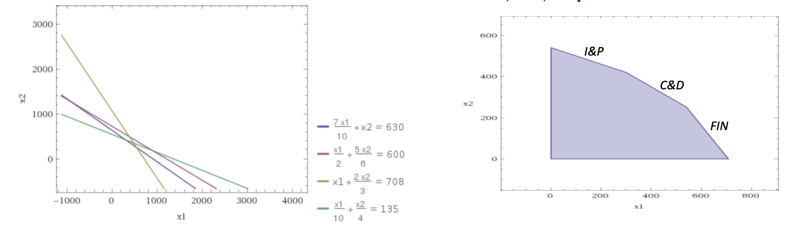
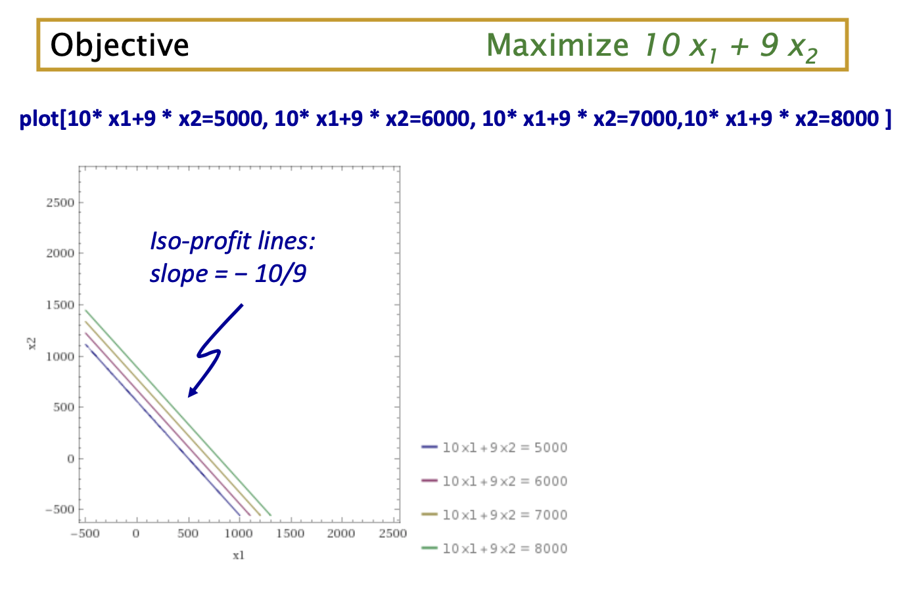
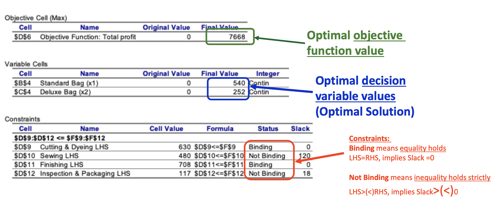
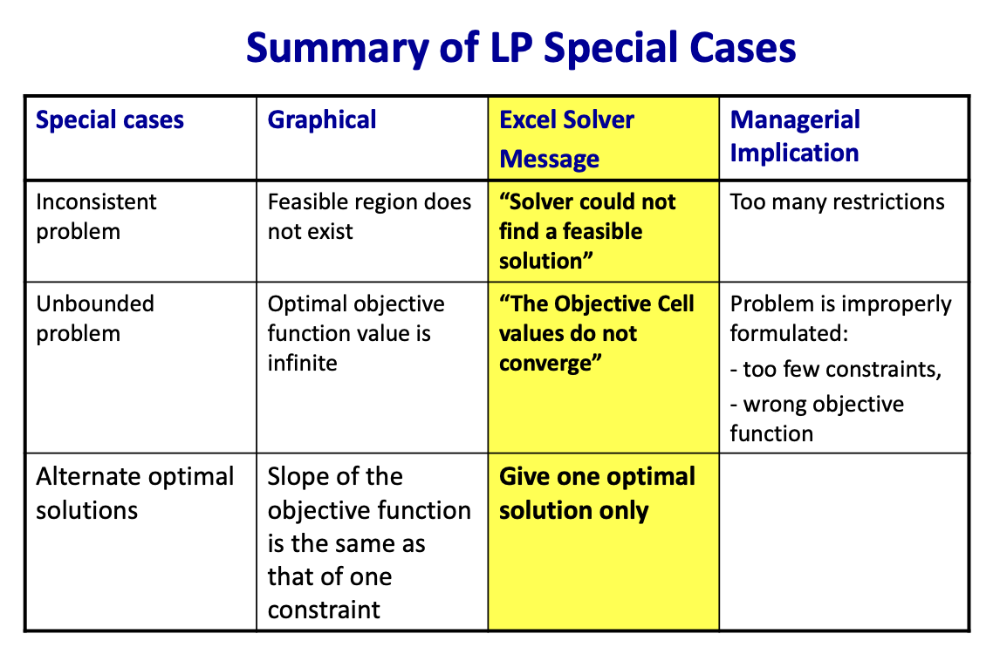
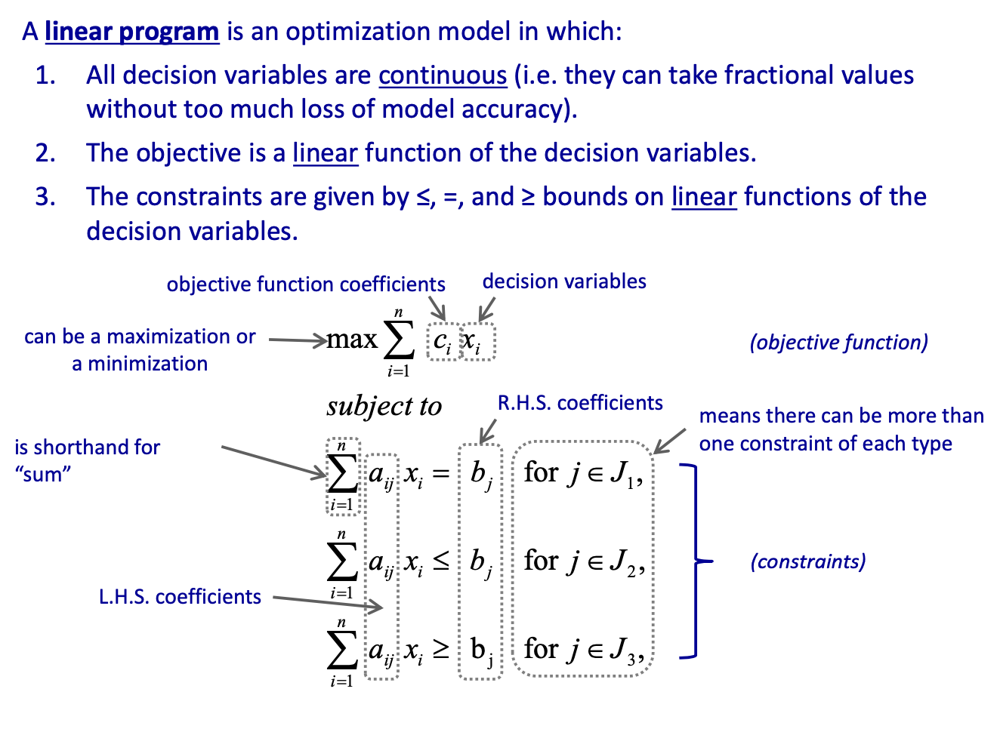

### Stages of analytics maturity

Descriptive analytics

Predictive analytics

Prescriptive analytics

### What is a descriptive model?

A descriptive models describes the causal relationship between various factors in a model. 

Answers the question "what if?"

### What is an optimization model?

By imposing additional structure onto a descriptive model

Three main components:

- *Decision variables* 
  - What variable can be decided or controlled 
- *Objective* 
- *Constraints* 
  - Remember there may be **non-negativity** constraint
- *and our beliefs about how decision variables (causally) affect the objective and constraints.* 

In an optimization problem we seek to optimize (i.e. maximize or minimize) the objective function subject to the model constraints. 

### A **Linear Program (LP)** 

- The word “linear” means that relationships are linear (i.e., each term in an expression is a constant multiplies a decision variable) 
- The word **“program” means plan or schedule** 

- Linear programs are important! 
  - A staggering diversity of problems can be posed as linear programs: they are routinely used in industry and government for planning and managing day‐to‐ day operations 
- Solution procedure
  - If you’ve taken a course in calculus, you have probably encountered optimization problems that you solve using differentiation
  - A linear program is an optimization problem that is solved by methods *other than* differentiation 

> Don't forget (x1+x2) is not necessarily positive 

**Simplex LP is for linear program** 

### **Blending Problems** 

Blend multiple inputs into multiple outputs, often with specific percentage requirements. Blending problems can be found in many industries, e.g., food, pharmaceutical, chemical, oil refinery industries.

4 decision variables! Not 2!

#### NOT A LINEAR FUNCTION!!!

### **Employee Scheduling Problem** 

(powerpoint)

----------

### Graphical solution 

#### Feasible region

 

#### Objective function

##### Iso-profit lines

Iso-profit means "same profit", they have the same slope

 

Maximize means to push the lines up as much as possible. Until push to the edge or the corner point of the feasible region. 

**Optimal solution (x1, x2) can be found at one of the corner points of the feasible region (polygon).**  

#### Solver Reports (Answers)

##### Constraints:

- **Binding** means equality holds LHS=RHS, implies <u>Slack =0</u> 
  - Which resources are used up completely. They are the scarce resources. Providing more of those and use them in an optimal way could probably help us improve objective function value further. 
- **Not Binding** means inequality holds strictly LHS>(<)RHS, implies <u>Slack>(<)0</u> 
  - Which resources are not used up. We don't need to look for ways to obtain more of those resources. 
- **Slack** means unused resources in the corresponding department
- Can be seen in the graphics (not provide the boundary line of the optimal solution)

### Simplex method

1. Start with a feasible corner point solution
2. Check to see if a feasible neighboring corner point is better
3. If not, stop; otherwise move to that better neighbor and return to step 2 

At any given solution a constraint can be **binding or unbinding**. Binding constraints and unbinding constraints have important economic interpretations (will revisit those concepts in Sensitivity Analysis). 

#### Error messages

- No feasible solutions
  - 无重合feasible region
- Unbounded Problem – Objective Function Cannot Converge
  - 无边界
- Alternate Optimal Solutions
  - slope相同 有不止一个结果
  - Solver will return only one of the answers
  - **Reading sensitivity report** 

### **Linear Optimization** 

If decision variables are only integer, Integer program requires different algorithms to solve.

