### **Sensitivity Analysis** 

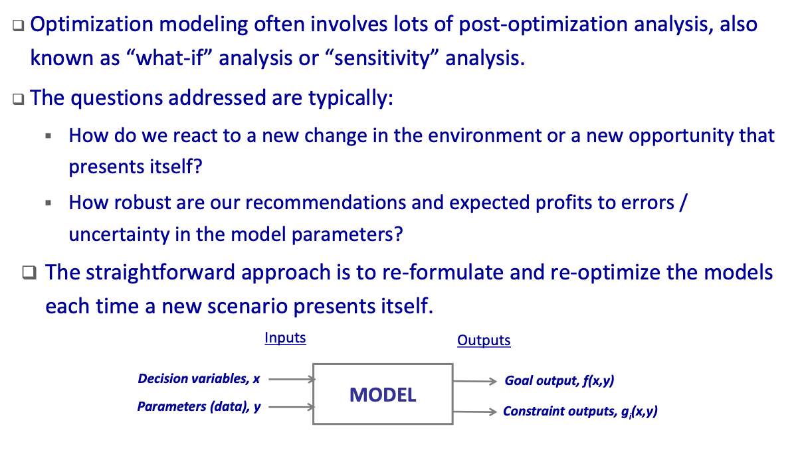

### **Sensitivity Report** 

In **linear programming**, however, most solvers, including Excel, provide a report that allows us to do sensitivity analysis pertaining to the **objective function coefficients** and the **right‐hand‐side constraint coefficients** without the need to re‐optimize. The sensitivity analysis can be done at‐a‐glance. 

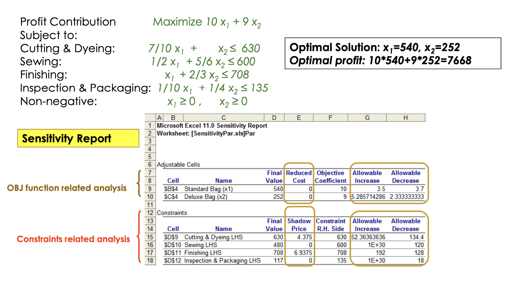

### **Types of Sensitivity Questions** 

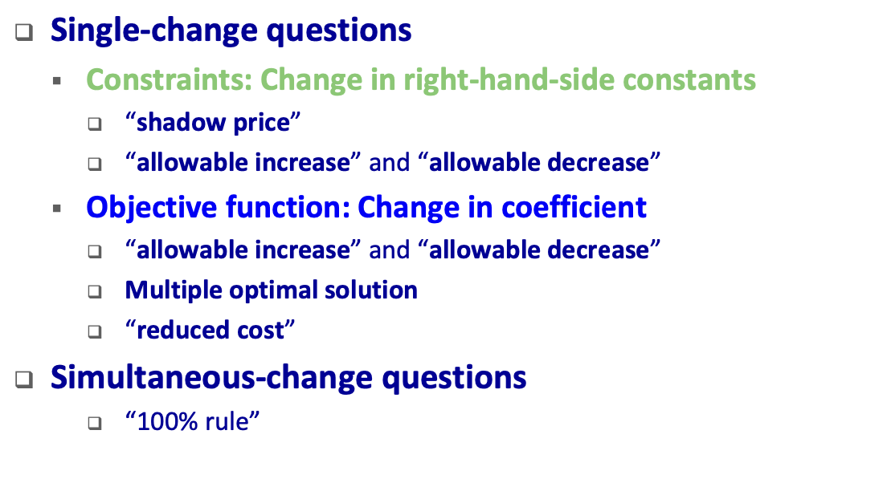

### **Interpretations of Shadow Price** 

**Shadow Price** is the amount by which the *optimal* objective function value changes given **a unit increase** in the constraint’s <u>right‐hand‐side</u> coefficient, holding all other parameters constant. 

- Think of this as the *marginal value of the resource* represented by the constraint. 
- The shadow prices of **non‐binding constraints are always zero.** 
- 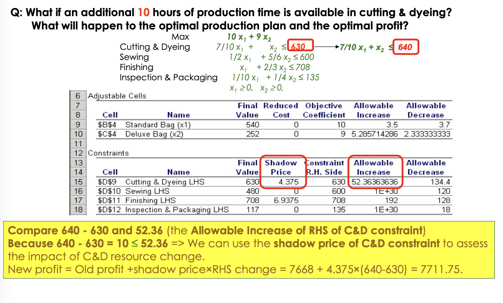

### **Effective Range for Shadow Price** 

Effective range for shadow price is specified by  “Allowable Increase” and “Allowable Decrease” of CONSTRAINTS 

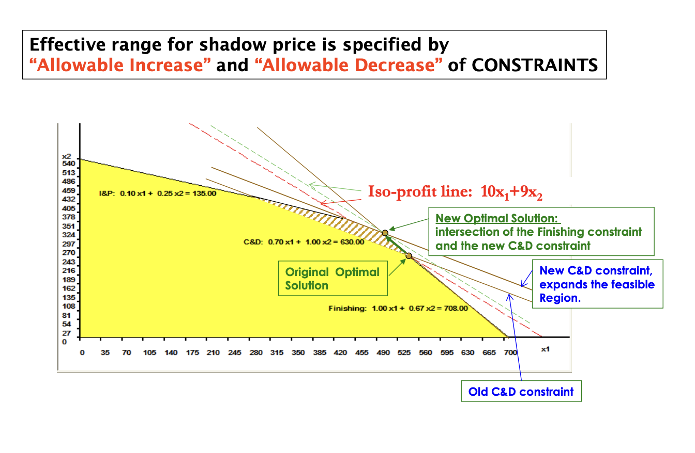

### **Change in OBJ Function Coefficient** 

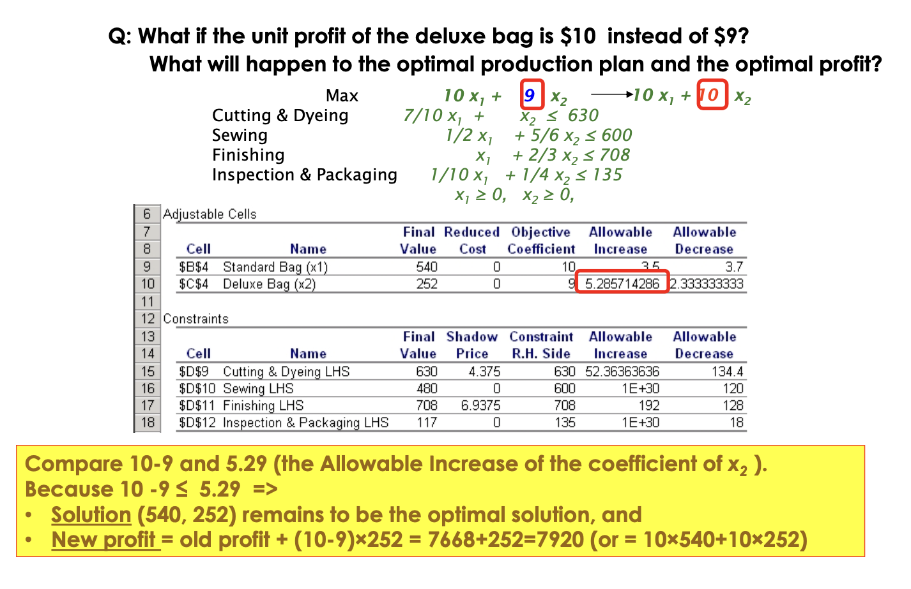

### “Allowable Increase” and “Allowable Decrease” in the “Adjustable Cells"

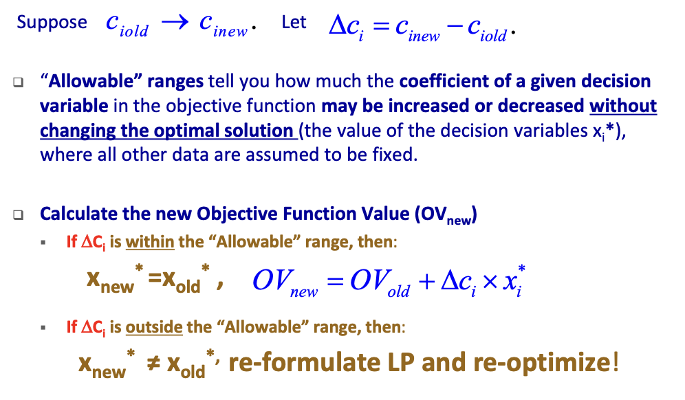

### **Alternate Optimal Solutions** 

If the **allowable increase or allowable decrease for objective function coefficient for one or more variables equal to zero, then it indicates that alternate optimal solutions exist.** 

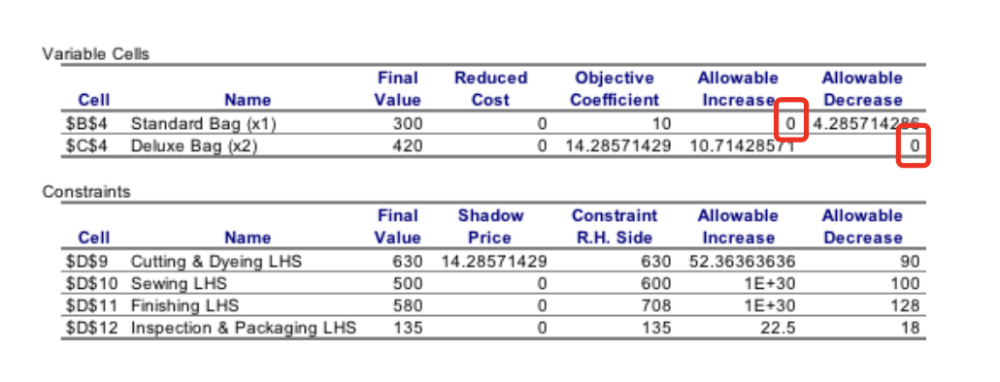

We can get Solver to produce an alternate optimal solution (when they exist) by: 

1. Adding a constraint to the model that holds the objective function at the current optimal value, and then 
2. Attempting to maximize or minimize the value of one of the decision variables that had an objective function coefficient with an allowable increase or decrease of zero. Max *x**1* 

### **Change in OBJ Function Coefficient ‐ Reduced Cost** 

**Reduced Cost** of **a product** = **difference** between **its marginal contribution** to the OBJ function value and **the marginal value of the resources it consumes** 

What is the consequence of producing one unit of unprofitable product? What is the impact 

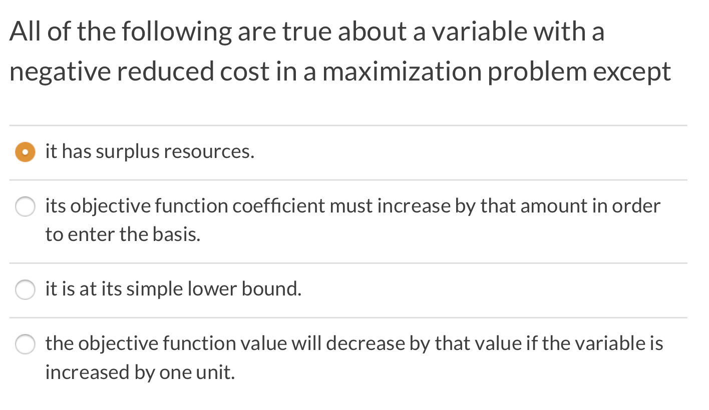

#### **Reduced Cost – Graphical Interpretation** 

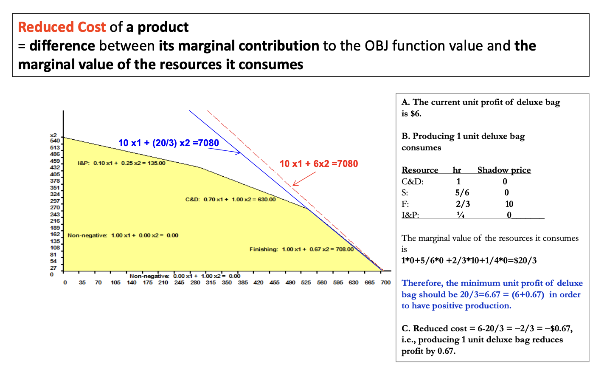

### Simultaneous Changes in Parameters

1. If **all changes** are **in the objective function** coefficients, then you can use the 100% rule.
2. If **all changes** are **in the RHS values**, then you can use the 100% rule. 

3. If **changes** are **in both the objective function** and RHS, you must **reformulate** and **re‐solve**! 

4. If **unsure**, **reformulate** and **re‐solve**! 

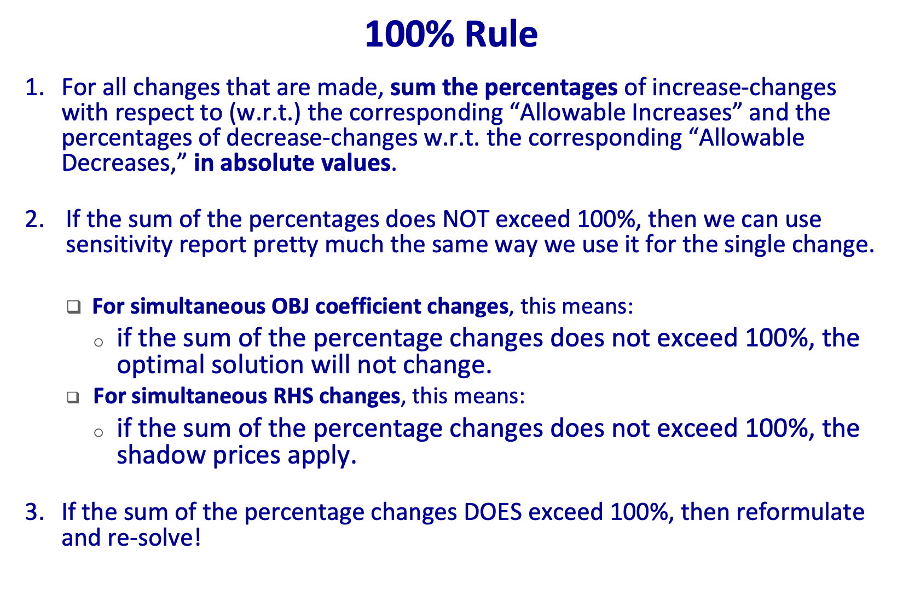

### 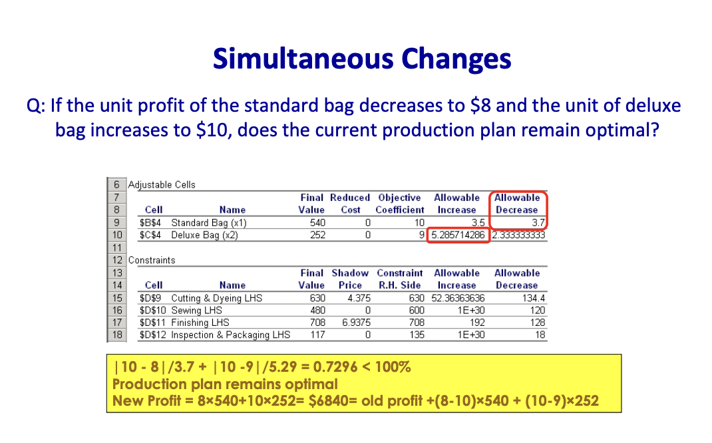  Concluding Remarks about Sensitivity Analysis 

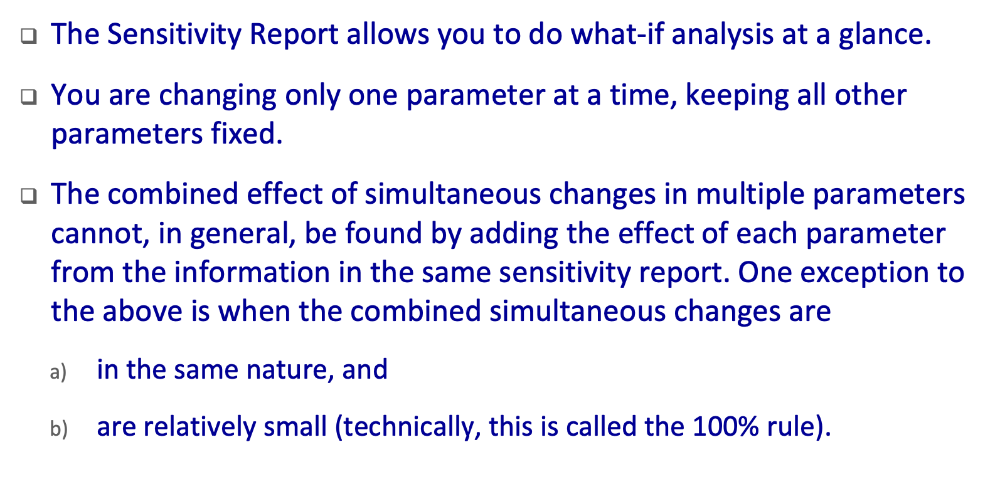

