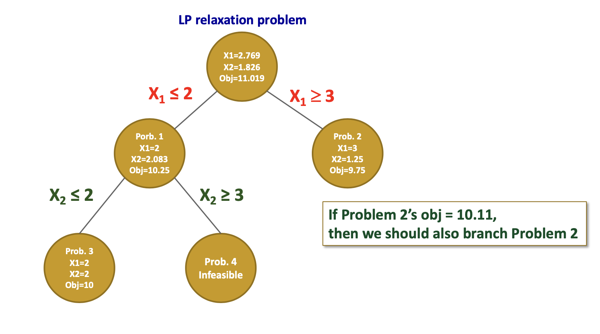
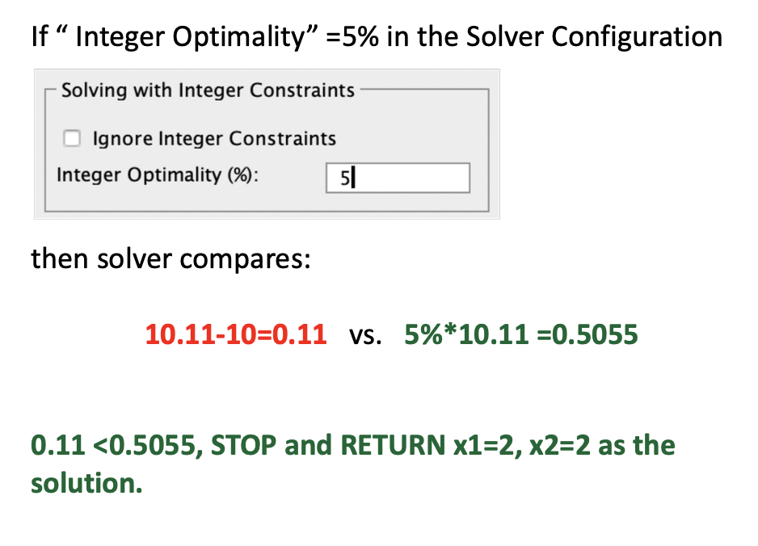

### Plan

- **Integer linear program** 
  - When integer solutions matter
  - Types of integer program problems
  - Solving integer program problems in Excel 
- **Modeling flexibility of binary decision variables** 
- **Solving integer programming problems** 
  - **Branch-and-Bound algorithm** 

### **Types of Integer Linear Program Models** 

### **Add Additional Logical Constraints** 

1. (**mutually exclusive**) Project 6 and Project 7 cannot be selected together.
   1. 
2. (**co-exist**) If project 1 is selected, then project 2 must be selected, and vice versa. 
   1. 
3. (**pre-requisite**) If we select Project 3, we must also select Project 4; but selecting Project 4 does not necessarily require selection of Project 3. 
   1. 
4. (**K out of N**) We can do at most four projects from among Projects 1 through 10. 
   1. 

### **Knapsack Problems** 

Capital budgeting problem belongs to a set of well-known integer programming problems: knapsack problem 

- You have a knapsack that has capacity (weight limit) C 
- You have several items 1,2,...,n 
- Each item j has a weight wj and a benefit bj 
- You want to place a certain number of copies of each item j in the knapsack so that: 
  - The knapsack weight capacity is not exceeded
  - The total benefit is maximized 

### **Fixed-Cost Problem** 

### **Use Binary Variables to Formulate “Minimum Order Size Requirement”** 

- Many production and distribution problems have minimum lot size or order size requirements: 
  - A supplier may require a minimum order of 10 units. 
  - A manufacturer may not produce any units of a given item unless a certain minimum lot size will be produced 
- Binary variables can be used to model such quantity threshold requirements 

### **Set Covering Problem** 

*Set covering problems typically deal with trying to identify the optimal set of locations to cover or serve a specified set of customers, where selection is a matter of binary choice.* 

#### **A BIP Formulation** 

### **Branch-and-Bound Algorithm** (solver)

- Total enumeration of integer solutions is computationally impractical
- Branch-and-Bound approach is a **divide-and-conquer** type of algorithm

#### **An All-integer Programming Problem** 

##### LP Relaxation

*Drop the integer constraints from the integer linear programming formulation*

- **Maximization Problem: LP relaxation gives an upper bound on the objective function value of the original integer LP** 
- **Minimization Problem: LP relaxation gives a lower bound on the objective function value of the original integer LP** 

#### **Solving Integer Problems in Excel** 

- Use the “Simplex LP” method when the objective function and constraints are **linear** (even if some variables are integer or binary). 
- Use the “GRG Nonlinear” method when the objective function and/or at least one constraint are **nonlinear**. 
- If integer values are required, then under the above settings, Solver uses the Simplex LP or the GRG Nonlinear methods within a framework called the **branch-and-bound** algorithm to find a solution. Typically this method takes far longer than solving the same problem without the integrality constraints. 
  - Used by most software packages (incl. Excel) 
  - Will yield the optimal solution 
  - More efficient than enumeration 

