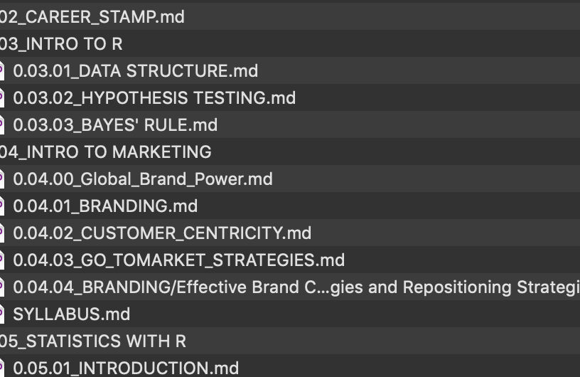

That the storage of the data is optimized for the individual transactions between customers employees while the analysisneeds data in a very different form you might need data from different sources.

One example that you might come up with is something like a bank. The bank has lots and lots of data Let's start thinking about the types of data that it has the data it's collecting and the data that it saving. So first of all the bank needs to have information about the products that it offers. You would have savings accounts checking accounts and money market accounts. It also has loans for different purposes. Some examples are home mortgages business loans or car loans credit cards et cetera et cetera. The product types is essential. We need to capture information about deposits into the account. We might need to capture information about withdrawals from the account and then connect the customer to the accounts. And which customer has which count which type of account balances in the account Really calculations from deposits and withdrawals. We might need for each type of account interest rate being offered. They like that. You might also want to know something like the customer's credit score. Now this a little bit more complicated because credit score can come from two sources. One option is to buy that information directly and just add it to the customer's demographic or you could calculate it yourself. And so you wanted to calculate the customer's credit score sort of have an internal credit score. You would need things like the customer's loans and loan payments and scheduled loan payments and missed loan payments. And so you would find your customers credit scores through that way. And so that might be one type of database. Let's think of another one that's near and dear to us which is the university. 

Data on faculty we have data on students. We have data on programs obviously many other types of data but let's sort of match those three up. So you might think of the programs that we offer. The business goal is one part of the university and within the business school we offer undergraduate degree and a master's degree. And within that we have the master of customer analytics and Finance Master in our supply chain master and we have various masters. We have MBA the PMB so those are different programs. Each program has courses. So I'm now going to need to maintain data on courses that are offered courses have lots of parameters to them. Who are the targets students there's some course description. There is how many credits there are or there prerequisites for this course other constraints on students taking the course into that sort of falls into the course data that I might have. And then you might have information about the faculty faculty to teach courses. And so you have faculty information about who is teaching a course which faculty taught which course in the past. And you'd collect that type of information about the courses and the faculty and then you need student information. So first of all students are part of programs and so there's an enrollment part or a registration for a student to a program in which students are registered for which program. There's also a question of which courses a student is registered for. That then leads to some requirements for payments. And so we have an entire payment processing environment where students have student bills. The bills had been paid to what extent if that had been paid and the payment around didn't bills and student services and dining services which students have payments that they have to make for dining services. We would have to collect that information as well. On the other hand we collect Demographic information we have employee information so they have employee unemployment responsibilities. And that type of information that we maintain for faculty. We've got students we've got faculty we've got courses enrollments. Eventually we are interested in degrees right instead is a student Eligible for their degree and we would want to see which courses he has taken. What are the course requirements where the degree requirements did the student take all the courses needed in order to graduate from their degree. And if so we would say that they are eligible for a degree or a certain major or minor within that degree or certain track. If we're talking about our customer analytics programs et cetera. So that's another set of calculations that we would make based on that university obviously has also sort of usage for that data. Some of it is reporting like how many undergraduate students graduated within four years of enrollment or what types of students did we accept or what does our Don't accept and traits some generic reporting. We also have some more sophisticated analyses that we might undertake like forecasting. How many students are going to be interested in say our database and SQL class next year or financial reporting and questions of that nature. 