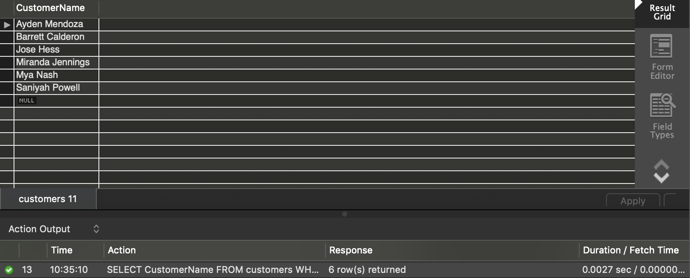
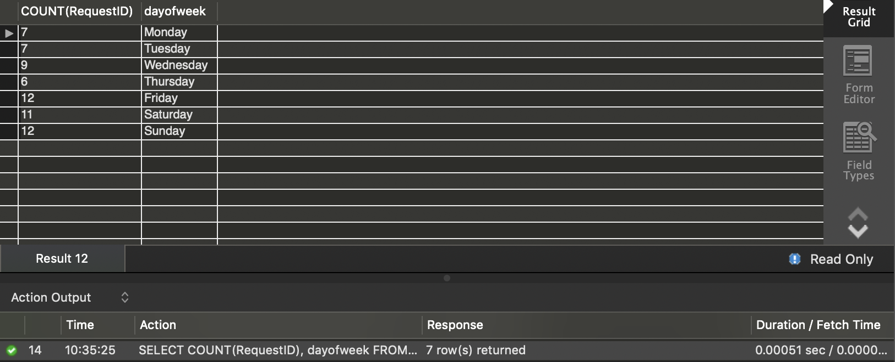
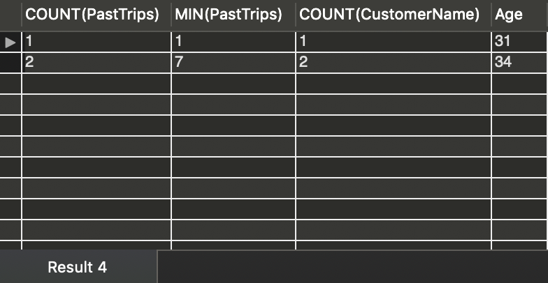

7)  Develop one query that will help find how many customers do not have addresses.

```mysql
SELECT CustomerName
FROM customers
WHERE Address IS NULL;
```



> 6 customers do not have addresses

8)  Calculate the number of requests for each day of the week

```mysql
SELECT COUNT(RequestID), dayofweek
FROM requests
GROUP BY DayOfWeek;
```



9)  Explain some of the previous results (in Question #8). Specifically, explain why there might be variation across days.

> There are more requests on Friday and weekends than Monday to Thursday, since people tend to go out on Friday nights and weekends after a whole week's working.

10)  For each age level of customers between 30 – 35, find the total number of past trips and minimum number of past trip for that age group. Also, include the number of customers in that age group. Sort the results by the age of customers. In other words, find the number of trips, etc, for 30-year- olds, 31-year-olds, ... 35-year-olds.

```mysql
SELECT COUNT(PastTrips), MIN(PastTrips), COUNT(CustomerName), Age
FROM customers
WHERE Age>30 AND Age<35
GROUP BY Age
ORDER BY Age ASC;
```



11)  For each driver of a white car, find all trips. Include the Destination and 2 other attributes in your results. Sort results in decreasing order of customer name

```mysql
SELECT requests.Destination, drivers.model, drivers.Model, requests.RequestID
FROM drivers INNER JOIN requests
WHERE drivers.Color='white'
ORDER BY requests.CustomerName;
```


12)  Find the name, gender, and address of customers that drove to the Stadium this past week

13)  List the number of requests for each customer. Sort the results in increasing order of number of requests