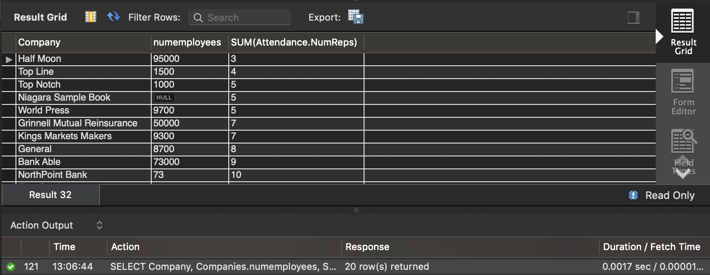

7. Recently, students seemed very interested in reaching out to Consulting companies who have positions available in Seattle, Dallas, or New York. On which companies should the career center focus? Include in your result 2 additional attributes

```mysql
SELECT JobOpenings.Position, JobOpenings.NumPositions, Company
FROM JobOpenings INNER JOIN Companies
USING (Company)
WHERE (Location='Seattle' OR Location='Dallas' OR Location='New York') AND Industry='Consulting';
```


*I select 2 additional attributes including positions the company offers and the number of positions the company offers. Bain, Deloitte, Molanphy and World Press are the companies the career center should focus.*


8. For each career fair held at Olin, list the number of students that may attend, and all the companies that will attend the career fair. Also include the number of reps sent by each company to each career fair. Sort the results by career fair and then by company.

```mysql
SELECT CareerFair, fairs.NumberStudents, attendance.Company, attendance.NumReps
FROM fairs INNER JOIN attendance
USING (CareerFair)
ORDER BY CareerFair AND Company
```


9. How many companies are represented in each industry, and how many positions are available in each industry? This should be the result of a single query. Sort the result by the number of positions available in each industry.

```mysql
SELECT Companies.Industry, COUNT(Company), SUM(JobOpenings.NumPositions)
FROM Companies INNER JOIN JobOpenings
USING (Company)
GROUP BY Companies.Industry
ORDER BY SUM(JobOpenings.NumPositions) ASC;
```


10. For each company that attended at least one career fair find the number of employees and the total number reps that come to career fairs. Sort the results by total number of reps.

```mysql
SELECT Company, Companies.numemployees, SUM(Attendance.NumReps)
FROM Companies INNER JOIN Attendance
USING (Company)
GROUP BY Company
ORDER BY SUM(Attendance.NumReps) ASC;
```




11. For each career fair with companies in attendance, identify the location and calculate the average number of reps in firms represented at the career fair. Sort the results in increasing order of average number of reps.

```mysql
SELECT CareerFair, AVG(attendance.NumReps), fairs.location
FROM Attendance INNER JOIN Fairs
USING (CareerFair)
WHERE attendance.company IS NOT NULL
GROUP BY careerfair
ORDER BY AVG(attendance.numreps) ASC;
```


12. Calculate the number of positions available in each city for students who want a career as a Data Scientist. Sort by the number of positions in descending order.

```mysql
SELECT Location, SUM(Numpositions)
FROM jobopenings 
WHERE jobopenings.Position='Data Scientist'
GROUP BY Location
ORDER by SUM(Numpositions) DESC;
```


13. Calculate the number of positions available in each city for each position type. Do NOT include New York in your results. Sort by the position type in decreasing order, and within each position, sort by location, in increasing order.

```mysql
SELECT location, position, SUM(NumPositions)
FROM jobopenings
WHERE Location !='New York'
GROUP BY Location, Position
ORDER BY Position DESC, Location ASC;
```


14. How much time did you spend on this homework?

*I didn't count but on and off about 4-6 hours perhaps.*

