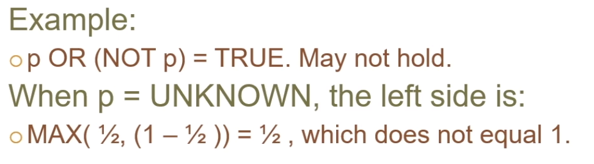
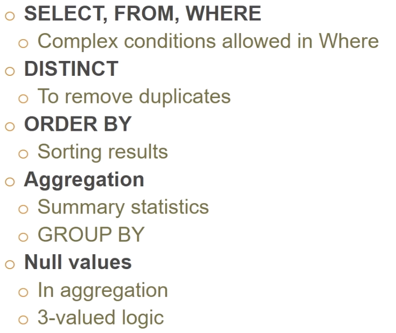

## First thing to do after open a sql file and import into schema

1. Connect to the server
2. Open a SQL Script
3. **USE** *ClassicModels*;
4. Reconnect to the server

## Select-From-Where Statements

- **USE** classicmodels
- **SELECT** desired attributes
- **FROM** one or more tables
- **WHERE** condition about tuples of the tables

";"在query最后一定要加

- 先看有多少row

## Meaning of Single-Relation Query

- **Operational semantics: general**
  - Think of a tuple variable visiting each tuple of the relation mentioned in **FROM**
  - Check if the "current" tuple satisfies the **WHERE** clause.
  - If so, return the attributes or compute expressions of the **SELECT** clause using the components of this tuple

## Using \* in SELECT clauses

- When there is one relation in the **FROM** clause, \* in the **SELECT** clause stands for "all attributes of this relation"
- Returns: tuples that match the **WHERE** condition, with all attributes
  - <u>In assignments, do not use **SELECT** *</u>

## Logical Statement

- Use AND, OR, (), within the WHERE clause
- **AND>OR**

## Sorting and removing duplicates

#### Duplicates - use DISTINCT

- Use **ORDER BY** to sort
  - **Asc** (ascending order, the default)
  - **Desc** (descending order)
- Use **SELECT DISTINCT** to remove duplicates
- Comments: /\*Insert comment here*/
- 选的列变量是唯一的

## Aggregations 

- SUM, AVG, COUNT, MIN, MAX, VARIANCE, etc. can be applied to a column in a SELECT clause
  - Generates the relevant aggregation.
- Also, COUNT(\*) counts the number of tuples
  - 一般计算的时候用key去count而不用其他，防止有null的情况
  - **SELECT** **COUNT** (**DISTINCT** productVendor) 只计算不重复的数量
- 如果select了aggregation，要注意小心把不是aggregated的变量加在aggregated的变量放在select里是否有意义
- **GROUP BY**: relations are grouped according to the values of all those attributes. Any aggregation is applied only within each group. 

## Null values

- Tuples in SQL relations can have NULL as a value for one or more components.
- Meaning depends on context. Two common cases:
  - <u>Missing value</u>: e.g., we know 1940s Ford Truck has a vendor, but we don't know what it is.
    - Common in datasets you will use
    - Possibilities: unknown, unavailable, or withheld values
  - <u>Inapplicable</u>: e.g., the value of attribute spouse for an unmarried person.
  - **NULL** not allowed for <u>primary key</u>

#### NULL's ignored in aggregation

- NULL never contributes to a SUM, AVG, or COUNT, and can never be the MIN or MAX of a column
- But if there all the values in a column are NULL, then the result of the aggregation is NULL.
  - Exception: COUNT of an empty set is 0.
  - *Count(NULLs)=0* 

#### Comparing NULLs to Values

- The logic of conditions in SQL is really 3-valued logic: TRUE, FALSE, **UNKNOWN**

- Comparing any value (including NULL itself) with NULL yields UNKNOWN

- WHERE clause: A tuple is in a query answer if and only if the WHERE clause is *TRUE* (not FALSE or UNKNOWN)

- > ```sql
  > SELECT customerNumber, customerName, country, salesRepEmployeeNumber
  > FROM customers
  > WHERE salesRepEmployeeNumber<=1200 #UNKNOWN
  > OR salesRepEmployeeNumber>1200
  > OR salesRepEmployeeNumber IS NULL; #UNKNOWN
  > #returns UNKNOWN when compared null with values
  > ```

#### Three-valued logic

- To understand how AND, OR, and NOT work in 3-valued logic, think of 
  - TRUE=1
  - FALSE=0
  - UNKNOWN=1/2
- AND = MIN
- OR=MAX
- NOT(x)=1-x
- 

## Reason: 2-valued laws differ from 3-valued laws

- Some common laws, like commutativity of AND, hold in 3-valued logic.

- But not others, e.g., the law of the excluded middle:

  - p OR (NOT p)= TRUE. May not hold. (NULL)

- When **p=UNKNOWN**, the left side is

  - 

    

- Solution to this problem:

  - 

  

## Summary 



## Inner Join

- Joining relations:
  - Left join, right join, full join, cross join, self join, inner join
- **INNER JOIN** is simply equivalent to Cartesian product when "WHERE" clause is attended
- In other words, **INNER JOIN** selects all rows from both participating tables as long as <u>there is a match between columns</u>
- Using only **JOIN** clause, is similar to **INNER JOIN** 

```sql
SELECT <columns>
FROM <table one> INNER JOIN <table two>
ON <join-conditions>;
```

```sql
SELECT *
FROM One INNER JOIN Two
ON One.x=Two.x; #或者直接Using(DriverName)
```

