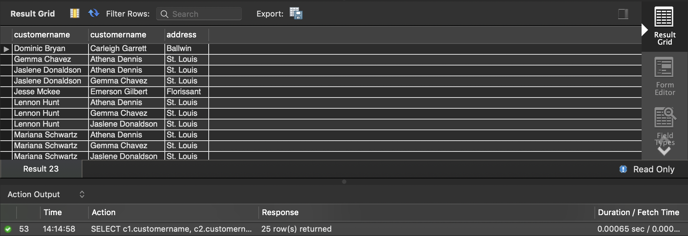

#### Group Assignment Lab #3, 09/10/2019

##### Student ID: 474878 / 473924 / 474281

7)  Find all destinations that have more than 2 requests in evenings.

```mysql
SELECT distinct requests.destination
FROM requests
WHERE requests.timeofday='evening'
GROUP BY requests.destination
HAVING count(requests.requestid)>2;
```


8)  Create a table that contains Customer name, customer age, driver name, destination, and the model of the car. Do not report rows with null values.

```mysql
SELECT customers.customername, customers.age, drivers.DriverName, requests.destination, drivers.model
FROM (drivers join requests
ON drivers.drivername=requests.DriverName)
JOIN customers
ON customers.customername=requests.customername
WHERE requests.destination IS NOT NULL AND drivers.model IS NOT NULL;
```


9)  Find the average of distances for each time of the day

```mysql
SELECT AVG(requests.Distance), requests.TimeOfDay
FROM requests
WHERE requests.Distance IS NOT NULL
GROUP BY requests.TimeOfDay;
```


10)  Find all pairs of customer that have the same address. Include the address in your result.

```mysql
SELECT c1.customername, c2.customername, address
FROM customers as c1 join customers as c2 USING (address)
WHERE c1.customername>c2.customername;
```




11)  How much time did you spend on this homework?

*1 hour.* 