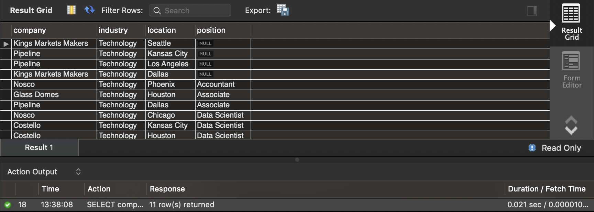
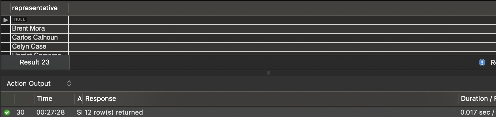
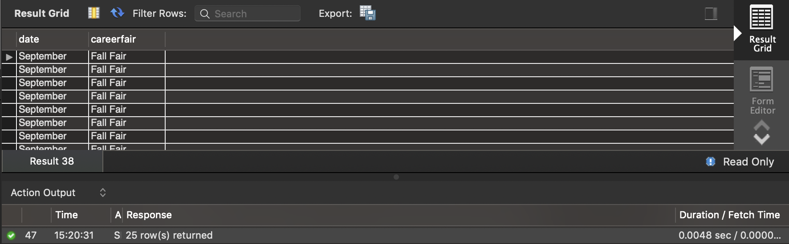
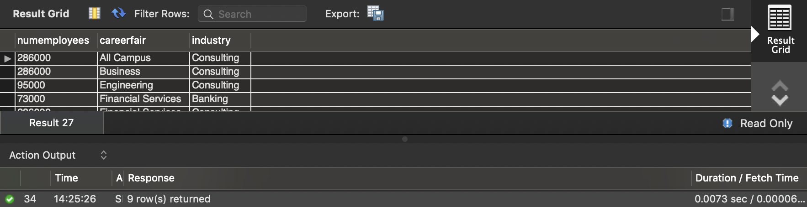
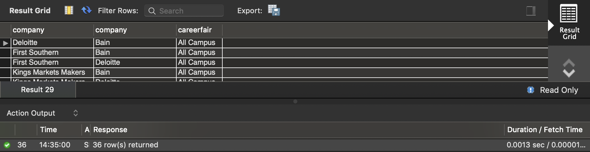
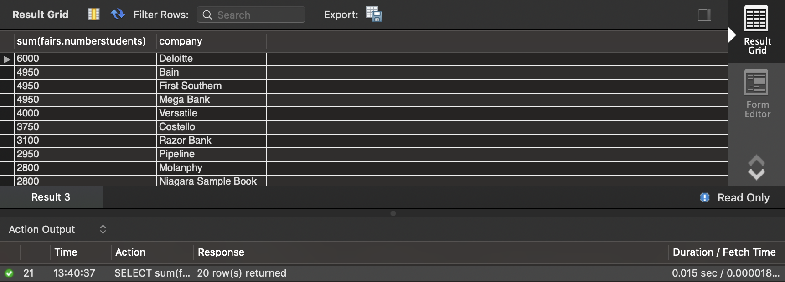
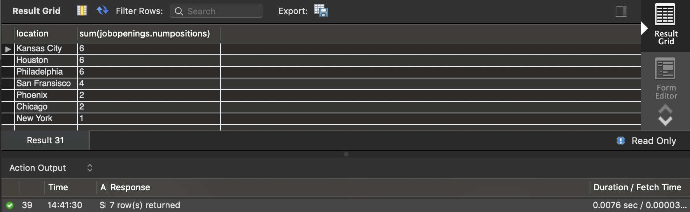

#### Student ID: 474878

#### Individual Assignment #3

7. A student is interested to take any jobs related to “Technology” section. She is currently living in St. Louis and she wants to move to a new place. Therefore, she is interested to take opportunities in anywhere but “St. Louis”. Could you help her find the name of companies to match with her wiling? In your list, please include company name, industry, location, and position. Sort your list by the location of the position in ascending order.

```mysql
SELECT companies.company, companies.industry, jobopenings.location, jobopenings.position
FROM jobopenings join companies
USING (company)
WHERE jobopenings.company !='St. Louis' AND companies.industry='Technology'
ORDER BY jobopenings.position ASC;
```



8. List the unique representatives who are attending at Olin. Please sort them based on their name in ascending order.

```mysql
SELECT distinct companies.representative
FROM (companies join attendance USING (company))
JOIN fairs USING (careerfair)
WHERE fairs.location='Olin'
ORDER BY companies.representative ASC;
```



9. List the companies that are going to attend any career fairs in the fall semester. Please have the career fair name in your list as well. Sort the results based on Date in ascending order (For example, January, February, March ...).

```mysql
SELECT attendance.company, fairs.date,fairs.careerfair
FROM attendance JOIN fairs USING (careerfair)
WHERE attendance.company IS NOT NULL 
AND (fairs.date='September' OR fairs.date='October' OR fairs.date='November')
ORDER BY FIELD(fairs.date,'January','February','March','April','May','June','July','August',
'September','October','November','December');
```



10. List companies with more than 50000 employees. Please let us know which career fair they attend and their corresponding industry. Sort the results based on the career fair names in ascending order.

```mysql
SELECT companies.numemployees, attendance.careerfair, companies.industry
FROM companies join attendance USING (company)
WHERE companies.numemployees>50000
ORDER BY attendance.careerfair ASC;
```



11. Please list pair of companies attending “All Campus” career fair.

```mysql
SELECT a1.company, a2.company, careerfair
FROM attendance as a1 join attendance as a2 USING (careerfair)
WHERE careerfair='All Campus' AND a1.company>a2.company
```



12. For each company find the total number of students they may get contact. Sort the result based on the total number of students in descending order.

```mysql
SELECT sum(fairs.numberstudents), attendance.company
FROM fairs join attendance USING (careerfair)
GROUP BY attendance.company
ORDER BY sum(fairs.numberstudents) DESC;
```



13. Calculate the total number of available positions for data scientist in different cities. Sort the result based on the available positions in descending order.

```mysql
SELECT jobopenings.location, sum(jobopenings.numpositions)
FROM jobopenings
WHERE jobopenings.position='Data Scientist'
GROUP BY jobopenings.location
ORDER BY sum(jobopenings.numpositions) DESC;
```



14. How much time did you spend on this homework?

*2-3 hours.*

