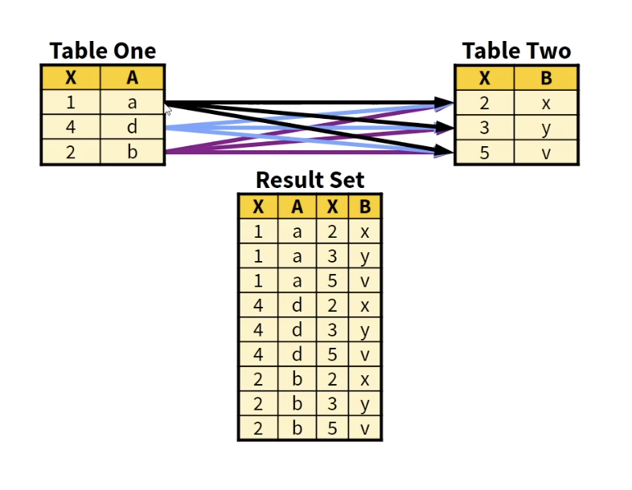
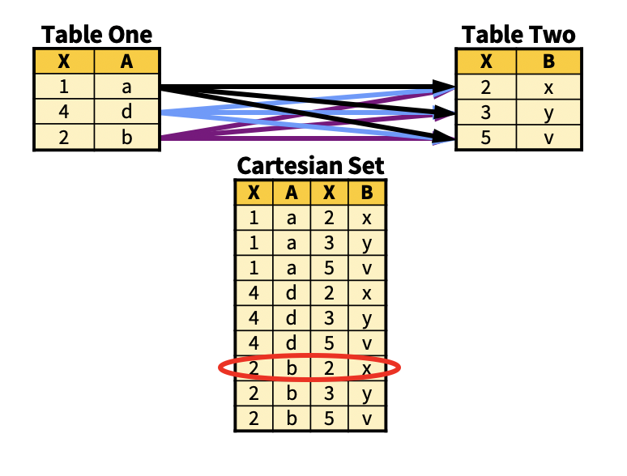
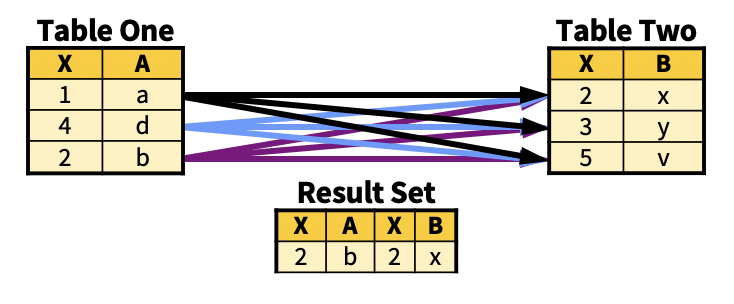
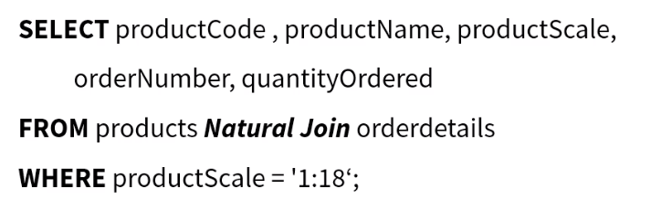
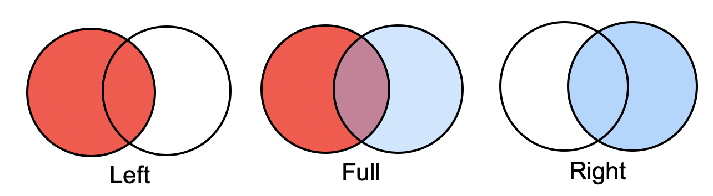
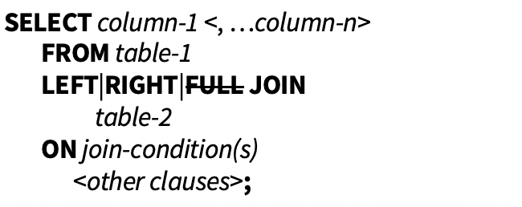
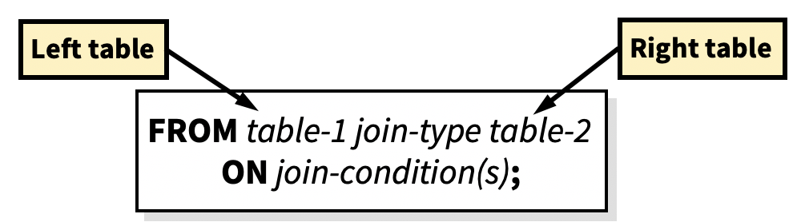
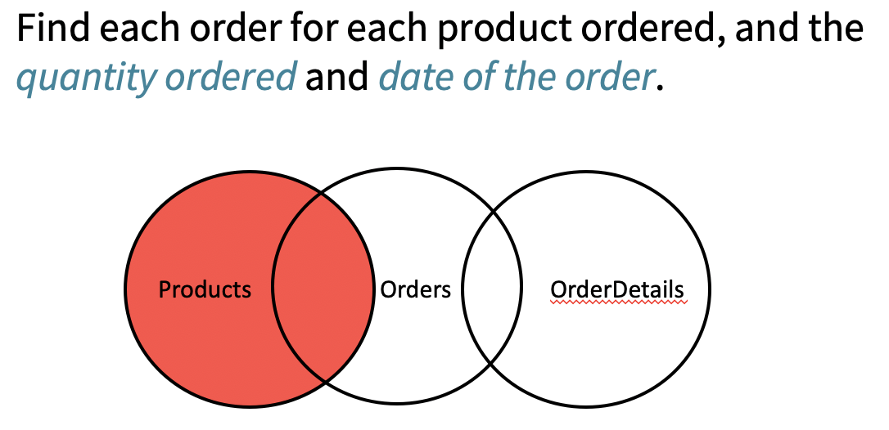

## Why join?

- Several smaller tables
  - Easier to manage and update
  - An entity in one table may not necessarily have values for another tables
  - Storage saving
  - Tables are coming from different sources joined with some keys
- Different type of joins SQL can handle
  - Cartesian product

## Cartesian product (Cross join)

A query that lists multiple tables in the FROM clause without a WHERE clause produces all possible combinations of rows from all tables. This result is called the Cartesian product. 

```mysql
select * from one, two;
```



- The number of rows in a Cartesian product is the product of the number of rows in the contributing tables.

- A Cartesian product is **rarely **the desired result of a query

- ```mysql
  WHERE products.productCode = orderdetails.productCode 
  #corresponding each other
  #即为inner join
  ```

## INNER JOIN

- INNER JOIN, is simply equivalent to Cartesian product when “WHERE” clause is attended. 
- In other words, INNER JOIN selects all rows from both participating tables as long as there is a match between columns
- Using only JOIN clause, is similar to INNER JOIN

```mysql
select <columns>
from <table one> inner join <table two> 
on <join-conditions>;

select *
from One inner join Two 
on One.X=Two.X;
#USING (X)
```





- Add **USING** in the **FROM **clause

- Better to debug & understand

## Natural Join

- The SQL NATURAL JOIN is structured in such a way that, columns with **same name of associate tables** will appear once only.
- The associated tables have one or more pairs of **identically named** columns.
- The columns must be the **same data type**.
- **Don’t use ON** clause in a natural join.



- **Use “WHERE”**, Do not use “ON”
- Remove Duplicate columns (if using SELECT *)

## Self join

- A self join is a join in which a table is **joined with itself**.

- To join a table itself means that each row of the table is combined with itself and with every other row of the table.
- The self join can be viewed as a join of two copies of the same table.
- Especially “**AS**” is used to **name or rename** tables or attributes. 

```mysql
select count(*) from products; #found the row numbers
select count(*) as numberofrows from products; #use as to name 
```

```mysql
select p1.productCode, p1.productName, productVendor, p2.productCode, p2.productName
from products as p1 join products as p2 using (productVendor)
where p1.productCode!=p2.productCode
order by p1.productCode; #remove the repeated productCode
```

Problem: there's a **replicate** problem. Should expect half of the table.

```mysql
select p1.productCode, p1.productName, productVendor, p2.productCode, p2.productName
from products as p1 join products as p2 using (productVendor)
where p1.productCode>p2.productCode
```

## Outer Join

- Inner joins returned only matching rows. When you join tables, you might want to include nonmatching rows as well as matching rows.
  - For example, cars that haven’t been sold? (entities that are in products while they are not in orderdetails)

- You can retrieve both **non-matching** and **matching** rows using an outer join.
- Outer joins include left, full, and right outer joins.
- Outer joins can process **only two** tables at a time



#### Outer Join vs Inner Join

- **Default** type of join in MySql is **Inner Join**. (If you just say JOIN, it's inner join)
- !! Both ***Outer*** and ***Inner*** terms are **optional**.
  - ~~Inner~~ join will be considered as inner join
  - Left|Right ~~outer~~ join will be considered Left|Right ~~outer~~ join. (Inner join has no left or right join)
- Inner returns only matching rows while outer brings matching plus others (depends on the side).

#### General form of an outer join:

##### Mysql doesn't support full outer join.



- The ON clause specifies the join criteria in outer joins. 
  - Like inner join, USING clause can be applied here too

#### Left and right

- Left joins include **all rows from the first (left) table**, even if there are no matching rows in the second (right) table.
- Right joins include **all rows from the second (right) table**, even if there are no matching rows in the first (left) table.
- Full joins include **all rows from both tables**, even if there are no matching rows in either table. **Full join is not supported in MySQL**



#### Null values

There might be null values after outer joining two tables.

- Missing 
- Not applicable
- Null values are not allowed for primary key

#### Problems

If we use **JOIN** with **ON**, the next clause should be **WHERE** not **AND**

## Relation Combining



- Cartesian product: **（结果和inner join相同）** 

```mysql
SELECT products.productCode, productName, orders.orderNumber, orderDate, quantityOrdered 

FROM products , orderdetails , orders #cartesian product

WHERE products.productcode = orderdetails.productcode AND orderdetails.orderNumber = orders.orderNumber

ORDER BY products.productCode DESC, orderDate ASC;	
```

- Inner join:

```mysql
SELECT products.productCode, productName, orders.orderNumber, orderDate, orderLineNumber, quantityOrdered 
FROM (products JOIN orderdetails 
ON products.productcode = orderdetails.productcode)#join 2 tables first
JOIN orders 
ON orderdetails.ordernumber = orders.ordernumber	#join the 3rd
ORDER BY productCode DESC, orderDate ASC;
```

## HAVING 

- HAVING is like a WHERE clause, except that it applies to the results of a GROUP query
- It can be used to select groups which satisfy a given condition
  - Groups not satisfying the condition are eliminated
- HAVING after the GROUP BY; WHERE before the GROUP BY

#### Having vs Where

- WHERE applies the condition to individual rows before the rows are summarized into groups by the GROUP BY. However, HAVING applies the condition to the groups after the rows are grouped into groups
- Therefore, it is important to note that HAVING is applied after whereas WHERE is applied before GROUP BY
- WHERE refers to the rows of tables, and cannot use columns which are not in GROUP BY

