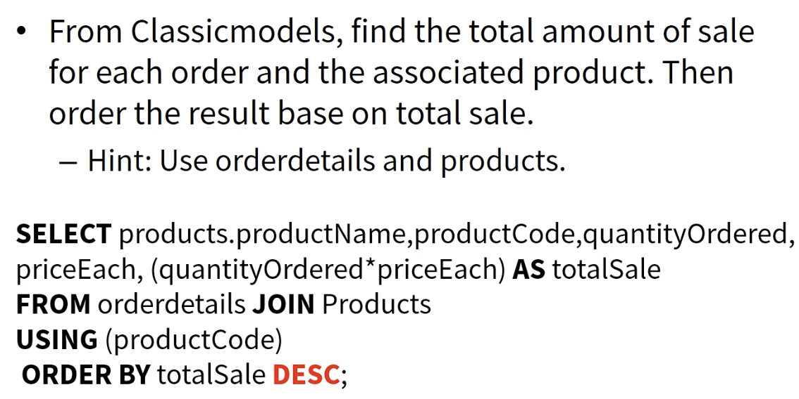
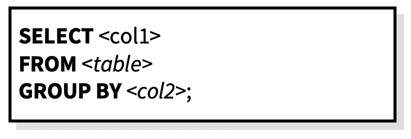
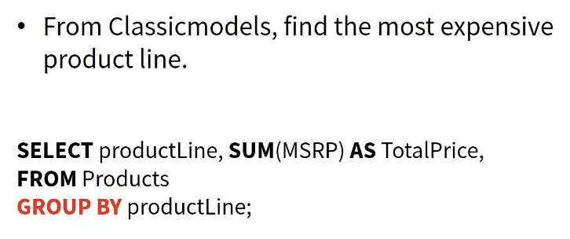
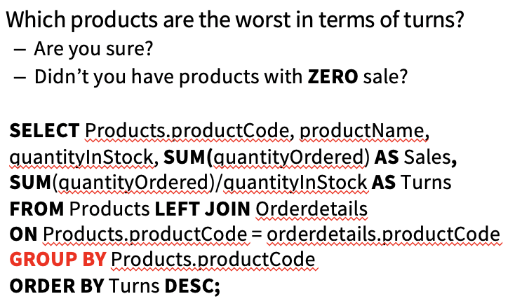

## Order and sorting

- The **ORDER BY** clause sorts the results of a query
  - You can sort in ascending (default) or descending order
  - Multiple columns can be given
  - Technically, you want to order by a column which is in the result (but you can order )

## Constants and arithmetic

- Select constants, compute arithmetic expressions  and evaluate functions in a **SELECT **statement

  - 

- #### Inventory Turns 存货周转

  - Inventory **turnover** shows how many times a company has sold and replaced inventory during a given period.
  - This helps businesses make better decisions on pricing, manufacturing, marketing, and purchasing new inventory.
  - A **low** turnover implies **weak sales and possibly excess inventory,** while a **high** ratio implies either **strong sales (good at selling) or insufficient inventory** (usually we love high number)
  - 

  

## Aggregate 

- Aggregate functions compute summaries of data in a table
  - Most aggregate functions (all except COUNT) work on a single column of numeric data
  - Use an **alias** to name the result

**COUNT**: The number of rows

**SUM**: The sum of the entries in a column

**AVG**: The average entry in a column

**MIN**,**MAX**: The minimum and maximum entries in a column

> - Count how many rows do we have
>
>   - **SELECT** COUNT(\*) as NumberOfRows
>
>      **FROM** table;

## Group by

- It is a very important function to be used for specific entities.

- **Aggregation** functions are mainly used with **Group BY**.

  - For example, we want to see the total order amount for each customer.
  - Find the average amount of purchase for each state.

- Col1 can be:

  - A column of table columns.
  - An **aggregation** function
  - A Constant

- Col 2:

  - **Should attend first in Col1** 

  

  

  

  

## Null values

- Tuples in SQL relations can have NULL as a value for one or more components.
- Meaning depends on context.  Two common cases:
  - **Missing value** : e.g., we know 1940s Ford Truck has a vendor, but we don’t know what it is.
    - Common in datasets you will use
    - Possibilities: unknown, unavailable, or withheld values
  - **Inapplicable** : e.g., the value of attribute *spouse* for an unmarried person.

- NULL not allowed for <u>primary key</u> 
- When **aggregating**, NULL values are **ignored**
  - Exception: **COUNT ** of an empty set is 0.
- The logic of conditions in SQL is really 3-valued logic: **TRUE, FALSE, UNKNOWN**.
- Comparing any value (including NULL itself) with NULL yields **UNKNOWN**.
- WHERE clause: A tuple is in a query answer if and only if the WHERE clause is *TRUE* (not FALSE or UNKNOWN).

#### Three-Valued Logic

- To understand how AND, OR, and NOT work in 3-valued logic, think of:
  - TRUE = 1
  - FALSE = 0
  - **UNKNOWN = ½.**
  - **AND = MIN**
  - **OR = MAX**
  - NOT(x) = 1-x
    - Example:
      - p OR (NOT p) = TRUE. May not hold.
      - When p = UNKNOWN, the left side is:
      - MAX( ½, (1 – ½ )) = ½ , which does not equal 1.

#### NULL’s Ignored in Aggregation

- NULL **never contributes** to a sum, average, or count, and can never be the minimum or maximum of a column.
- But, if all the values in a column are NULL, then the **result** of the aggregation is **NULL**. 
  - Exception: **COUNT of an empty set is 0.** 

## Having 

- **HAVING** is like a **WHERE** clause, except that it applies to the **results of a GROUP BY** query

- It can be used to **select groups** which satisfy a given condition

  - Groups not satisfying the condition are eliminated.

  - > identify how many vendors do we have
    >
    > **SELECT COUNT(DISTINCT(productVendor))FROM** products;

#### Having vs Where

- The **WHERE** clause applies the condition to individual rows before the rows are summarized into groups by the GROUP BY clause. However, the **HAVING** clause applies the condition to the groups after the rows are grouped into groups.
- Therefore, it is important to note that the **HAVING ** clause is applied after whereas the **WHERE** clause is applied before the GROUP BY clause.
- **WHERE** refers to the rows of tables, and **cannot use aggregate** functions
- **HAVING** refers to the groups of rows, and **cannot use columns which are not in the** **GROUP BY** 


## Subquery 

- A subquery is a query nested within a query
- Subqueries are used in order to achieve very complex searches and complex reports, as well as for various optimizations
- Subqueries come as **parenthesized statement** 
- Extremely powerful and useful
- Can be in any part of **SELECT-FROM-WHERE**
- Useful when you aren’t sure how to write a direct query
- **have to have an alias for the subquery** 

> Join 3 relations, to find product sales including name, date, and quantity ordered
>
> ​	We have done it before with chain of joins. Here lets try subqueries:
>
> ```mysql
> SELECT ORD.productCode, ProductName, orderDate, quantityOrdered
> FROM products JOIN 
> (SELECT productCode, orders.orderNumber, orderDate, quantityOrdered 
> FROM Orders JOIN orderDetails 
> ON orders.orderNumber = orderDetails.orderNumber) as ORD #have to have an alias
> ON products.ProductCode = ORD.productCode;
> ```

> At times we have an expression we want to use repeatedly
>
> Example: expected profit of inventory is: **Profit =**(MSRP – buyPrice)*Quantity
>
> Find products with profit 100,000 – 400,000; or profit > 700,000
>
> ```mysql
> SELECT * 
> FROM (SELECT ProductCode, buyPrice, MSRP, quantityInStock, (MSRP - buyPrice)*quantityInStock AS Profit FROM Products) AS Calc
> WHERE (Profit > 100000 AND Profit < 400000) OR Profit > 700000;
> ```

- #### **SubQueries can be used in the WHERE clause.**

- #### Then they need to **produce one attribute**! 

  - For example, a number
  - Especially useful when comparing to aggregate functions.  

- For example, find all products that have more than average quantityInStock.

  > Using *Products* Relation, find products with above-average profit margin.
  >
  > ​	**Profit margin is MSRP/buyPrice** 净利率
  >
  > ```mysql
  > SELECT productName, MSRP, buyPrice, quantityInStock, MSRP/buyPrice AS ProfitMargin
  > FROM products
  > WHERE MSRP/buyPrice >	(	SELECT avg(MSRP/buyPrice) FROM Products)
  > ORDER BY ProfitMargin ASC ;
  > ```


