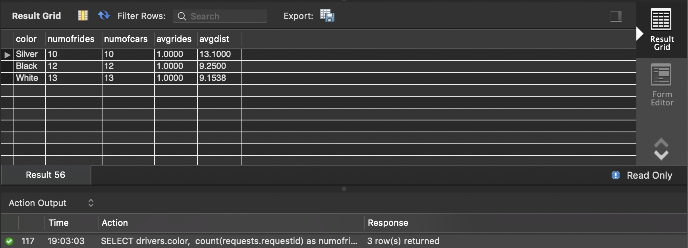
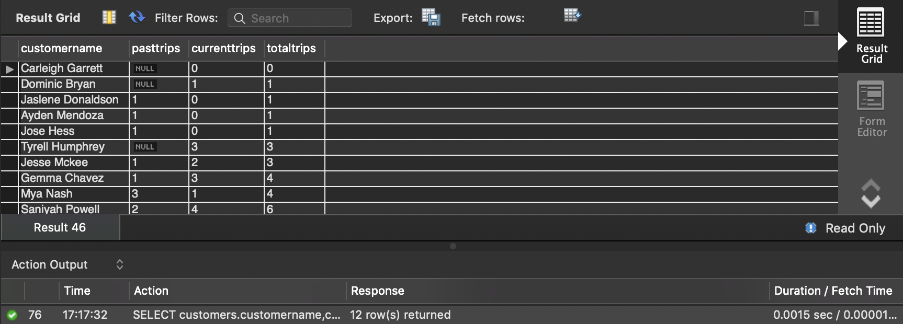
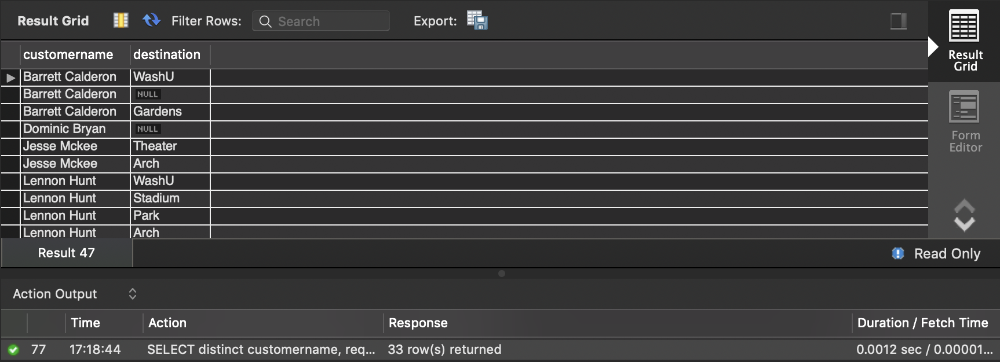
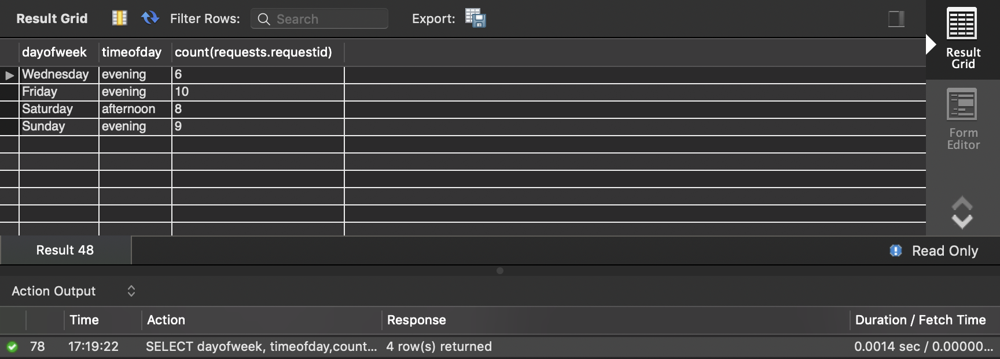
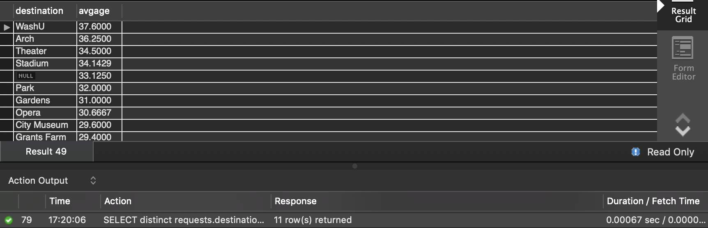
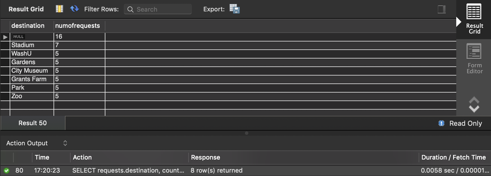
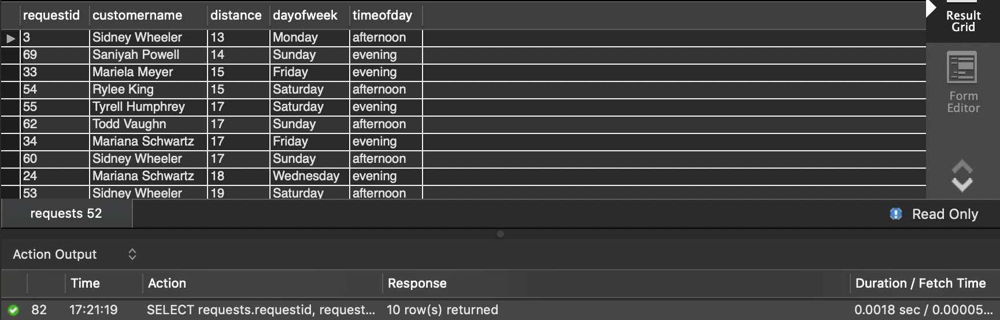

#### Student ID: 474878 / 474281 / 473924

#### Lab #4 Group Assignment

7)  Are certain car colors more popular? For each car color calculate: the number of rides, the number of cars, and the average number of rides per car. Also, calculate the average distance per car of that color.

```mysql
SELECT drivers.color, 
count(requests.requestid) as numofrides, 
count(drivername) as numofcars,
count(requests.requestid)/count(drivers.color) as avgrides,
sum(requests.distance)/count(drivers.color) as avgdist
FROM requests join drivers USING (drivername)
WHERE drivers.color is not null
GROUP BY drivers.color;
```



8)  For each customer find the total number of rides they had, both in the past and in the current week. Is there any relationship between the number of rides a customer had in the past, and the number of rides in the current week? Sort you results by the total number of rides, and return only the 12 customers with the fewest rides, in total

```mysql
SELECT customers.customername,customers.pasttrips,count(requests.requestid) as currenttrips,
if(pasttrips is null,0,pasttrips) + count(requests.requestid) as totaltrips
FROM customers left join requests
ON customers.customername=requests.customername
GROUP BY customername
ORDER BY totaltrips ASC limit 12;
```



9)  Find the destination of the customers who are older than the average age. Please list the customer name and destination of the customer. (We are interested to not see the repeated rows!).

```mysql
SELECT distinct customername, requests.destination from requests
join (select customername from customers
where age>
(select avg(age) from customers)) as oldcustomers
using (customername);
```



10)  List the number of requests by time of day on each day. List only times with more than 5 requests.

```mysql
SELECT dayofweek, timeofday,count(requests.requestid)
FROM requests
GROUP BY timeofday,dayofweek
HAVING count(requests.requestid)>5;
```



11)  What is the average age of travelers to each destination? Order from oldest to youngest.

```mysql
SELECT distinct requests.destination, avg(customers.age) as avgage
FROM requests join customers USING (customername)
GROUP BY requests.destination
ORDER BY avgage DESC;
```



12)  List the destinations that have more than 4 ride requests. Include the destination and the number of requests. Sort the results based on decreasing order of the requests.

```mysql
SELECT requests.destination, count(requests.requestid) as numofrequests
FROM requests
GROUP BY requests.destination 
HAVING numofrequests>4
ORDER BY numofrequests DESC;
```



13)  List the RequestID, CustomerName, Distance, and two other attribute for trips that are longer than the average trip. Return only the 10 shortest trips.

```mysql
SELECT requests.requestid, requests.customername, requests.distance, requests.dayofweek, requests.timeofday
FROM requests
WHERE requests.distance>(SELECT avg(requests.distance) FROM requests)
ORDER BY requests.distance ASC limit 10;
```

