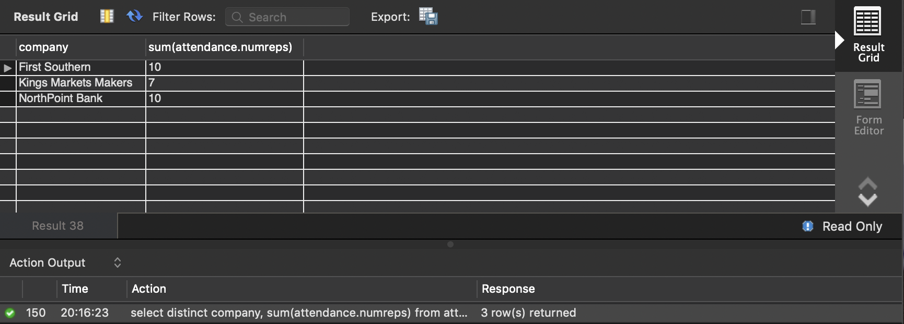
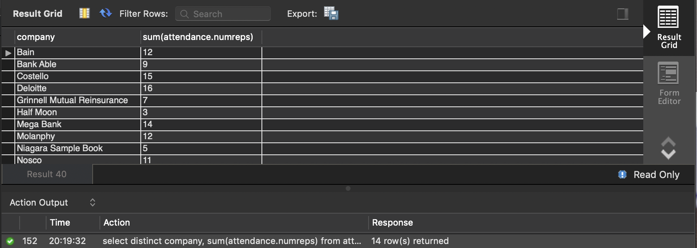

#### Student ID: 474878

#### Individual assignment #4

7. Please list the fairs that have more than average number of students attending. Please sort them based on number of students attending in descending order. Please list the career fair’s name and number of students.

```mysql
select careerfair, numberstudents
from fairs
where numberstudents>(select avg(numberstudents) from fairs)
order by numberstudents desc;
```


8. Please list the total number of students for each month of the fair where the number of students attending in the fairs are less than half of the average number attending in all fairs.

```mysql
select distinct date, sum(numberstudents)
from fairs
group by date
having sum(numberstudents)<(select avg(numberstudents) from fairs)/2;
```


9. Please list the companies that do not have any open positions (in any fair). Please do not report repeated names! (Hint: There should be only 3 companies)

```mysql
select distinct company, sum(numpositions)
from jobopenings
group by company
having sum(numpositions) is null;
```


10. Among the companies listed in question 9, how many of them are in banking industry? What about other industries? Count how many companies (selected companies) in each industry is working.

```mysql
select count(company), industry
from companies right join (select distinct company
from jobopenings
group by company
having sum(numpositions) is null) as nopos using (company)
group by industry;
```


11. In question 10, we have rows with Null industry. Please report the table without having Null rows.

```mysql
select count(company), industry
from companies right join (select distinct company
from jobopenings
group by company
having sum(numpositions) is null) as nopos using (company)
where industry is not null
group by industry;
```


12. Please find the total number of representatives for each company you listed in question 9.

```mysql
select distinct company, sum(attendance.numreps)
from attendance join (select distinct company, sum(numpositions)
from jobopenings
group by company
having sum(numpositions) is null) as nopos using (company)
group by company;
```



13. Based on your response to question number 12, please find the total number of representatives for the rest of companies. Is there any correlation regarding number of representatives between companies that are having open positions and companies that do not have?

```mysql
select distinct company, sum(attendance.numreps)
from attendance join (select distinct company, sum(numpositions)
from jobopenings
group by company
having sum(numpositions) is not null) as pos using (company)
group by company;
```



*The companies that have open positions usually assign more representatives to career fairs.* 

14. How much time did you spend on this homework?

*4 hours or so.* 