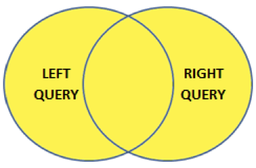
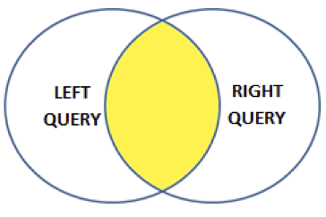
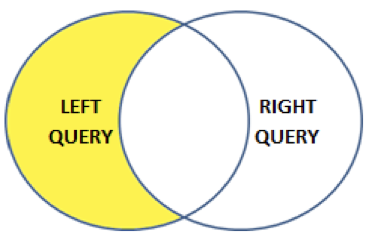
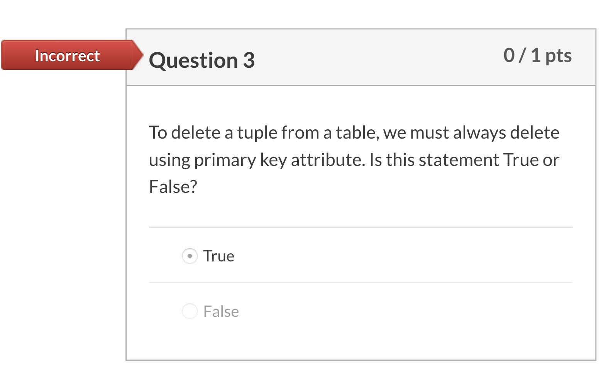
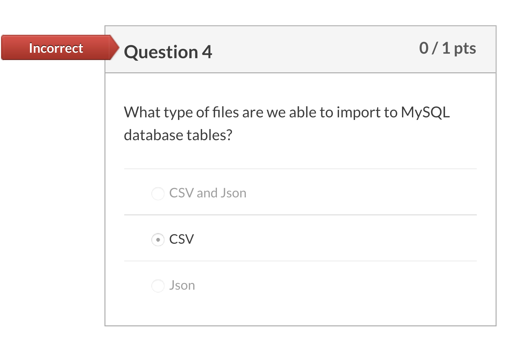
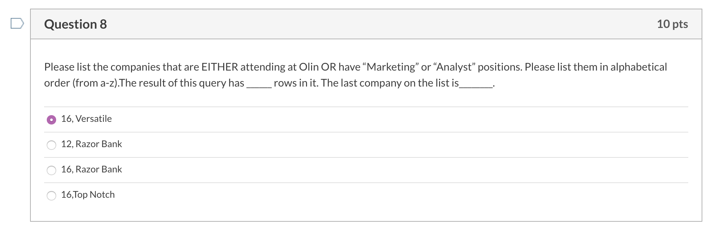

## Set 

### Union 

**UNION** operator combines the results of two or more queries and makes a result set which includes fetched rows from the participating queries in the UNION



#### Rules 

- Number of columns and order of columns of all queries must be same.
- The data types of the columns on involving table in each query must be same or compatible.
- Usually returned column names are taken from the first query.
- By default the UNION behalves like UNION [DISTINCT] , i.e. eliminated the duplicate rows; however, using ALL keyword with UNION returns all rows, including duplicates.

#### Example 

The union of products with MSRP greater than 120 and products with buy price greater than 60.

```mysql
(SELECT productName, buyPrice, MSRP FROM Products 
WHERE MSRP > 120)
UNION 
(SELECT productName, buyPrice, MSRP FROM Products 
WHERE buyPrice > 60)
ORDER by MSRP DESC;
```

### Intersection 

- The **INTERSECT** operator compares the result of two queries and returns the distinct rows that are output by both left and right queries.
- Uses the **INTERSECT** operator. 
- MySQL **doesn’t** support INTERSECT. Need to use alternative methods.
  - For example, we can use **IN** operator and a subquery.



#### Example 

Find the list of vendors that have products with both 1:18 scale and 1:24 scale

```mysql
SELECT distinct(productVendor)
FROM Products
where productScale = '1:18' and productVendor IN 
(SELECT productVendor
FROM Products
where productScale = '1:24');
```

*Alternative approach: **Self Join*** 

```mysql
SELECT p1.productVendor, p1.productCode, p1.productScale , p2.productCode, p2.productScale
FROM Products AS P1, Products AS P2 
WHERE p1.productVendor = p2.productVendor 
AND p1.productScale = '1:18' AND p2.productScale = '1:24‘
ORDER BY productVendor;
```

会多很多重复的结果，因为列多了，列的排列组合也多了

### Difference (Minus, Except)

- **MINUS** compares results of two queries and returns distinct rows from the first query that aren’t output by the second query.

- Uses the **MINUS** operator.

- MySQL **doesn’t** support MINUS.Need to use alternative methods.

  - For example, outer join, …

  - ```mysql
    (SELECT column_list 
    FROM table_1)
    MINUS
    (SELECT column_list
    FROM table_2);
    ```



#### Example

- Find the list of vendors that have products with 1:18 scale but not 1:24 scale.

- *It’s quite difficult.* 
  - Requires a subquery
  
  - Perhaps challenge yourself to work on this.
  
  - ```mysql
    SELECT distinct(productVendor)
    FROM Products
    where productScale = '1:18' and productVendor NOT IN 
    (SELECT productVendor
    FROM Products
    where productScale = '1:24');
    ```
  
    

## Creating a new database

#### Create a Database & Relation

- First create the database:

- Then, the table

- Lets create a table name bankcustomers

  - ```mysql
    Create DATABASE temp;
    USE temp;
    CREATE TABLE bankcustomers
    (Contact_id INT(11) PRIMARY KEY NOT NULL AUTO_INCREMENT, Name VARCHAR(30) NOT NULL, Address VARCHAR(30), Gender VARCHAR(6), NetWorth DOUBLE)
    ```

    - Primary key is not null
    - AUTO_INCREMENT: after the first row, increase by 1 each row
    - Double: big number
    - varchar: character

    SELECT * from bankcustomers

#### Inserting data into a relation

- Using **INSERT INTO** 

- The **first INSERT** should include an ID. This is the first value for **auto-increment**

  - ```mysql
    INSERT INTO bankcustomers (Contact_id, Name, Address, Gender, Networth)
    VALUES(100, 'John', '123 First Ave.', 'Male', 50000);
    ```

- For the rest:

  - ```mysql
    INSERT INTO bankcustomers(Name, Address, Gender, Networth)
    VALUES
    ('Sam', '324 Second Ave ','Male', null),
    ('Martha','123 First Ave', 'Female', 60000),
    (‘Alex', '542 Third St', **null, null**);
    ```

- Note: **must include *NULL*(no quotes) for null values**

- Allowed to skip columns that are null

  - ```mysql
    INSERT INTO bankcustomers (Name, Address)
    VALUES('Loser', '324 Lost Ave');
    ```

- Can also INSERT **tuples** based on a query

  - ```mysql
    INSERT INTO bankcustomers(name, address, Gender, Networth)
    SELECT name, 'New Address', Gender, null 
    FROM bankcustomers;
    ```

#### Deleting tuples

- To delete a tuple from a table, we must always delete using primary key attribute. 

  - Try first:

  - ```mysql
    DELETE FROM bankcustomers 
    WHERE Name = ‘Loser’;
    ```

  - Doesn’t work – we’re in safe mode

  - Now try:

  - ```mysql
    DELETE FROM bankcustomers 
    WHERE Contact_id = 104;
    ```

- **Note**: need to use the **Primary Key to delete**. We’re in “safe mode”

- When DELETING a tuple in one relation, make sure to **delete that tuple in all other relations** 

#### Populate Loans relation from Excel

- To read data from Excel or **CSV** file

  - Create the data in Excel. Use the same schema. No headers.  
  - ✭✭✭**NULL values** **<u>DO NOT</u> work**
  
- May need to use a special character (e.g. **-1**) and then update
  
- **To read in – Option #1**
  
    ```mysql
    LOAD DATA LOCAL INFILE 'C:/path/file.csv'INTO TABLE loans
    FIELDS TERMINATED BY ',' LINES TERMINATED BY '\n';
  ```
  
- **To read in – Option #2** 
  
    Use icon

## Updating relation and text operators

#### Updating a relation: Example

- Add a column in *loans* for Risk
  - This represents how much money the bank might lose on this loan
- To add a column (attribute)

```mysql
ALTER TABLE loans ADD Risk INT(10) AFTER Name;
```

- Update data in the column

```mysql
UPDATE Loans
SET Risk = Amount - PaidOff
WHERE PaidOff< 900;
```

- To remove a column (not now)

```mysql
ALTER TABLE loans DROP COLUMN Risk;
```

#### Updating a relation: Example 2 (concat)

- Add a column in *loans* for Address

- To add a column (attribute)

  - ```mysql
    ALTER TABLE loans ADD Address VARCHAR(30) AFTER Name;
    ```

- Update data in the column

  ```mysql
  UPDATE Loans
  SET Address = CONCAT(Name,’-’,Bank)
  WHERE Loan_ID >1202;
  ```

- ✭✭✭To remove a column 

  - ```mysql
    ALTER TABLE loans DROP COLUMN Address;
    ```

#### Updating a relation based on another relation

- Update Risk *from both tables*. 

  - Risk is based on Gender, Amount, and NetWorth.

- Use INNER JOIN to update Loans

  - ```mysql
    UPDATE Loans INNER JOIN bankcustomers USING(Name)
    SET Loans.Risk = IF(Amount < 6500, Amount-PaidOff-0.05*NetWorth, Amount)
    WHERE Gender = 'Male';
    SELECT * FROM Loans JOIN bankcustomers USING(Name);
    ```

  - Also provides an example of IF statement.

  - Could be useful for updating attribute

    - **Use nested IF**, like in Excel: IF, THEN, ELSE

#### Patterns ... Like

- A condition can compare a string to a pattern by:

  \<Attribute> **LIKE** \<pattern> or 

  \<Attribute> **NOT LIKE** \<pattern>

- Pattern  is a quoted string with:
  - **% = “any string”, of any length**

  - **_ = “any character.” (only one)**  

  - ```mysql
    SELECT*
    FROM bankcustomers
    WHERE name LIKE ‘S%';
    ```

    ```mysql
    WHERE name LIKE ‘S__'; #(exactly 2 _) #two underscores mean two characters
    ```

    ```mysql
    WHERE name LIKE ‘%m%'; #any words but include "m"
    ```

- Text processing

## Case statement

- **CASE** statement is very similar to IF statement.

- It is used to return a result based on a set of conditions

- ```mysql
  CASE 
  WHEN condition1 THEN result1
  WHEN condition2 THEN result2
  WHEN conditionN THEN resultN
  ELSE result
  END;
  ```

- You can name the condition using **AS** statement

- **CASE **statement goes through each row &
  - conditions and **return a value** when the first condition is met 
  - Once a condition is true, it will stop reading and return the result.
  - If no conditions are true, it will return the value in the ELSE clause.
  - **If there is no ELSE part and no conditions are true, it returns NULL.**

- Example

  - From loans, mark each person with high risk if the risk is greater than \$5000.

  - If between \$2000, ​\$5000 name as medium risk.

  - If less than \$2000, name as no risk.

  - ```mysql
    SELECT Name,
    CASE	
    	WHEN risk>5000 THEN 'High Risk'    
    	WHEN risk<5000 and risk>2000 THEN 'Medium Risk'    	
    	ELSE 'No Risk‘
    END
    as Explanation
    from loans;
    ```

  - Now, add this column into loans table.

    - Name it *Risk_Eval*
    - Steps: 
      - Adding a column into table
      - Updating loans table
        - Adding the “case end” 
        - ✭✭✭✭Making it into **subquery**

    ```mysql
    ALTER TABLE loans 
    ADD Risk_Eval varchar(30) AFTER Name;
    
    UPDATE loans INNER JOIN 
    (select Loan_ID,
    CASE	
    	WHEN risk>5000 THEN 'High Risk'    
    	WHEN risk<5000 and risk>2000 THEN 'Medium Risk'    			
    ELSE 'No Risk‘
    END AS Explanation
    from loans) 
    AS temp_table #it has to have a name
    using (Loan_ID)
    SET Risk_Eval= temp_table.Explanation;
    ```

## All & Any Operators

#### The ALL Operator

- **ALL** operator is a logical operator in SQL.

- ALL is used with SELECT, WHERE, & HAVING statements.

- When used after Where or Having:

  - The ALL operator returns TRUE **if** all of the subqueries values meet the condition. 

- After Select:

  - ```mysql
    Select All <col_name> from <table_name> 
    Where <condition>
    ```

  **After Where, Having:** 

  ```mysql
  SELECT <column_name(s)>
  FROM <table_name>
  WHERE <column_name> <comparison_operator> ALL
  (SELECT <column_name>
  FROM <table_name>
  WHERE <condition(s)>);
  ```

##### Example

- From products relation in Classicmodels, Find the highest mark-up among all products.

  - Mark-Up=MSRP/BuyPrice

  - ```mysql
    SELECT productName, buyPrice, MSRP, MSRP/buyPrice
    FROM products
    WHERE MSRP/buyPrice >= ALL
    (SELECT MSRP/buyPrice
    FROM Products);
    ```

#### The **ANY** Operator

- **ANY** operator is a logical operator in SQL.
- **ANY** return true if any of the subqueries values meet the condition. 
- **ANY** must be preceded by comparison operators.

```mysql
SELECT <column_name(s)>
FROM <table_name>
WHERE <column_name> <comparison_operator> ANY
(SELECT <column_name>
FROM <table_name>
WHERE <condition(s)>);
```

##### Example

From products relation in Classicmodels, find all scales, other than the “lowest” scale

```mysql
SELECT DISTINCT productScale 
FROM products
WHERE productScale > ANY
(SELECT productScale	
FROM Products);
✭✭✭✭✭！！最好加一行 is not null 因为null值会影响比较结果
```

```mysql
SELECT DISTINCT productScale 
FROM products
WHERE productScale > 
(SELECT min(productScale)	
FROM Products);
```

If you do "not" before any like below:

```mysql
SELECT DISTINCT productScale 
FROM products
WHERE NOT productScale > ANY
(SELECT productScale	
FROM Products);
```

You will get exact minimum.

#### The **EXIST **Operator

- The **EXISTS **operator checks the existence of a result of a **Subquery**. 
- When a subquery uses the EXISTS operator:
  - The subquery functions as an existence test.
  - The subquery evaluates to TRUE or FALSE rather than returning any data.
- If the subquery returns any row, the **EXISTS **operator returns **true**, otherwise, it returns **false**.
- The **NOT EXIST** returns true if the subquery returns no row, otherwise it returns false.

```mysql
Select <col_name> 
From <table_name> 
Where <condition>
EXIST (SELECT <column_name>
FROM <table_name>
WHERE <condition(s)>);
```

##### Example

From customers and orders relations in Classicmodels, find the customer who has placed at least one sales order, 

```mysql
SELECT customerNumber, customerName
FROM customers
WHERE EXISTS
( SELECT *        
FROM orders        
WHERE            
orders.customernumber = customers.customernumber);
```

Now, find customer who has **not** placed any orders:

```mysql
SELECT customerNumber, customerName
FROM customers
WHERE NOT EXISTS
( SELECT *        
	FROM orders        
	WHERE            
	✭✭✭✭✭orders.customernumber = customers.customernumber);
```

Now, find product that hasn’t been sold:

```mysql
SELECT productCode, productName
FROM products
WHERE NOT EXISTS
(SELECT * 
FROM orderdetails
WHERE orderdetails.productCode=products.productCode)
```

```mysql
SELECT productCode, productName, quantityInStock, quantityOrdered
FROM products LEFT JOIN orderdetails
using (productCode)
order by quantityOrdered limit 1;
```





In: expect to return the same attribute like you select

Exists: check all the attributes



