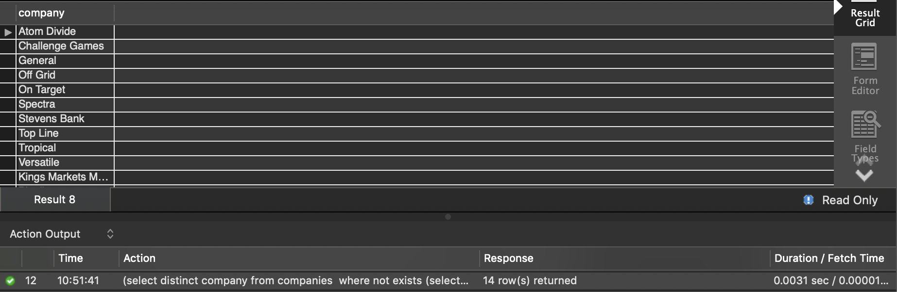

#### Student ID: 474878 / 474281 / 473924

7. Please add a new column to the companies table in order to identify the size of the companies. Please tag companies based on the following condition:

- If the number of employees are larger than 50,000, tag it as “Very Large”.
- If the number of employees are between 20,000 and 50,000, tag it as “Large”.
- If the number of employees are between 5,000 and 20,000, tag it as “Medium”.
- If the number of employees are between 500 and 5,000, tag it as “Small”.
- If the number of employees are less than 500 tag it as “StartUp”.
- If no information is available on the company size, please tag it as “No Information”

```mysql
alter table companies add CompanySize varchar(30) after company;
update companies inner join
(select company,
case 
when numemployees>50000 then "Very Large"
when numemployees>20000 and numemployees<=50000 then "Large"
when numemployees>5000 and numemployees<=20000 then "Medium"
when numemployees>500 and numemployees<=5000 then "Small"
when numemployees<=500 then "StartUp"
else "No Information"
end as explanation
from companies)
as temp_table
using (company)
set CompanySize=temp_table.explanation;
```


8. Please remove the column that you made recently (CompanySize). 

```mysql
alter table companies drop column companysize;
```


9. Find the company with the maximum number of employees. Please report the number of employees as well. Hint: use ALL.

```mysql
select company, numemployees
from companies
where numemployees >= all
(select numemployees 
from companies
where numemployees is not null);
```


10. List all the companies, except for the one with minimum number of employees.

```mysql
select company, numemployees
from companies
where numemployees > any
(select numemployees 
from companies
where numemployees is not null);
```


11. Please list companies that are not in the job opening list. Hint: you may use EXIST or IN.

```mysql
select distinct company
from companies 
where not exists
(select company from jobopenings 
where jobopenings.company=companies.company);
```


12. In addition to the list of companies in question 11, please add companies that do not have any open positions (have Null value) Hint: You may use UNION.

```mysql
(select distinct company
from companies 
where not exists
(select company from jobopenings 
where jobopenings.company=companies.company))
union
(select distinct company
from companies
where company in 
(select company from jobopenings where position is null));
```



13. Among the companies attending “All Campus” career fair, how many of them have open positions for Data Scientist or Analyst? (Hint: You may use IN command). Please list companies along with all available information for them (from Companies table).

```mysql
select * from companies
where company in 
(select attendance.company 
from attendance join fairs using (careerfair)
where careerfair='all campus')
and company in
(select jobopenings.company from jobopenings
where jobopenings.position='data scientist' or jobopenings.position='analyst');
```


14. How much time did you spend on this homework?

*5 hours or so.* 