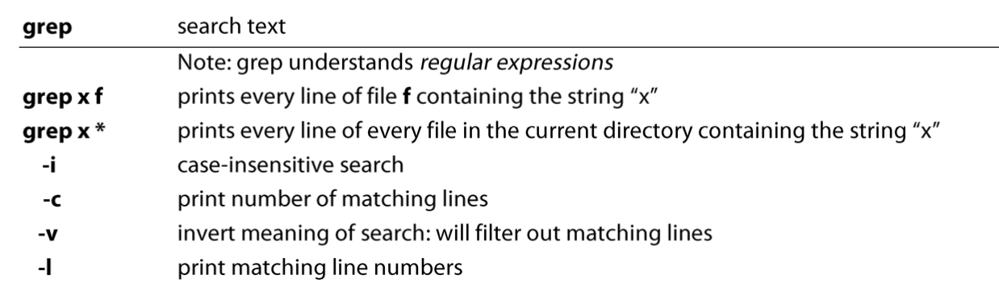
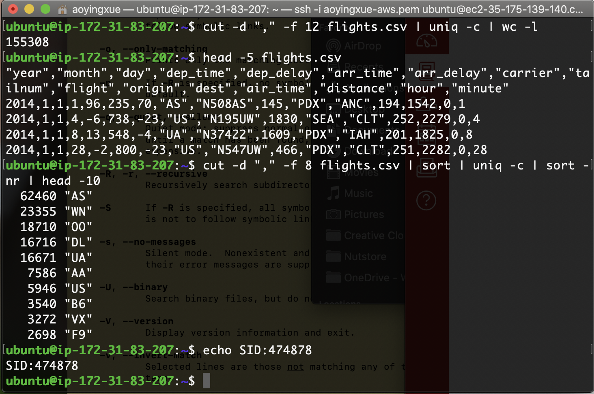

```bash
aoyingxue@yuki ~ % whoami #username
aoyingxue

aoyingxue@yuki ~ % pwd #directory i am in
/Users/aoyingxue

aoyingxue@yuki ~ % ls #folder
Applications
Creative Cloud Files
...

aoyingxue@yuki ~ % ls -a #including hidden files
.
..
.CFUserTextEncoding
.DS_Store
.RData
.Rapp.history
.Rhistory
.ShadowsocksX-NG

aoyingxue@yuki ~ % ls -lh #more information including permission and so on
total 4232
drwx------@   4 aoyingxue  staff   128B Aug  4 11:26 Applications
drwxrwxr-x@   3 aoyingxue  staff    96B Oct 22 09:49 Creative Cloud Files
drwx------@   6 aoyingxue  staff   192B Oct 22 11:32 Desktop
drwx------@  15 aoyingxue  staff   480B Oct 21 14:31 Documents
drwx------@  14 aoyingxue  staff   448B Oct 21 21:55 Downloads
drwxr-xr-x    3 aoyingxue  staff    96B Aug  4 11:13 GitBook

aoyingxue@yuki 1.07_BIG_DATA_and_CLOUD_COMPUTING % mkdir test #a new directory

aoyingxue@yuki 1.07_BIG_DATA_and_CLOUD_COMPUTING % mv txt.txt test2/ #move

aoyingxue@yuki 1.07_BIG_DATA_and_CLOUD_COMPUTING % mv txt.txt #remove a file

aoyingxue@yuki 1.07_BIG_DATA_and_CLOUD_COMPUTING % rm -r test2/ #remove a directory

htop #check cpu and running programs status

wget https://archive.ics.uci.edu/ml/machine-learning-databases/00488/Live.csv #download from internet
curl -O https://archive.ics.uci.edu/ml/machine-learning-databases/00488/Live.csv #download with -O, not just open 

ubuntu@ip-172-31-94-193:~$ head -5 Live.csv
ubuntu@ip-172-31-94-193:~$ tail -5 Live.csv
1050855161656896_1061863470556065,photo,9/24/2016 2:58,89,0,0,89,0,0,0,0,0,,,,
1050855161656896_1061334757275603,photo,9/23/2016 11:19,16,0,0,14,1,0,1,0,0,,,,
1050855161656896_1060126464063099,photo,9/21/2016 23:03,2,0,0,1,1,0,0,0,0,,,,
1050855161656896_1058663487542730,photo,9/20/2016 0:43,351,12,22,349,2,0,0,0,0,,,,
1050855161656896_1050858841656528,photo,9/10/2016 10:30,17,0,0,17,0,0,0,0,0,,,,

ubuntu@ip-172-31-94-193:~$ touch txt.txt
ubuntu@ip-172-31-94-193:~$ nano txt.txt
ubuntu@ip-172-31-94-193:~$ cat txt.txt #print out the file
sfdskdmna
dksfl
sjdls

ubuntu@ip-172-31-94-193:~$ cat Live.csv | less #print out page by page; ctrl+z cancel

[1]+  Stopped                 cat Live.csv | less

ubuntu@ip-172-31-94-193:~$ wc Live.csv #wordcount
  7051  14101 567089 Live.csv
  
ubuntu@ip-172-31-94-193:~$ shuf -n 10 Live.csv #shuffle and sample 10 rows but with headers
134115277150304_147944495767382,photo,7/1/2017 9:53,1,0,0,1,0,0,0,0,0,,,,
246675545449582_533017520148715,video,4/11/2014 6:12,332,3,2,332,0,0,0,0,0,,,,
614855718638584_656449171145905,photo,11/22/2017 2:24,16,1,1,16,0,0,0,0,0,,,,
246675545449582_311777885606014,photo,1/12/2013 6:48,83,15,0,83,0,0,0,0,0,,,,
246675545449582_447394992044302,video,10/16/2013 11:36,107,5,5,107,0,0,0,0,0,,,,
246675545449582_1208615195922274,photo,2/24/2017 9:12,320,17,0,309,9,1,1,0,0,,,,
134115277150304_191754744719690,photo,11/8/2017 8:08,37,2,3,35,1,1,0,0,0,,,,
725980084255106_864711063715340,video,5/17/2018 6:06,1290,1530,627,1032,149,106,3,0,0,,,,
246675545449582_908456265938170,photo,3/12/2016 23:15,183,15,0,182,1,0,0,0,0,,,,
1050855161656896_1368931673182575,status,8/15/2017 10:02,29,7,0,27,0,0,0,2,0,,,,
```

#### **| (<u>piping</u>)** : 

use one output of a command as an input to the other command

#### wordcount: frequency of the words (wc) 

How many lines it does have? How many words are in the Shakespeare text file?

```bash
wc t8.shakespeare.txt
```

##### wc: -l lines; -w words; -c bytes / -m characters

#### Shuffle 

#### How to deal with header?

```bash
#get headers
head -1 Live.csv > Header.csv
tail -n+2 Live.csv | shuf -n 100 > samplewithouthead.csv #print the whole file without the header and then shuffle; save into another file
cat Header.csv samplewithouthead.csv > sample.csv #combine two files and save into another file
```

#### chmod (change mode)

R: read 4

W: write 2

X: executable 1 

Root (admin) / groups / anyone

#### history

Every command that we has tried so far

How to access the history command without typing or copying?

```bash
!13
!! #the previous command
```

#### grep

Find some words in files (正则化)

```bash
#find x in any files in my current folder
grep e *

#count how many words including 9
grep -c "9" times.csv

#find some command in history and return the number of the command
history | grep ssh

#find the number of lines containing "video"
grep "video" Live.csv -c
```



#### cut

-d, --delimiter=DELIM  use DELIM instead of TAB for field delimiter

-f, --fields=LIST    select only these fields; also print any line

​              that contains no delimiter character, unless

​              the -s option is specified

```bash
#cut using "," and get the second column
cut -d "," -f 2 Live.csv | less
```

#### sort

**-r Option:** **Sorting In Reverse Order**

**-n Option** : To sort a file **numerically** used –n option

#### uniq

##### Best <u>sort</u> before uniq!!! Otherwise there may be different 

-c, --count     prefix lines by the number of occurrences

-d, --repeated    only print duplicate lines, one for each group

-u, --unique     only print unique lines

```bash
uniq -d Live.csv #print the repeated lines
uniq -u live.csv #print the unique lines
```

#### tr

Unix is sensitive about the characters so it needs <u>translation</u>

"<"

```bash
cat Live.csv | tr '[:lower:]' '[:upper:]' | less #change the lowercase to uppercase
cat Live.csv | tr -d "photo" | less #delete "photo"
```

```bash
tr " " "\n" < t8.shakespeare.txt
```

#### quiz 1

```bash
wget https://ocw.mit.edu/ans7870/6/6.006/s08/lecturenotes/files/t8.shakespeare.txt

#How many lines it does have? How many words are in the Shakespeare text file?
wc t8.shakespeare.txt
## wc: -l lines; -w words; -c bytes / -m characters

#How many unique words are in the file? 
tr " " "\n" < t8.shakespeare.txt | sort | uniq -c | wc -l

#What is the most frequent word? And how many times?
cat t8.shakespeare.txt | tr " " "\n" | sort | uniq -c | sort -nr | head -10
```

```bash
#How many lines does it have?
wc -l flights.csv

#How many unique destinations are there? (12列)
cut -d "," -f 12 flights.csv | uniq -c | wc -l

#What carrier has been used most? How many times? (8列)
cut -d "," -f 8 flights.csv | sort | uniq -c | sort -nr | head -10
```



------------------

1. **whoami**. The command is used to see the username.
2. **pwd**. The command is used to see the current directory.
3. **ls**. The command is used to see the list of files and folders in the current directory. 
   1. ls -lh list all files and folders by details.
4. **cd**. The command is used to change the directory.
   1. cd .. goes to upper directory.
   2. cd <folder> goes into requested folder.
   3. cd ~/ goes into home directory. 
5. **mkdir**. The command is used to create a directory.
6. **nano**. Nano is an editor. It used to create or change a document.
7. **cp**. The command is used to copy a file into a folder or somewhere else.
8. **mv**. The command is used to move (cut/paste) a file or folder.
9. **rm**. The command is used to delete a file or folder.
   1. rm -r deletes a folder.
10. **clear**. The command is used to clear the screen.
11. **top**. It is used to display the users and resources on the machine. 
    1. htop is another version that is a little bit fancier.
12. **wget** "url" is used to download a file.'
    1. In mac, wget is not istalled.
       1. You can install wget through brew.
       2. You can instead, use curl -O "url" to download a file.
13. **head**. It is used to show the top rows of a file.
    1. head -n shows first n rows of a file.
14. **tail**. It is used to show the last rows of a file.
    1. tail -n shows the last n rows of a file.
15. **cat**. It is used to display the file on the screen.
16. **wc**. It is used as wordcount.
    1. wc shows how many lines, how many words, and how many characters.
    2. wc - l, shows numbers, wc - w shows how many words, wc -c shows how many characters.
17. **shuf**. It is used to create a sample of a file. 
    1. shuf -n takes n randomly selected rows of a file.
    2. shuf is not installed on mac. You can install "coreutils" first, then gshuf will be the command.
18. \>. This character is used as an assignment. For example, I can save the first 5 rows of a file into a new file using this command.
    1. head -5 file > new_file
19. **|**. This is the piping character. Means the output of the command before that, will be the input into the command after that. 
20. **grep**. This command search for a pattern in a file.
    1. ex. grep video Live.csv shows the rows in the Live.csv where the video is available on the row.
21. **cut**. This command is used to take a section of a file. 
    1. ex. cut -d "," -f 2 c.csv means get the second command of c.csv. 
22. **uniq**. This command is used to find the uniq values in a file.
    1. uniq -c counts how many times each value has been repeated.
    2. uniq -u shows uniq values.
    3. uniq -d finds duplicate.
23. **tr**. It is a translation command. It reads from screen.
    1. tr [:lower] [:upper:] changes lower letters to capital letters.
    2. tr [a-z] [A-Z] changes lower letters to capital letters.
    3. tr -d "_" deletes "_" from the screen.
24. **sort**. This command sorts the values. 
    1. sort -r sorts in reverse.
    2. -n sorts in numeric

