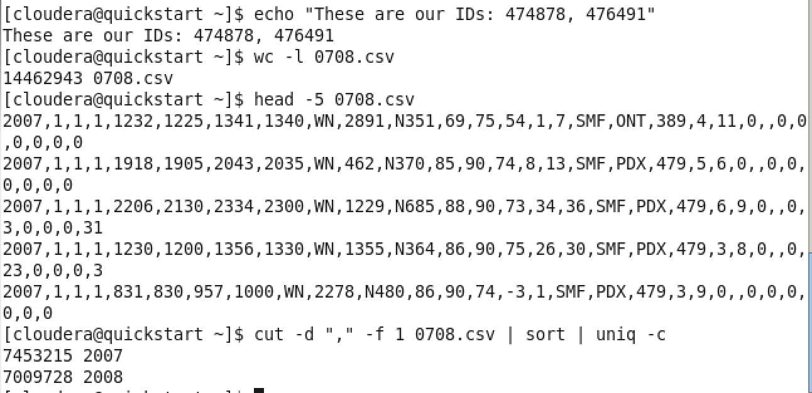
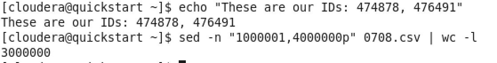
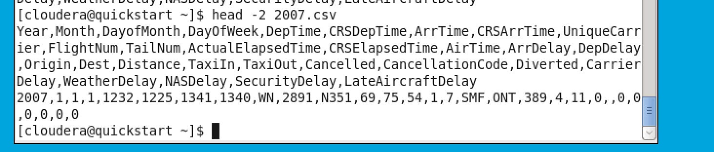

#### Summary of Lab #3

**Exercise**

1- Download a file "[Web Sample Tweets 2009.csv](https://wustl.instructure.com/courses/31856/files/762556/download?wrap=1)[](https://wustl.instructure.com/courses/31856/files/762556/download?wrap=1)" from Canvas

2- Upload it to your home directory

*Active the drag-drop option in VMBox. Look at the VBoxSettings page on Canvas. Then drag and drop your file into Cloudera*

3- Using bash commands, take only tweets column and save it as "tweets.txt" (Hint: You may use awk or cut). Report the exact commands and parameters.

```bash
cut –d “,” –f 6 Web\ Sample\ Twitts\ 2009.csv > tweets.txt
```

4- Run wordcount MapReduce job on "tweets.txt".

On terminal:

```bash
cd /usr/lib/hadoop-0.20-mapreduce/

cp hadoop-examples.jar ~/

cd ~

hadoop jar hadoop-examples.jar wordcount tweets.txt output
```

5- Load the results into Hive and report your Hive commands for tasks 6 to 9. You need to create the table for this file.

On terminal:

```
hdfs dfs –get output/part-r-00000

hdfs dfs –chmod 777 output
```

On Hive:

```bash
CREATE TABLE wordcount (word STRING, freq INT) ROW FORMAT DELIMITED On FIELDS TERMINATED BY '\t' STORED AS TEXTFILE;

LOAD DATA INPATH “/user/cloudera/output/part-r-00000” INTO TABLE wordcount;
```

6- Show the top 10 words in terms of the frequency and report the results.

```
SELECT * FROM wordcount SORT BY freq DESC LIMIT 10;
```

7- Show the 10 lowest frequent words and report the results.

```
SELECT * FROM wordcount SORT BY freq ASC LIMIT 10;
```

8- Show which words had a frequency of 50 to 100 and report the results.

```
SELECT * FROM wordcount WHERE freq>50 AND freq<100 SORT BY freq DESC;
```

9- Perform the last three questions by Impala and create a table contains the time to execute the code in both languages (Hive and Impala).

Generally run time in Impala is less than Hive

------------


1. 

2/3. 

4. 

section 2

1. 

create table 0708 (Year INT, Month INT, DayofMonth INT,
DayOfWeek INT,DepTime INT,CRSDepTime INT,ArrTime INT, CRSArrTime INT, UniqueCarrier STRING,FlightNum INT,TailNum STRING, ActualElapsedTime INT, CRSElapsedTime INT,AirTime INT,ArrDelay INT, DepDelay INT,Origin STRING,Dest STRING,Distance INT, TaxiIn INT, TaxiOut INT,Cancelled INT, CancellationCode INT,Diverted INT,CarrierDelay INT,WeatherDelay INT,NASDelay INT,SecurityDelay INT,LateAircraftDelay)

ROW FORMAT DELIMITED FIELDS TERMINATED BY ","

STORED AS TEXTFILE;


