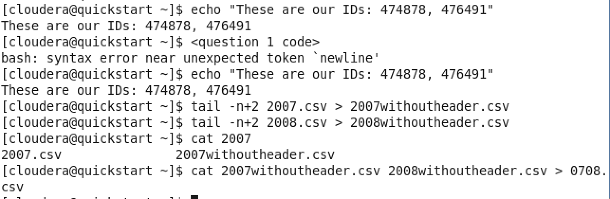

1. 

2/3. 

4. 

section 2

1. 

create table 0708 (Year INT, Month INT, DayofMonth INT,
DayOfWeek INT,DepTime INT,CRSDepTime INT,ArrTime INT, CRSArrTime INT, UniqueCarrier STRING,FlightNum INT,TailNum STRING, ActualElapsedTime INT, CRSElapsedTime INT,AirTime INT,ArrDelay INT, DepDelay INT,Origin STRING,Dest STRING,Distance INT, TaxiIn INT, TaxiOut INT,Cancelled INT, CancellationCode INT,Diverted INT,CarrierDelay INT,WeatherDelay INT,NASDelay INT,SecurityDelay INT,LateAircraftDelay)

ROW FORMAT DELIMITED FIELDS TERMINATED BY ","

STORED AS TEXTFILE;

