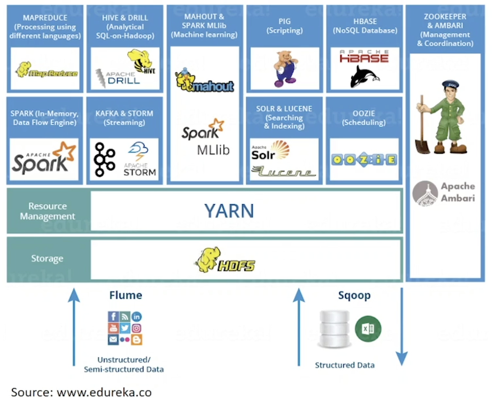
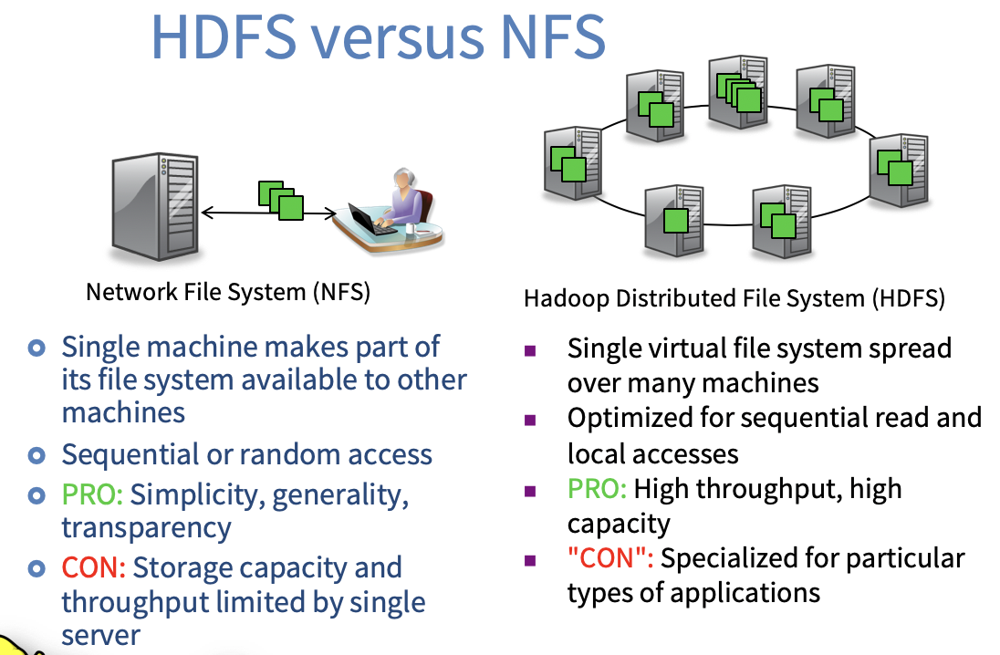
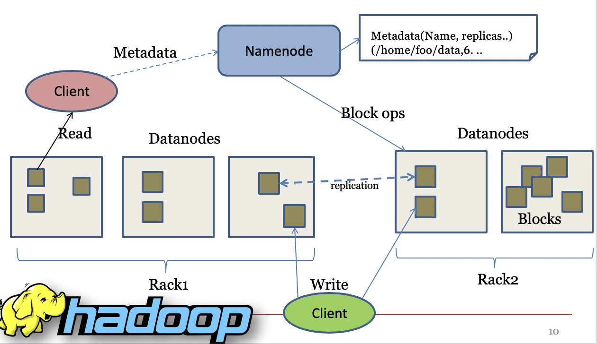
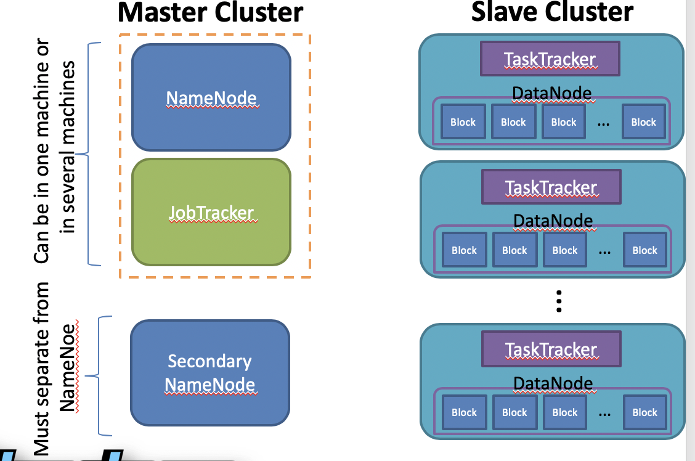
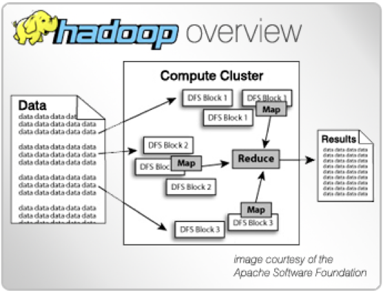
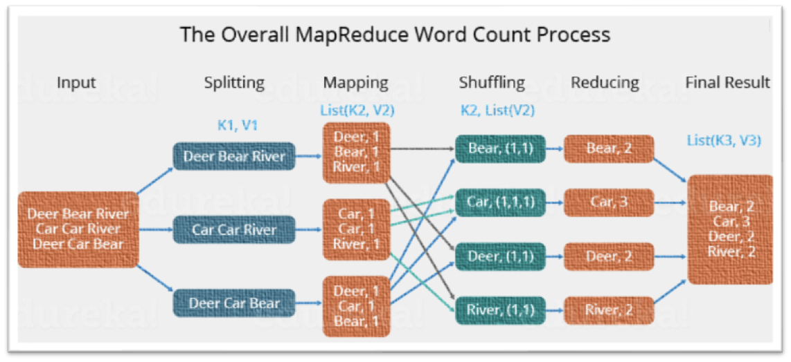
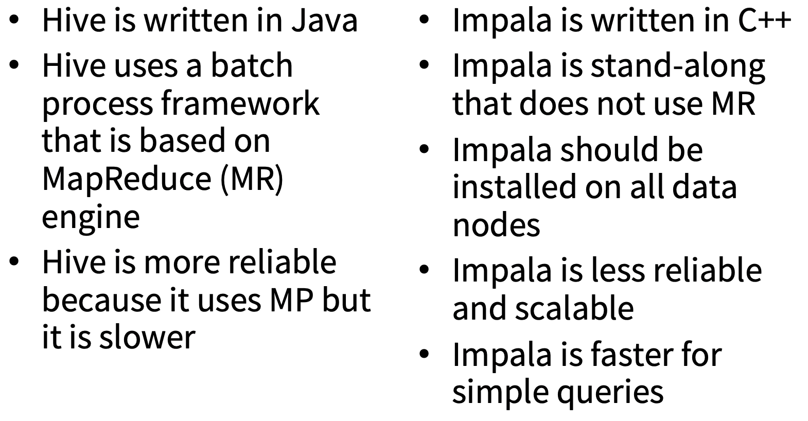

### Hadoop Ecosystem  

- Hadoop is a scalable and fault-tolerand distributed system for processing & storage of large files.
- Apache Hadoop is an open-source software framework for storage and large-scale processing of data-sets on clusters of commodity hardware.

### Some characteristics of Hadoop  

- Open source
- Distributed processing
- Distributed storage
- Scalable
- Reliable
- Fault-tolerant
- Economical
- Flexible

#### Main Components:

- **HDFS**: Distributed File System
- MapReduce: Programming Paradigm

#### Other tools:

- Hbase: Hadoop column database; supports batch and random reads and limited queries.
- ZooKeeper: It’s a coordination service that gives you the tools you need to write correct distributed applications.
- Pig: Data processing language and execution environment
- Hive: Data warehouse language with SQL interface
- Oozie: Workflow <u>scheduler</u> system for MR jobs
- Hue: Web application for interacting with Apache Hadoop.
- Impala: Low-latency data warehouse language with SQL interface
- Spark: Spark is a framework for writing fast, distributed programs. Spark solves similar problems as Hadoop MapReduce does but with a fast in-memory approach and a clean functional style API.



### HDFS  

- HDFS is the abbreviation for Hadoop Distributed File System.

- HDFS is a distributed file system that is fault tolerant, scalable and extremely easy to expand.

- HDFS is the primary distributed storage for Hadoop applications.

  -------------

- Terabytes or Petabytes of data

- Larger files than NFS (Network File System)
- Reliable
- Fast, Scalable access 
- Integrate well with Map Reduce
- Restricted to a class of applications

### Requirement of a big data platform  

- Fault tolerance
  - If a component fails, it should not affect the entire system
- Recoverability
  - In the event of failure, no data should be lost
- Consistency
  - The failure of one job should not affect the final result
- Scalability
  - Adding load may lead to a decline in performance, not failure

### HDFS versus NFS 



### Fault tolerance  

- Failure is the norm rather than exception.
- A HDFS instance may consist of thousands of server machines, each storing part of the file system’s data.
- Since we have huge number of components and that each component has non-trivial probability of failure means that there is always some component that is non-functional.
- <u>Detection</u> of faults and quick, automatic <u>recovery</u> from them is a **core architectural goal** of HDFS.

---------

- HDFS is designed to spread the data across a large number of machines.
- HDFS is implemented as a block-structured file system, means that HDFS makes small chunks of a data file. By default each chunk is 128MB. However, this size can be changes.
- HDFS uses data **replication** to cope with the malfunctioning. By default, HDFS makes **3 copies** of each file.
- HDFS is optimized to support high-streaming read performance.  This means that if an application is reading from HDFS, it should **avoid (or at least minimize) the number of seeks****.** 
- HDFS supports only a limited set of operations on files — writes, deletes, appends, and reads, but not updates**.** 
- HDFS does **not** provide a mechanism for **local caching** of data**.** Data should simply be **re-read** from the source.

### HDFS Architecture  

- —Master/slave architecture
- —HDFS cluster consists of a single **Namenode**, a master server that manages the file system namespace and regulates access to files by clients.
- There are a number of **DataNodes** usually one per node in a cluster.
- The DataNodes manage storage attached to the nodes that they run on.
- —HDFS exposes a file system namespace and allows user data to be stored in files.
- A file is split into one or more blocks and set of blocks are stored in DataNodes.
- —DataNodes: serves read, write requests, performs block creation, deletion, and replication upon instruction from Namenode.





### Secondary NameNode  

- What if **primary** NameNode **fails**? 
  - losing the NameNode effectively means losing HDFS.
- The Secondary NameNode is not just a “backup NameNode**.**”
- It serves as a **check pointing** mechanism for the primary NameNode.
  - it maintains an image file and an edit log.
  - The image file represents an HDFS metadata state at a point in time, and the edit log is a transactional log of every file system metadata change since the image file was created**.** 

### Commands 

https://hadoop.apache.org/docs/current2/hadoop-project-dist/hadoop-common/FileSystemShell.html

```bash
#List all files: 
hdfs dfs -ls

#Copy a file from local machine to HDFS: 
hdfs dfs –put <localsrc> <dest>

#Copy a file from HDFS to local machine:
hdfs dfs –get <src> <localdest>

#Remove file from HDFS:
hdfs dfs –rm <file>

#Remove a directory from HDFS:
hdfs  – -r <folder>

#another way
hadoop fs -ls
```

# Manipulation

### MapReduce  

- MapReduce is a programming model for data processing. The model is simple, yet not too simple to express useful programs in.
- MapReduce is a framework for executing highly parallelizable and distributable algorithms across huge data sets using a large number of commodity computers.
- MapReduce was introduced to solve large-data computational problems, and is specifically designed to run on commodity hardware. 
- It is based on *divide-and-conquer* principles — the input data sets are split into independent chunks, which are processed by the mappers in parallel.





### Hue  

- Hue is a Web-UI to let users easily access to Cloudera tools such as Hive, Hbase tables, HDFS files, Jobs, Users, …
- Hue is introduced by Cloudera.
- Hue can be accessed through your favorite browser.
- Default address to access:

[http://](http://quickstart.cloudera:8888/hue)[quickstart.cloudera:8888/hue](http://quickstart.cloudera:8888/hue)

- If you are running Cloduera in VM, 
- Just open the Mozilla and click on Hue in the bookmarks.
- Default User & Pass for Hue is “cloudera”
- Hue lets you to write and run codes in Hive, Pig, Impala.
- In Hue, you can see the saved **tables** in **Hive and Impala**.
- You also get access to HDFS. You may remove, or download files from HDFS to local directory.
- Hue lets you to create users to get access to the interface.
- You can also look at the running jobs and schedulers. 

### Hive  

- Hive is a data warehouse infrastructure built on top of Hadoop that provides tools to enable easy data summarization, ad-hoc querying and analysis of large datasets data stored in Hadoop files. 
- It provides a mechanism to put structure on this data and it also provides a simple query language called Hive QL which is based on SQL and which enables users familiar with SQL to query this data. 
- Hive also allows traditional **map/reduce** programmers to be able to plug in their custom mappers and reducers to do more sophisticated analysis which may not be supported by the built-in capabilities of the language.
- Not very fast

#### Simple Exercise:

- Display tables:

  - ```
    Show tables;
    ```

- Create table

  - ```
    CREATE TABLE wordcount (word STRING, freq INT) ROW FORMAT DELIMITED FIELDS TERMINATED BY '\t' STORED AS TEXTFILE;
    ```

- Description of wordcount table

  - ```
    DESCRIBE wordcount;
    ```

- Load file from HDFS to Hive

  - Before loading a file into Hive:

    - **Make sure that Hive has write access to the folder.**

      ```
      Hdfs dfs –chmod **777** <folder_name>
      ```

  - ```
    LOAD DATA INPATH “word_output” INTO TABLE wordcount;
    ```

- Display the input data:

  - ```
    SELECT * FROM wordcount;
    ```

- Find freq over 2

  - ```
    SELECT * FROM wordcount WHERE freq > 2 SORT BY freq ASC;
    SELECT freq, **COUNT(1)** AS f2 FROM wordcount GROUP BY freq SORT BY f2 DESC; 
    #dummy number just to count
    ```

### Impala  

- Cloudera Impala is the massively parallel processing (MPP) SQL query engine that runs natively in Apache Hadoop.
- Impala shares the **same tables with Hive** 
- Impala provides a high degree of compatibility with the Hive Query Language (HiveQL).

#### Impala vs Hive  



#### When to use Impala or Hive  

- Use **hive** if you are considering of taking up an upgradation project then compatibility comes up as an important factor to rely upon.
- **Impala** is the best choice out of the two if you are starting something fresh

Ref. https://www.quora.com/What-is-the-difference-between-Apache-HIVE-and-Impala 

### Pig  

- Apache Pig is an abstraction over **MapReduce**.
- Apache Pig is a framework for analyzing large un-structured and semi-structured data on top of Hadoop.
- To write data analysis programs, Pig provides a high-level language known as Pig Latin.
- Pig Engine, then translates and converts the Pig Latin scripts into MapReduce tasks.

#### Features of Pig  

- Rich set of operators: 
  - It provides many operators to perform operations like join, sort, filer, etc.
- Ease of programming: 
  - Pig Latin is similar to SQL and it is easy to write a Pig script if you are good at SQL.
- **UDF’s**: 
  - Pig provides the facility to create **UDF(User Defined Function)** in other programming languages such as Java and call them in Pig Scripts.
- Handles all kinds of data: 
  - Apache Pig analyzes all kinds of data, both structured and unstructured.
  - It can store the results in HDFS.

#### Motivation of Using Pig  

- Faster development
  - Fewer lines of code (Writing map reduce like writing SQL queries)
  - Faster & Optimized
- One test: Find the top 5 words with most high frequency
  - 10 lines of Pig Latin V.S 200 lines in Java
  - 15 minutes in Pig Latin V.S 4 hours in Java

#### Word Count using Pig  

```plsql
Lines=LOAD ‘input/hadoop.log’ AS (line: chararray); 
Words = FOREACH Lines GENERATE  FLATTEN(TOKENIZE(line)) AS word;
Groups = GROUP Words BY word;
Counts = FOREACH Groups GENERATE  group, COUNT(Words);
Results = ORDER Words BY Counts DESC;
Top5 = LIMIT Results 5;
STORE Top5 INTO /output/top5words;
```

#### Pig vs Hive  

| Characteristic            | Pig                        | Hive                      |
| ------------------------- | -------------------------- | ------------------------- |
| For                       | Programming                | Making Reports            |
| Language Name             | Pig Latin                  | HiveQL                    |
| Type of Language          | Dataflow                   | Declarative (SQL Dialect) |
| Developed By              | Yahoo                      | Facebook                  |
| Data Structures Supported | Nested and Complex         | Table/Partition/Bucket    |
| Relational Complete       | YES                        | YES                       |
| Who uses?                 | Researchers  & Programmers | Data Analyst              |

#### Example  

- Lets work on the wordcount table.

- First Go into Pig environment 

  - Either through Hue, or directly into Pig Shell by typing pig in terminal.

- This table is already available on Hive.

  - Note that table space is shared between Hive & Impala, but **NOT Pig**.
  - So, we need to **import it into PIG.**

- First we need to load the file into Pig.

  - If by shell: First Call Pig shell by pig -useHCatalog

  - ```
    wordcount = LOAD 'wordcount' USING org.apache.hive.hcatalog.pig.HCatLoader();
    ```

- You can **watch the table** now by:

  - ```plsql
    Dump wordcount;
    ```

- Then, lets do a group by to see how many frequencies we have.

  - We have done it in Hive using

  - ```plsql
    SELECT freq, COUNT(1) AS f2 FROM wordcount GROUP BY freq SORT BY f2 DESC;
    ```

  - Now try it in Pig, but a little bit different syntax!

- Then, group by:

  - grpd = GROUP wordcount BY **freq**

- Then count:

  - ```plsql
    cntd = FOREACH grpd GENERATE group, COUNT(wordcount) AS cnt;
    ```

- Then filter to see rows with higher than 1 count (Extra step):

  - ```plsql
    fltrd = FILTER cntd BY cnt > 1;
    ```

- Watch results:

  - ```plsql
    Dump fltrd
    ```

- Store the result into HDFS:

  - ```plsql
    STORE fltrd INTO 'filtered_wc';
    ```


### Lab

-----------

Pig: yahoo; DUMP: send the output to the screen when you are debugging; pig latin and runtime similar to between java virtual machine(JVM) and java application

Hive: Facebook; HQL; hive shell (command line interface)

Oozie: yahoo; XML based called hPDL(Hadoop process definition)

Bigsheets: non-program, browser based; by big insights; can read and process data in JSON, CSV and other delimited formats; translate workload into Pig scripts;

JAQL: BigInsights, Hadoop

Avro: data serialization, data exchange; data schema stored in JSON, data stored in binary format

Flume: a mechanism for moving large volumes of data into Hadoop 

HBase: predefine the schema; tables stored in HDFS; not a relational data store; good at managing sparse data sets