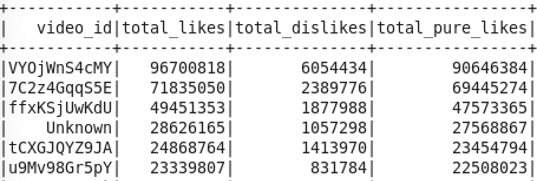

#### Assignment 5

Student ID: 474878 / 476491

Question 1:

```python
yt_rdd=sc.textFile("youtube.csv")

## header
yt_header=yt_rdd.first()
rows_rdd=yt_rdd.filter(lambda x:x!=yt_header)

## extract columns
data_rdd=rows_rdd.map(lambda x:x.split(",")).map(lambda x:(x[0].encode("ascii"),x[8].encode("ascii"),x[9].encode("ascii")))
f1_rdd=data_rdd.map(lambda x:[x[0],int(x[1]),int(x[2])])

## create dataframe
df1=sqlContext.createDataFrame(f1_rdd,["video_id","likes","dislikes"])

## group by and sum up
df2=df1.groupby(df1.video_id).agg({"likes":"sum","dislikes":"sum"})
df2.show()
## rename the columns
df2=df2.toDF("video_id","total_likes","total_dislikes") ##rename
df2.show()
```


```python
## calculate pure likes of each video id
df3=df2.withColumn("total_pure_likes",df2.total_likes-df2.total_dislikes)
df3.show()
```


Question 2:

```python
## sort the pure likes
df4=df3.sort(df3.total_pure_likes.desc())
df4.show(6)
```



```python
df4.show()
```


It's consistent with what we found in the previous homework. 