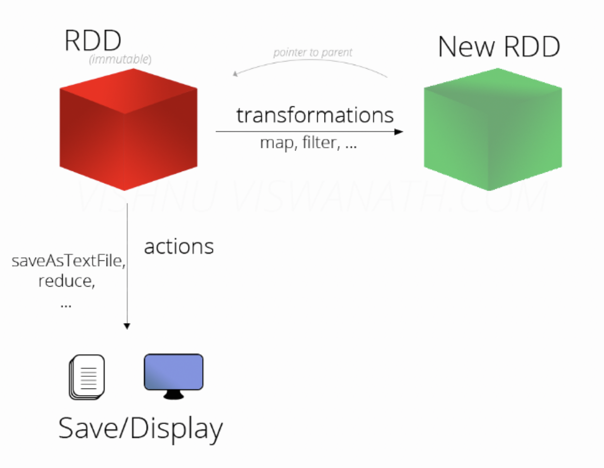
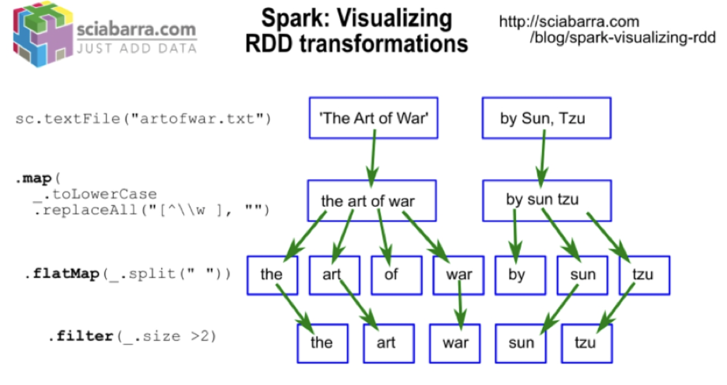
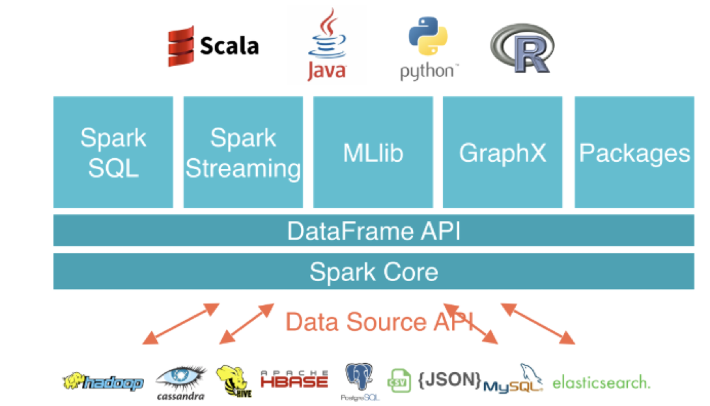
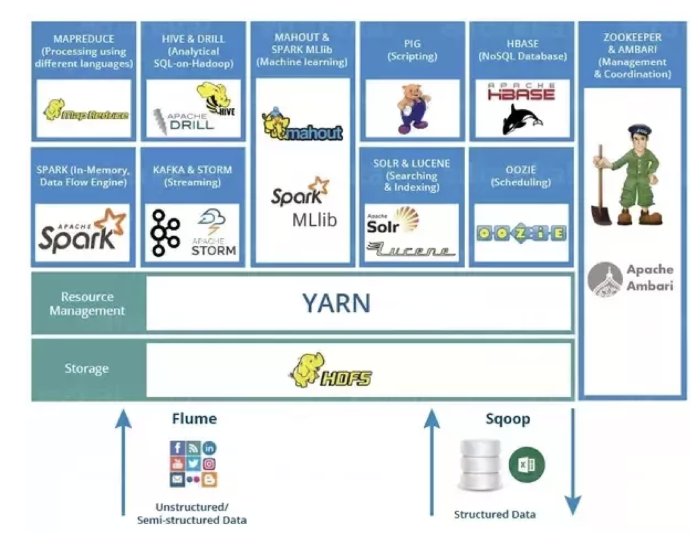

### MAP/REDUCE/LAMBDA in python

A lambda function in Python can take any number of arguments, but can only have one expression.

Map is like for loop. 

### Motivation for Spark  

- The paradigm of Map-reduce is capable of handling big data by the concept of divide and conquer.
  - Spark was developed after MapReduce
- However, in the reduce part, its requirement to collect multiple computational results in a single point takes time.
- If an algorithm, needs to be run iteratively, a map-reduce job is very time consuming.
- So Hadoop needs Spark!

### In-Memory Processing Speed  

Access of in-memory processing is 100,000 times faster than disk when performing random access

### What is Spark  

- Spark is developed in UC Berkley AMPLab by Matei Zaharia in 2009.
- Spark is written in **Scala** (Most other Hadoop apps were written in Java).
- Spark can handle both real time and batch computational tasks on HDFS and other data sources.
- Spark is an **in-memory computational framework** so that if a data set can fit into a memory, the computation is much faster (100x).
- Map reduce needs to be done into small pieces in many applications but Spark can be implemented continuously in a sequence of in-memory data
- Spark performs **better for iterative algorithms**.

### Inside Spark’s Parallel Computation  

- RDD (**Resilient Distributed Datasets**): a programming abstraction that represents a **read-only** collection of object that are partitioned across a set of machines.
  - While programming in Spark, we cannot modify RDDs.
- Two types of operations on RDDs:
  - Transformations (like map)
  - Actions (like reduce) e.g. sum or mean
- RDDs are partitioned collections of data that allow the programmer to apply operations to the entire collection in parallel.







### Running Spark to Replace Hadoop Ecosystem  

- Structured Data Analysis
  - Spark SQL for Hive SQL
- Interactive SQL
  - Spark SQL for Impala
- Machine Learning Analysis
  - **MLlib** for Mahout
- Real-time Streaming Data Analysis
  - Spark streaming for Storm



https://spark.apache.org/docs/latest/programming-guide.html

### Spark  

- Spark is generally provided in the Hadoop Ecosystem.
- Many are interested to play around Spark.
- But, not all have access to Hadoop clusters.
- In addition, not many know Scala to write Spark languages.
- But many know PYTHON! 
- Then, we have PySpark. 

#### How to access PySpark?

- Just go to terminal in your Cloudera VM and type pyspark.
- This method is called stand-alone Spark environment where you can install PySpark on your local machine.
- This environment is usually used for training, and definitely not production.

### WordCount Example  

```bash
wget https://ocw.mit.edu/ans7870/6/6.006/s08/lecturenotes/files/t8.shakespeare.txt
```

- Like what we have done in MapReduce, we like to process the word count. But before, let’s perform simple tasks using Spark.
- First task, is to read the file so (r**emember to have the file in HDFS**):
- I’ll call it lines_rdd. So I write:

```python
lines_rdd= sc.textFile(" t8.shakespeare.txt ")
```

- If you are running in stand_alone mode, please have these two rows first:

```python
conf = SparkConf().setMaster("local").setAppName("WordCount")
sc = SparkContext(conf = conf)
```

-  identify the **header**.

  ```python
  header = flight_rdd.first()
  ```

- Now, try to **count the number of lines**:

```python
lines_rdd.count()
```

- Now, see how many words does it have, just number. How many words?
- To perform this, we have to first split the words and then count how many words we have. So,

```python
words_rdd=lines_rdd.flatMap(lambda x: x.split())
words_rdd.count()
```

- How many distinct (unique) words?

```python
words_rdd.distinct().count()
```

#### WordCount Example  

report words and the frequency of each word in the text file.

```python
words_rdd.countByValue() 
```

- Warning:
  - We want to remain as an **RDD** until reach our final results.
  - Do not transform objects into python at the first.
  - Yes, you can work easily, but if the data is truly BIG, you’ll have trouble!! 

- First assign 1 as value to each key:

  - ```
    key_value_rdd=words_rdd.map(lambda x: (x,1))
    ```

- Let’s see how does it look like:

- This code will show the first 5 elements.

```python
key_value_rdd.take(5)

#We have to sum the 1s for each word.
word_count_rdd=key_value_rdd.reduceByKey(lambda x,y:x+y)
word_count_rdd.take(2)
>>[(u'fawn', 11), (u'considered,', 2)]
```

- However, the result here is key, val where key is the word and val is frequency. 
- Then, we should sort the val, but we can **sort the key**!
- So, let’s **flip the key and val.** 

```python
flipped_rdd=word_count_rdd.map(lambda x:(x[1],x[0]))
flipped_rdd.first() ##see the first element

#sort
result_rdd=flipped_rdd.sortByKey(False) #(false is to say descending, not ascending)

result_rdd.take(2)
```

In one line:

```python
lines_rdd.flatMap(lambda x: x.split()).map(lambda x: (x,1)).reduceByKey(lambda x,y:x+y).map(lambda x: (x[1],x[0])).sortByKey(False).take(5)
```

### Lab

```python
flight_rdd=sc.textFile("1987.csv")
## find the header
header=flight_rdd.first()
## remove the header
rows_rdd=flight_rdd.filter(lambda x:x!=header)
## get the columns
data_rdd=rows_rdd.map(lambda x: x.split(",")).map(lambda x: (x[8].encode('ascii'), x[15].encode('ascii')))
```

##### Why "ascii"?

To remove "u" at the front 

##### Data cleaning: nulls in the departure delay  

```python
f1_rdd=data_rdd.filter(lambda x:(x[1]!="NA")
                       
f1_rdd.count() >>1292141
data_rdd.count() >>1311826 ##omited the NAs
```

##### Convert strings to numbers

```python
f2_rdd=f1_rdd.map(lambda x:[x[0],int(x[1])])
```

##### Create dataframe

```python
df=sqlContext.createDataFrame(f2_rdd,["airline","depdelay"])
```

##### Group by average

```python
df2=df.groupBy(df.airline).agg({"depdelay":"avg"})
## because there are only two columns, we could also do: 
df2=df.groupby(df.airline).mean() 

df2.show() ## show results
```

