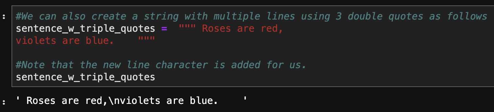

- type(): check what type
  - int
  - float
  - bool
  - Nonetype
  - str

- \*\* 指数

- % 余数

- abs() 绝对值

- import math; math.sqrt()  开平方根

- **\t** - inserts tab in string

- **\n** - inserts new line in string

- 多行文字用三对引号 “”“ ”“”

  - 

- in 查看字符串是否在其中

  - ```python
    >>>"Charl" in name
    True
    ```

- Slicing 

  - 两个冒号表示step

    ```python
    #Get every second letter of entire string
    greeting[::2]
    ```

  - string immutable所以不能直接用等号替换，只能用concatenation

  - ```python
    #Combine slicing and concatenation
    first_name = "Charlie"
    middle_name = "Dilly"
    last_name = "Bear"
    
    #Get the initials
    initials = first_name[0] + middle_name[0] +  last_name[0]
    
    initials
    ```

  - string只能和string相接，不能直接接int等

- 强制转型：

  - 如果要对list所有内容强制转型，必须循环，不能直接int(list())

- sorted返回，sort直接改变
- 乘号的使用：Recall that \* works on both numbers and strings because we never declare the types of variables, arguments, or return values in Python. Hence we can use times to either multiply numbers or repeat strings.