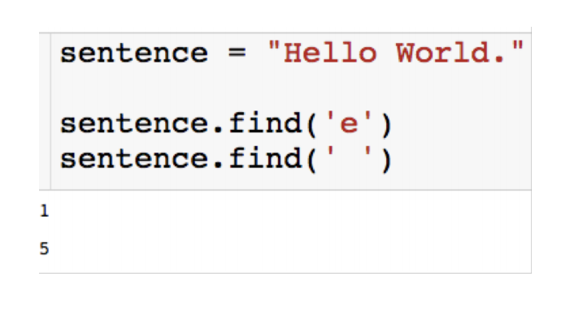

# Objects

## Mutability 

- Each object is mutable or immutable
- Mutable objects can be changed
- Immutable means objects cannot be changed
  - Lists are mutable objects
  - **Strings are immutable** objects (update)
  - Methods are built in functions

## Dictionaries

- Collection of unordered objects stored/accessed through **keys**
- The **key** in a dictionary must be an **immutable** object 
  - **number, string, tuple**, dictionary (we can have nested dictionaries)

- Dictionaries have **no order**.


- How to access:

  The value can be any object and it is access **through its key**


- **Iterate** over keys of dictionary: 

  - REMEMBER: Dictionaries are not ordered!
  - 

- Iterate over values of dictionary:

  - ```python
    for name in D.values():
    	print(name)
    ```

- Add element to existing dictionary:

  - 

### When to use dictionaries

- Let’s us store and access info through something other than a number (index).

## Tuples 

- Tuples are essentially **immutable** lists.
  
  - They can be **slice and index** and **used in for loops**, but you **can’t sort** them.
- Since they are immutable, they can be **keys** in a dictionary, as we already saw.

- **Parentheses** 

  ```python
  a=(1,2)
  type(a)
  ```

  


### Why Tuples?

The best answer seems to be that the immutability of tuples provides some integrity -- you can be sure a tuple won't be changed through another reference elsewhere in your program.  Tuples can also be used in places that lists cannot -- for example, as dictionary keys (recall that dictionary keys must be immutable objects).  As a rule of thumb, lists are the tool of choice for ordered collections that might need to change; tuples can handle the other cases of fixed associations.

## Sets (immutable)

Python also has the set -- an unordered collection of unique and immutable  objects that supports operations corresponding to mathematical set theory.  By definition, an item appears only once in a set, no matter how many times it is added.  Sets are iterable, can grow and shrink on demand, and may contain a variety of object types.

To make a set object, pass in a sequence or other iterable object to the built in *set* function.

```python
#Making sets
x = [5, 2, 3, 4, 4]
set(x)
```

Sets support the common mathematical set operations with expression operators.  Note that in order to perform these operations, x and y must be sets.


# Object methods

## String Methods

Because string is immutable, so every method that string has cannot mutate the original string.

#### **<u>Replace</u>** method: 

global search and replace


#### <u>Find</u> method : 

finds the **first** location of the given substring (or a "-1" if it is not found). 



#### <u>Split</u> method : 

splits string into list, delimited by input. Returns a list


#### <u>Strip</u> method : 

**Deletes** input from both sides of string.


[^.strip(" .")]: gets rid of every space and also period in the string, 并不需要把空格和句号分开strip！

#### <u>Join</u> methods

If we have a list of strings, we can put it back together with the **join** method.  The join method is a method for strings which takes as input a list of string and joins them into a single string.

```python
row_1 = ["23","21","1","5"]
','.join(row_1)
#'23,21,1,5'

#if we want periods between letters
S="spammy"
L = list(S)
'.'.join(L)
#'s.p.a.m.m.y'
```

#### <u>Capitalize</u> methods

```python
"jake".capitalize()
#Jake
```

#### We can <u>stack</u> string methods


##### **ORDER HERE DOES MATTER.**

## List Methods

List is mutable, so method can **directly go into the object**, make the corresponding update and not return anything back. 

#### <u>Append</u> method : 

Add element to end of the list. Do not return anything.


It's better to use append than concatenation because of memory use. 

#### <u>Sort</u> method : 

Sorts the elements in the list; lose the original one


```python
L.sort(reverse = True)
```

```python
#What happens when we sort a list of lists? defaults to first element of the list
L= [[2,3,1], [5,7], [1,9,11]]
L.sort()
L
#[[1, 9, 11], [2, 3, 1], [5, 7]]
```

> How do I sort by the second element of list? More on this later...we will need a module called <u>itemgetter</u>. 

#### <u>Sorted</u> method :

Give back a sorted version


#### <u>Index</u> method : 

returns the index of **first** occurrence of the inputted element


> String.find() will give a "-1" if it cannot find the one that you're looking for;
>
> list.index() will give you errors if it cannot find. 


#### <u>Extend</u> method:

Extend method **adds many items to end of list** 

```python
L=[1,2]
L.extend([3,4,5])
L
#[1, 2, 3, 4, 5]
```

#### <u>Pop</u> method

<u>return</u> and removes the **last** element of the list

```python
L.pop()
#5
```

#### <u>Insert</u> method

inserts the second input into the location of the first input

```python
L.insert(1,1.5)
L
#[1, 1.5, 2, 3, 4]
```

#### <u>Remove</u> method

removes the item from the list

```python
L.remove(1.5)
L
#[1, 2, 3, 4]
```


#### We <u>cannot stack</u> list methods

When using strings, we can stack because string methods will return strings back to construct further methods. But list method won't return anything, they change the list inplace. It will return an error if stacking list methods.

## Dictionary Methods

#### <u>keys</u> method : 

returns the keys as an iterable.

You can wrap in a list to a get indexable object


#### <u>values</u> method : 

returns the values as an iterable

Can wrap in a list to a get indexable object


Can put values on the object in for loop


We can check whether a key or value exists as follows


#### <u>get</u> method : 

another way to access a value through a key


If we try to access **key that doesn't exist**, we'd better use **.get()** than []. Will return "**<u>None</u>**"


#### <u>Items</u> method

Get key, value as list of **tuples** 

```python
list(D.items())
#[('spam', 2), ('ham', 1), ('eggs', 3)]
```

#### <u>Update</u> method

**merges** keys and values of one dictionary into another, blindly **overwritting** values of the same key. (会有重复现象)

```python
D2 = {'toast': 4, 'spam':3}
D.update(D2)
D
#{'eggs': 3, 'ham': 1, 'spam': 3, 'toast': 4}
```

#### <u>Pop</u> method

**returns** the value of the inputted key and **deleted** this entry from the dictionary.

```python
#Dictionaries also have a pop method
D.pop('spam')
D
#2
#{'ham': 1, 'eggs': 3}
```

#### **<u>Delete</u>**:

```python
#Delete an entry
del D['eggs']
```

