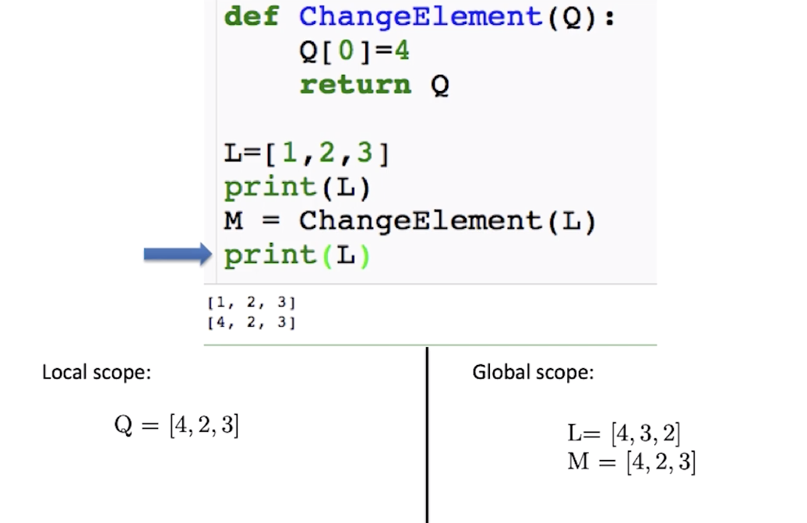
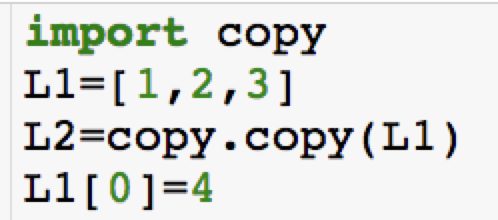
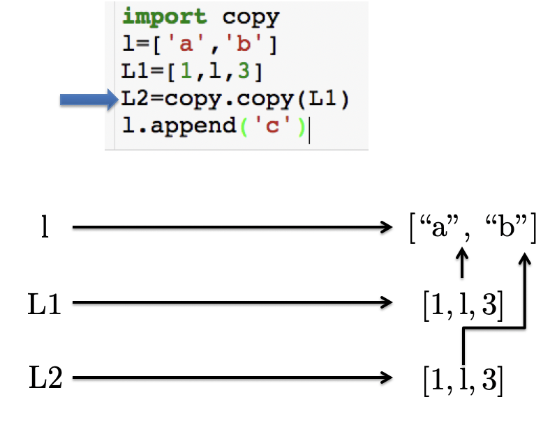
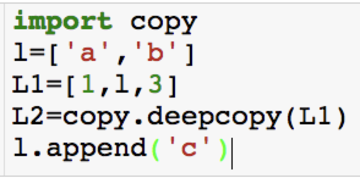
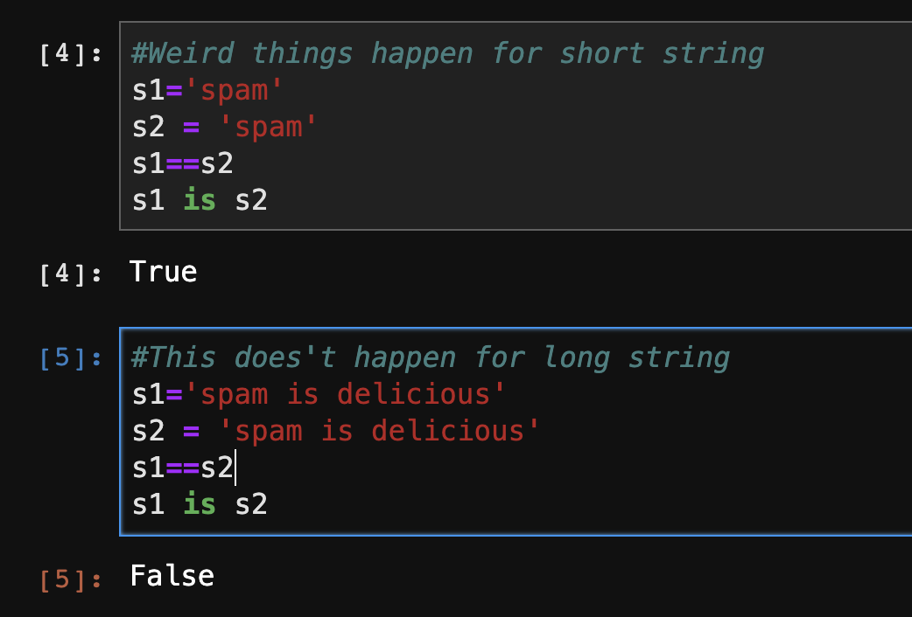

## Motivation 

Why was L changed inside of the function?

## Variable Assignment

If you pass on a list to another variable, and you are changing the original list, you have to be careful. Because the other variable may be changed too. Be careful about references. Especially list is mutable. If we pass a variable to the list, it will change the list.

## Copy 

#### ***import copy***

#### Deep copy

If I want when l is changed, both l1 and l2 won't be changed, we should do ".**deepcopy()**":

