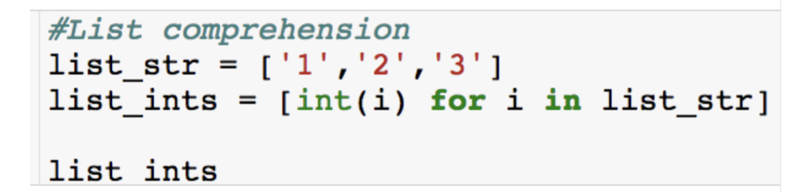
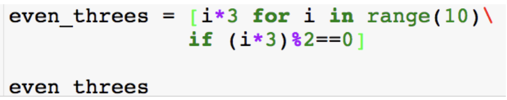
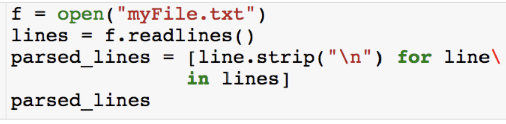
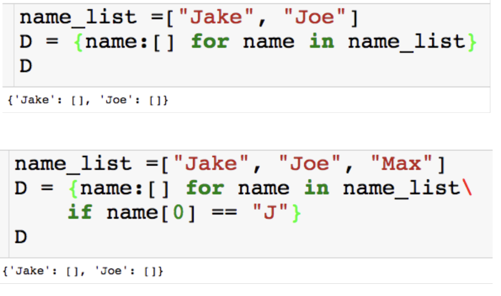
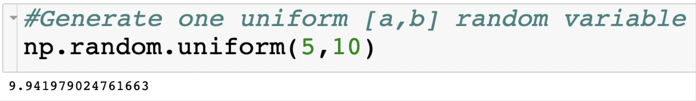
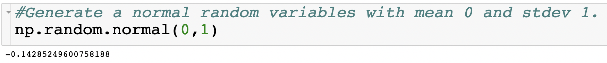
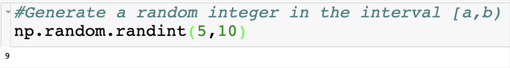
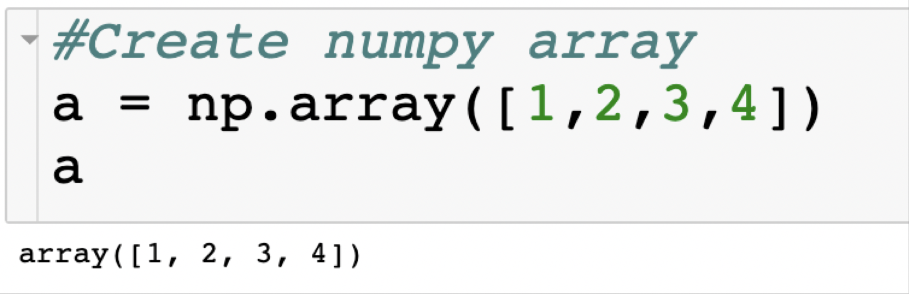
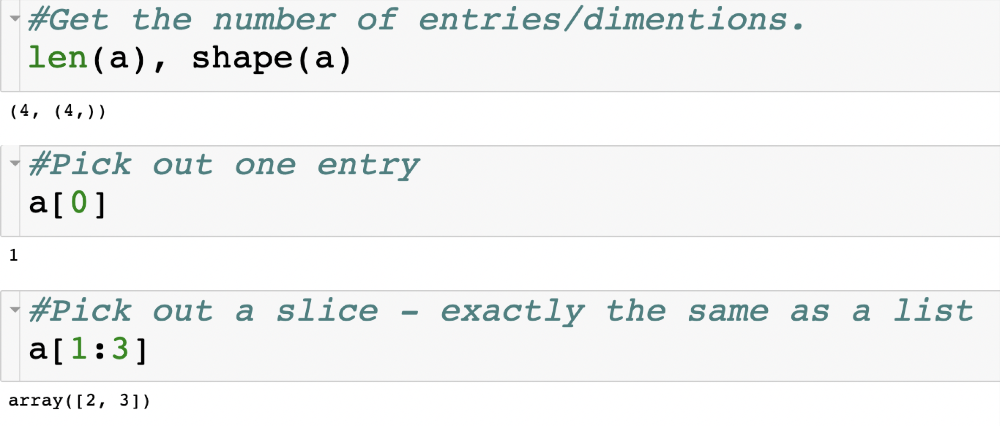

## **List Comprehension**

- List comprehension is useful for efficient and concise list creation
  - Faster than a for loop due to C implementation.
  - Sometimes they are less readable than for loops.
  - Very useful for reading files.
  - There is also dictionary comprehension.

> Jupiter magic
>
> **%%timeit**: calculate the time 



#### **Adding an if Statement**





## **Dictionary Comprehension**



## **Python Packages**

- **os**: operator system interface
- **numpy**: matrix algebra, random number generation
- **scipy**: random number generation, optimization
- **pandas**: reading csv/xls files, data analytics, plotting

- Things we can do with <u>numpy and scipy</u>:
  - Generate random numbers
  - Matrix algebra – matrix inversion, eigenvalues, dot products, etc ...
  - Solve linear program

## **Numpy – Generate Random Number**

```python
import numpy as np

#The mean method
print(np.mean([1,2,3]))

#We will be using the random module inside of numpy to generate uniform [0,1] random variable
np.random.uniform()

# If we import everyting using * we can jump to the random line
from numpy import *

random.uniform()

#Generate one uniform [a,b] random variable
np.random.uniform(5,10)

#Generate a normal random variables with mean 0 and stdev 1.
np.random.normal(0,1)

#Generate a random integer in the interval [a,b)
np.random.randint(5,10)

#Generate multiple random ints
np.random.randint(5,10,5)

#Generate 10 uniform [0,1] random variables
randomNums = np.random.uniform(0,1,10) 
randomNums

#Create numpy array
a = np.array([1,2,3,4])

#Using shuffle method you can shuffle a list or numpy array in place
b=[4,5,6]
np.random.shuffle(b)

#Sample uniformally from a list or numpy array using the chocie method.
np.random.choice(b)


```


**[a,b]** 

 

 

**[a,b)** 

 

#### **Numpy Arrays** (like list)

 

 

## scipy

#### Generate custom discrete distributions using the scipy.stat ([scipy.stats site](https://docs.scipy.org/doc/scipy-0.17.1/reference/stats.html)) 

```python
import scipy.stats as st

#lets sample a bias coin 100 times, 0 is heads (0.25 prob) and 1 is tails (0.75 prob)

#First creates the distribution using rv_discrete
distrib = st.rv_discrete(values=([0,1], [0.25, 0.75]))

flips = distrib.rvs(size=100)
flips

>>array([1, 0, 0, 0, 0, 1, 1, 1, 1, 1, 0, 1, 1, 1, 1, 0, 1, 1, 1, 1, 1, 1, 1, 1, 1, 1, 1, 1, 1, 0, 1, 1, 1, 1, 1, 0, 0, 0, 1, 1, 1, 0, 1, 0, 0, 0, 1, 1, 0, 1, 0, 0, 1, 0, 1, 1, 1, 1, 0, 0, 0, 1, 1, 1, 0, 1, 1, 1, 1,
0, 1, 0, 1, 0, 1, 0, 1, 1, 0, 1, 1, 1, 0, 0, 1, 1, 1, 1, 1, 0, 1, 0, 1, 1, 0, 1, 1, 1, 1, 0])
```

## Pandas

- Read/write csv and excel files
- SQL
- Data visualization
- Regression

## OS

This is an operating system interface that lets you create, move, change files

```python
#Get the current working directory
os.getcwd()

#Change the current working directory
os.chdir('/Users/aoyingxue/Documents/GRADUATE STUDIES/1.08_INTRO_TO_PYTHON_AND_DATA_SCIENCE/session_7')
os.getcwd()

#List directories and files
os.listdir()

#Easily create a file path (don't have to worry about slashes)
new_path = os.path.join(os.getcwd(),'Lecture')

#listdir method can take file path as input
os.listdir(new_path)

# Walk through all paths, directories and files
path = os.getcwd()
for path, directory, file_name in os.walk(path):
    print("Path:", path)
    print("Directory:", directory)
    print("File:", file_name)
```

## Operator

#### operator.itemgetter to sort by the second entry, for example, in a list of lists.

```python
import operator as op

inventories = [['apples',5], ['oranges',6], ['bananas',3]]

#itemgetter returns a callable object that fetches item from its operand

#the call getcount(r) return r[1]
getCount = op.itemgetter(1)

getCount(inventories[1])

>>6
#We can use the key input in the sorted function to sort by the second index
sorted(inventories, key =getCount)
```

## itertools

We can use the package itertools to look at all of the permutations of given size of a list. This might be useful in a discrete optimization problem to check all possible solutions or if you want to compute some sort of probability.

```python
import itertools as it

l = [1,2,3]
#Produces iterable 
sizeTwo = it.permutations(l,2)

sizeTwo
>> <itertools.permutations at 0x104809990>

#Wrap in list function to get list of tuples
list(sizeTwo)
>> [(1, 2), (1, 3), (2, 1), (2, 3), (3, 1), (3, 2)]

#There is also a combinations method
list(it.combinations(l,2))

[(1, 2), (1, 3), (2, 3)]
```

