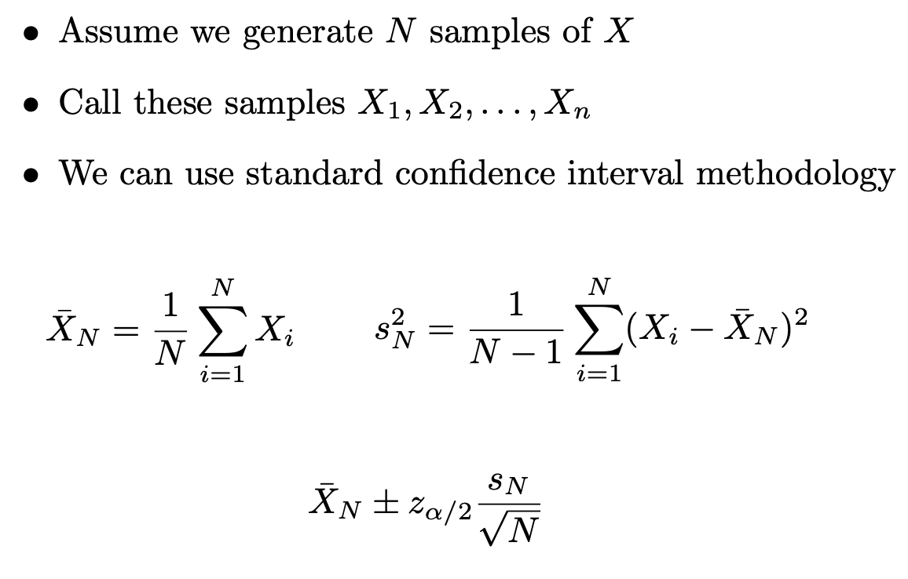
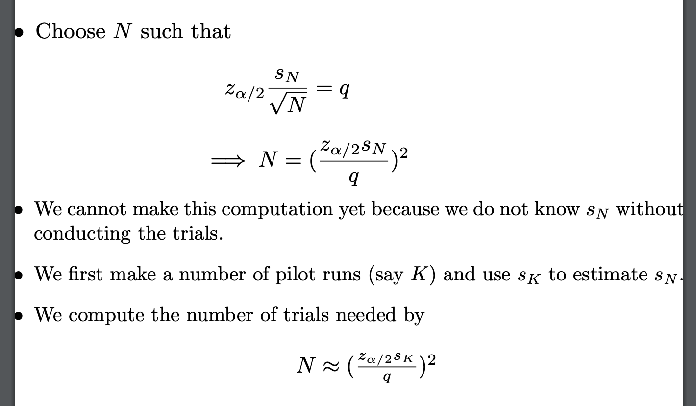
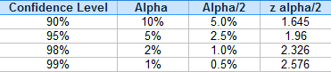

### Monte Carlo Simulation

#### Use simulation to get a handle on randomness

- Estimate probabilities of events
  - Probability of getting straight flush 
- Estimate expected values
  - Expected return of portfolio 
  - Payout of gambling strategy
- Approximate stochastic optimization problems
  - Newsvendor problem
  - Evaluate heuristics

### Monte Carlo Confidence Interval

$z_{\frac2{\alpha}}$ =1.96  

### Simulation Optimization

- What is the expected cost if I choose weights of 20K and 30K? 
- Here is the Monte Carlo: 
  - 1. Sample a truck arrival   
    2. Find the optimal truck assignment 
    3. Compute cost 
    4. Repeat steps 1-3 N times 
    5. Return the average over the N trials