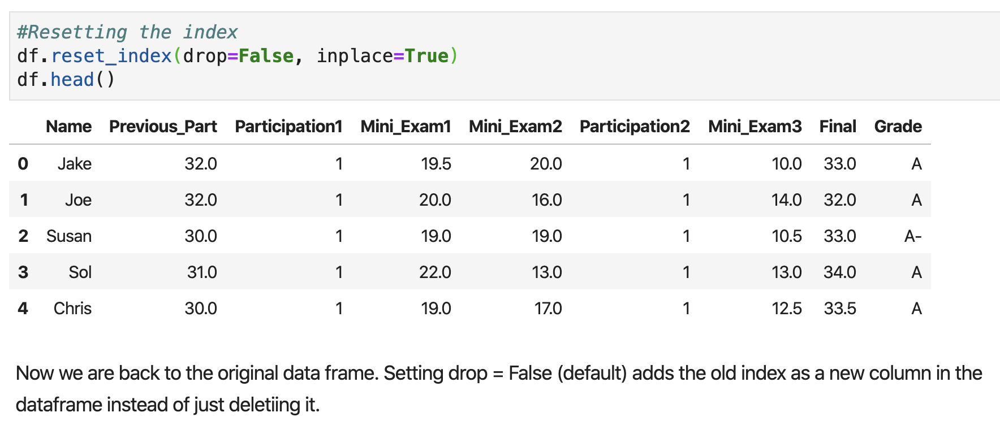
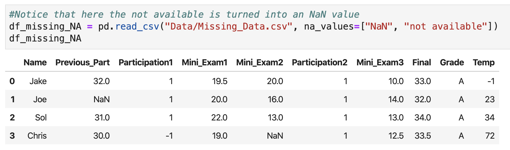
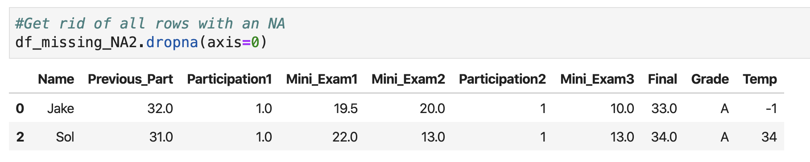

### Basic Pandas


1. Acquired from clients or customers
2. Load data using pandas and SQL into analysis environment
3. Clean data
4. Describe certain scenario (why/ how)
   1. pandas
   2. Ab testing for causal inference
5. Visualize results using pandas or plotly
6. Prescribe the computers to form certain decisions
   1. pandas
   2. Machine learning: sklearn, tensorflow

#### Read data from excel

 


- **header=0** means column names are in the first row
- **index_col=0** specify column that will serve as index

#### The head() Method

- If the data is really large you don’t want to print out the entire dataframe to your output. 
- The **head(n)** method outputs the first n rows of the data frame. If n is not supplied, the default is the first 5 rows. 
- I like to run the head() method after I read in the dataframe to check that everything got read in correctly. 
- There is also a **tail(n)** method that returns the last n rows of the dataframe 

#### .shape

Return the **dimension** of the data frame 行数列数

(How many rows, how many columns)

 

#### .dtypes

What are the types of each column

 

#### .columns

Return column names

#### .index

Return row names

 

### Slicing Dataframes

#### **Selecting a Single Column** 

##### Approach 1

- Between square brackets, the column must be given as a string 
- Outputs column as a **series**  
  - A series is a one dimensional dataframe..more on this in the slicing section 

 

##### Approach 2

- Exactly equivalent way to get Name column 

- <u>Advantages</u>: don’t have to type brackets or quotes 
- <u>Disadvantages</u>: won’t generalize to selecting multiple columns,, won’t work if column names have spaces, can’t create new columns this way 

 

#### **Selecting Multiple Columns** 

 

- List of strings, which correspond to column names. 
- You can select as many column as you want. 
- Column don’t have to be contiguous. 

#### Slicing a series

- Picking out a single element
  - names[0]

- Contiguous slice
  - names[**1:4**]
- Arbitrary slice
  - names[[1,2,4]]

#### Select block(.loc[])

##### Pick a single value out


##### Pick out entire row


##### !!!End points are inclusive!!!

> Because the column name is typically strings. The program won't know the column before endpoints. 

#### .iloc[]

#### .to_csv("Name_Grade.csv")

Write a data frame into csv

### Built-in Functions and Attributes

#### .mean()

Average of a <u>column</u> 

#### .max()

Returns the maximum of a column

#### .astype()

convert the type of a column using the **astype()** method

```python
#Returns the Participation 1 column as a float
df["Participation1"].astype("float64").head()
```

#### .describe()

- get all key stats for ***numeric*** columns at once with the describe() method
- Returns a **data frame** 
-  


#### .value_counts() 

Gives a count of the number of times each unique value appears in the column. Returns a series where indices are the unique column values. 


#### .values.tolist()

transform a dafaframe into a list of lists, where each sub-list contains a row of the original data frame.

#### **.unique()** 

Returns an array of all of the unique values. 

#### Whether to have () or not

- No () means it's an attribute of the data frame, a feature; no need of computation
- () means a method that can be run; Require computation for output; 

### **Creating New Columns** 

 Create a useless new column of all 1s:  

### Deleting columns

#### del()

- Deleting one column using name
  - del <table [column]> 

 

### **The Drop Method** 

#### .drop()


 

### **Sorting Dataframes** 

#### .sort_values()


### timestamp 

#### 对某个时间戳

#### .day

Get the day

#### .month

Get the month

#### .weekday_name

get the weekday name

#### .is_leap_year

see if the year is a leap year

#### 对某列时间戳 .dt

#### .dt.weekday_name

Get the day of the week for the entire column

#### .dt.month

#### .dt.week

#### .dt.weekday

### **Converting to Datetime** 

#### .to_datetime()

 

### timedelta


### Rename columns

#### .rename(columns={})


#### .set_index()


make sure you choose a column that will uniquely identify each row.

#### .reset_index()



#### .tail()

Last five rows

#### .concat()

 

### Handling missing data

#### .isnull()

returns a series or dataframe of booleans corresponding to whether the particular entries are **null or not**


#### .read_csv("",na_values=[])

all read in as NA values using the na_values input when we read in the file



#### .dropna(axis=0)

Get rid of all rows with an NA



#### .dropna(how='all')

Passing how='all' will only drop rows that are all NA (doesn't change anything)

#### .fillna()

fill in the "holes" in any number of ways. For most purposes, the *fillna* method with a **constant** relplaces missing values with that value.

 

### Read and Write to excel

We can write the file with to_excel. We can specify a start row and column

```python
#Read in an excel file
df1 = pd.read_excel("Data/Excel_Reading.xlsx", "Sheet1")
df1

df1.to_excel("NewFile.xlsx", "Sheet1", startrow=5, startcol=5)
```

### Changing Column Names and Stacking Dataframes

#### .rename()

```python
df_titanic.rename(columns={"Name":"Passenger_Name","Ticket":"Ticket_Num"},inplace=True)
```

#### .concat()

```python
df_grades=pd.concat([df_grades_A,df_grades_other],axis=0,ignore_index=True)
#row index is repeated if ignore_index=False
```

### Using the index

#### .set_index()

重新设置了row index，用name那列做index并代替了原index

```python
df_grades.set_index("Name",inplace=True)
df_grades.loc["Joe","Grade"]

#remain the name column and set new index
df_grades["Name"]=df_grades.index
df_grades.set_index("ID",inplace=True)
```

#### .reset_index()

```python
df_grades.reset_index(drop=False,inplace=True)
```

drop=False: put the original index into a new column

drop=True: the original index is dropped and gone

### Missing Data 

```python
#global search and replace in all columns
df_grades=pd.read_csv("Data/Missing_Data.csv",na_values=["not available","NaN"])

#using dictionary, specify column by column the values that needs to be replaced
df_missing=pd.read_csv("Data/Missing_Data.csv",na_values=["Mini_Exam2":"not available","Participation":-1])
```

- Have common symbol for where there is missing data 
  - Good for you and good for others looking at your code/data 
  - These entries will be ignored if you try to compute means of columns with NaNs. 
- We can easily get rid of column/rows with missing data 
- We can easily replace the missing values with the mean of the column, for example. 

#### is.null().sum()

Is null=true=1

#### .dropna()

```python
df_missing.dropna(axis=0,inplace=False) #axis=0:row; axis=1:column
df_missing.fillna(0,inplace=False) #fill the missing values with 0

#replace with specific value in specific column
mean_temp=df_missing.Temp.mean()
df_missing.fillna({"Temp":mean_temp},inplace=False)

```

### Using String Methods

#### .str

First call .str to make it use string methods

#### .str.lower()

Returns series with all lower case in the name column.

```python
df_titanic["Name"],.str.lower()
```

#### .str.contains()

Returns boolean series with True if name contains “Mrs.” and False otherwise. 

```python
df_titanic["Name"].str.contains("Mrs.")
df_titanic["Bool_Mrs"]=df_titanic["Name"].str.contains("Mrs.")
df_titanic["Bool_Mrs"].mean() #get the proportion
```

### Apply Function

The apply() method lets us use custom or built in functions to multiple columns. 

```python
df_numeric=df_titanic[["Age","Fare"]].copy() #use .copy() to avoid the warning
df_numeric
df_numeric.apply(max,axis=1)

#ceiling version of each number in the column Fare
import numpy as np
df_numeric.Fare.apply(np.ceil)

df_age_sex["Old_Man"]=df_age_sex.apply(Old_Man,axis=1) #when applying the function to the whole dataframe, axis=1: row by row, the input to your function is not each entry but each entire row(series)
```

### Iterrows

Two attributes: index and row

Slower than apply: because it cannot parrellize 

```python
for index,row in df.iterrows():
  print(index,row)
  
```

