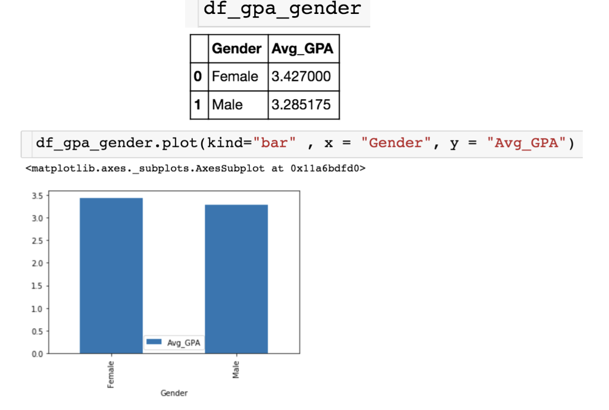

### Plotting Data in Pandas

#### Basic scatterplot

#### Barplot 

#### Histogram 

##### Number of bins to use: bins=

#### Customize the plots

#### Horizontal bar

### MatPlotLib

#### import

#### style

#### Create figure + axes

### Axis Limit and Figure Size

#### **Changing Features of Axes** .set()

#### Change figure size (figsize=[])

### Move Legend and Annotation

#### **Move Legend** .legend()

#### **Annotate the Plot – Vertical Line** 

#### **Annotate the Plot – Add Text** .text

### Formatting Axes

#### **Formatting Axes Labels** .set_major_formatter()

##### Import 

### **Creating Multiple Plots** 

#### sharey=True

