### Transform

Transform 返回和原dataframe相同dimension的dataframe/group并对原

而apply会进行aggregate

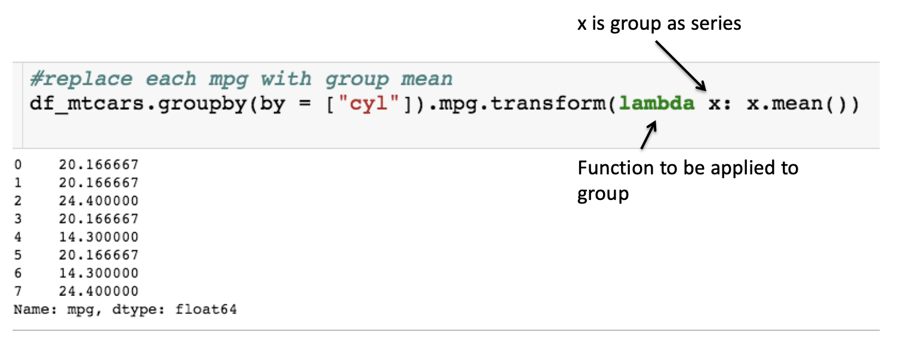

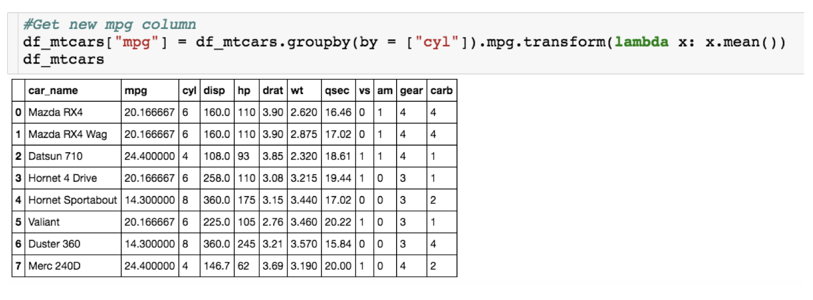

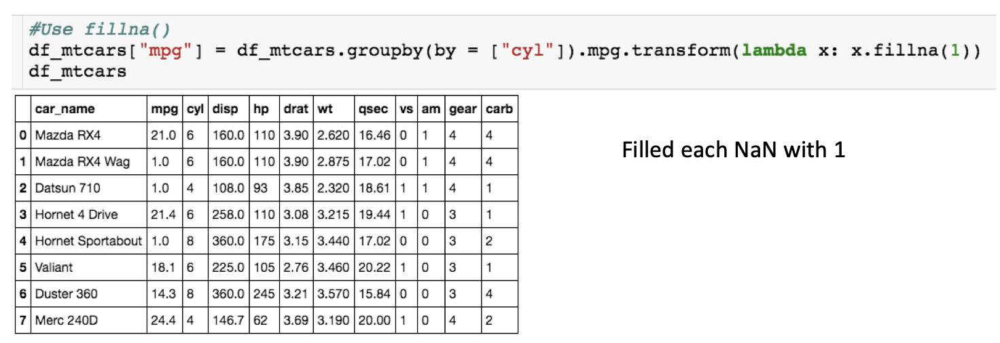

### Normalizing for units

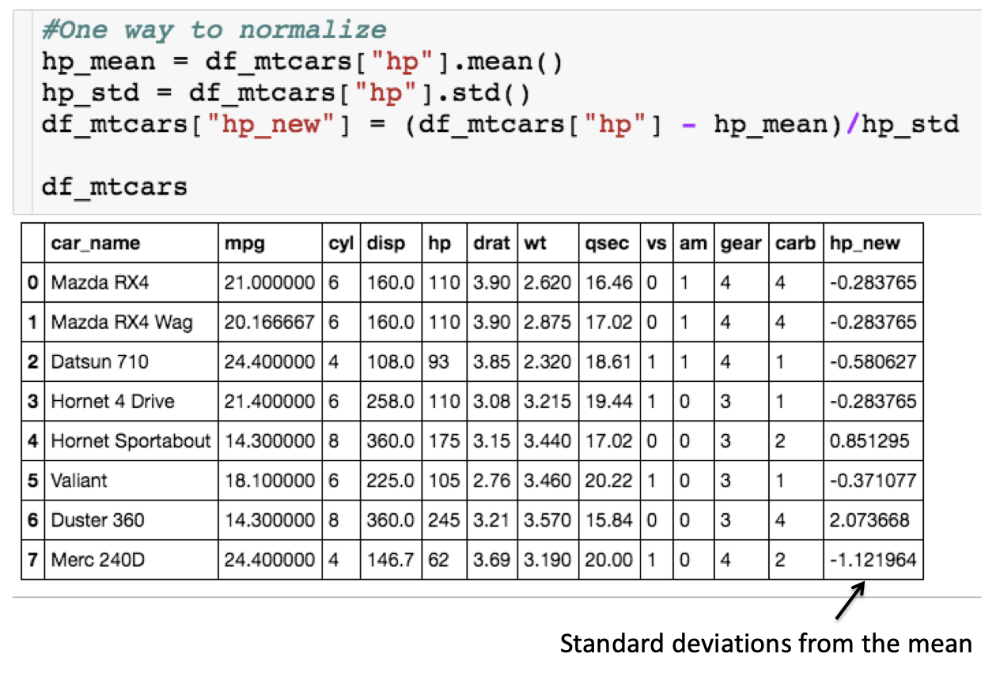

```python
df_mtcars["hp_new"]=(df_mtcars["hp"]-hp_mean)/hp_std
```

If we take a column (series) and minus or divide by a numeric number, we'll apply the function to every entry of the column.

#### Normalizing for groups

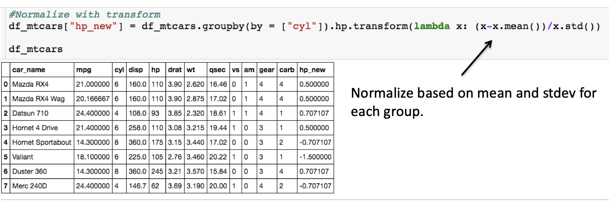

#### Normalizing for units - apply()

But logically difficult to understand

It has to return a DataFrame to reserve the format of the object

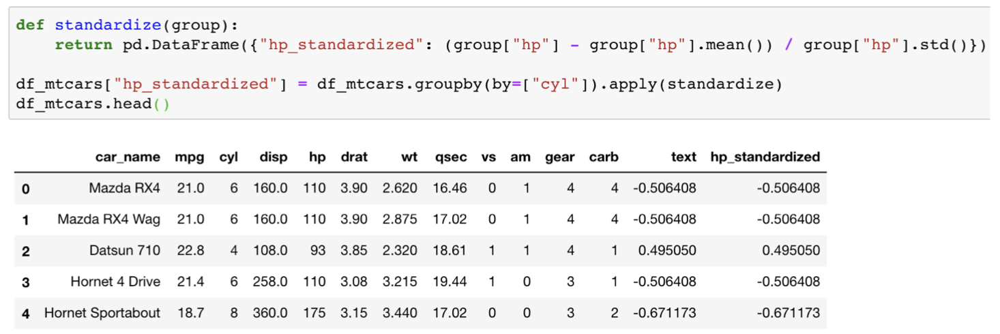

### Filter with group by

Function you pass to filter must return a boolean: True for keeping the group and False for getting rid of it. 

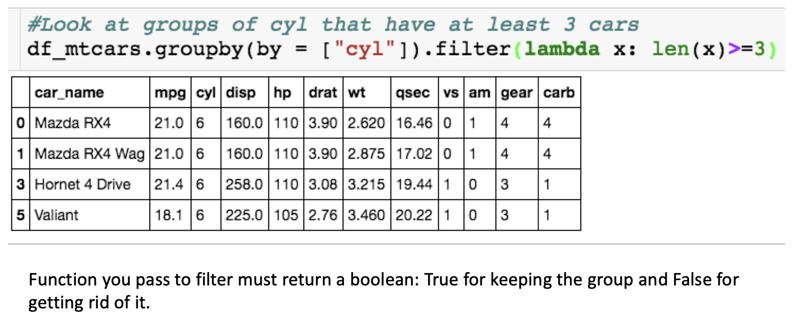

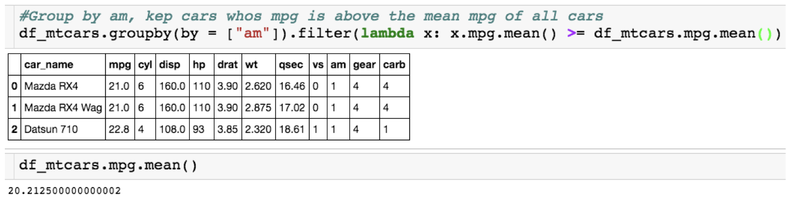

#### Filter + aggregate

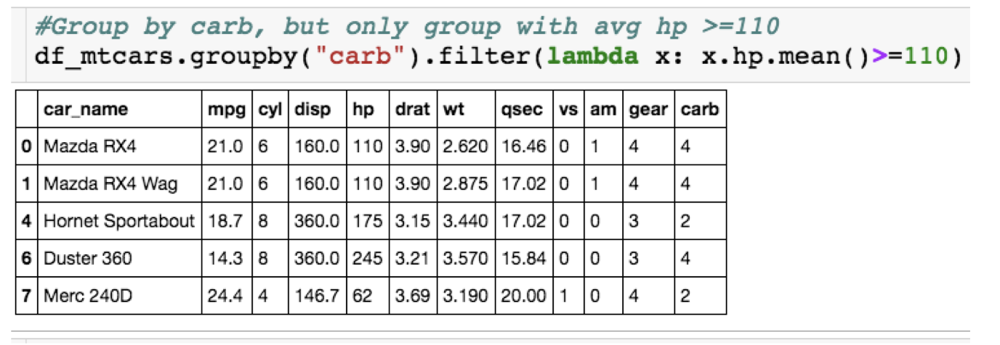

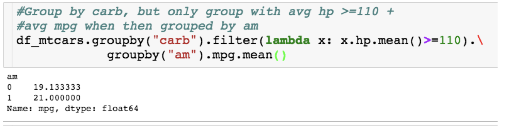

### Merge

#### Inner merge

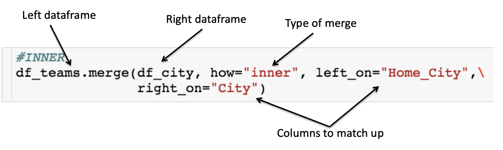

#### left merge

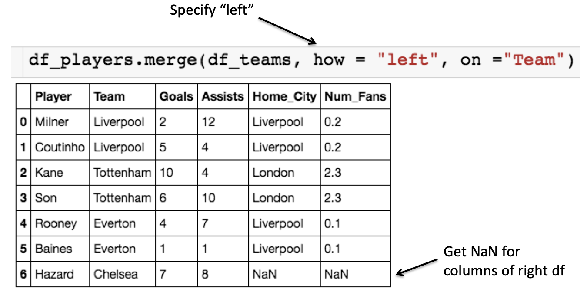

- There is a RIGHT JOIN ... but any RIGHT JOIN can be written as LEFT JOIN 

#### Outer merge

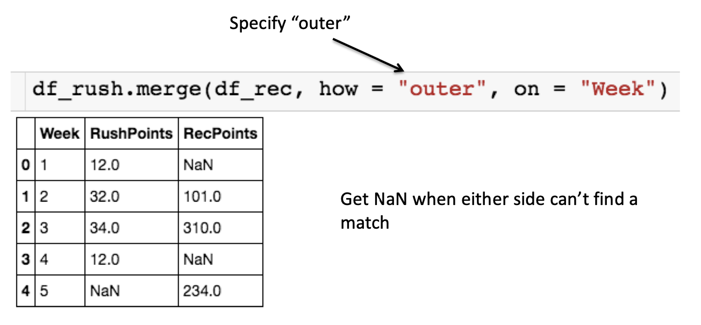

##### Replace NaNs

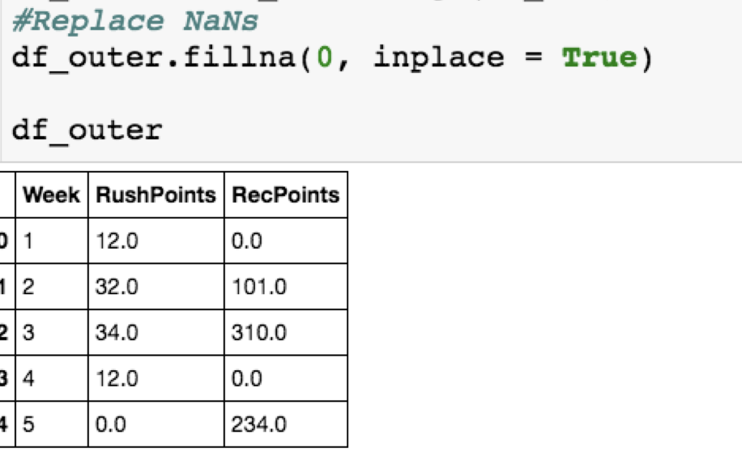

### summary

- Apply(): 
  - Allows you to write a customized function that takes in 
    - an entry (if applied to a column) 
    - a dataframe (if applied to a groupby) 
    - additional parameters 
  - and returns
    - an entry (the final return is a series) 
    - a series (the final return is a row) 
    - a dataframe (the final return is multiple rows from groupby) 
- Groupby(): 
  - That allows you to group the data by certain levels and do computation
    - Groupby() + agg() 
    - Groupby() + transform() 
- Merge(): (differ from stack: concatenate multiple dataframes)
  - Allows you to merge multiple dataframes 