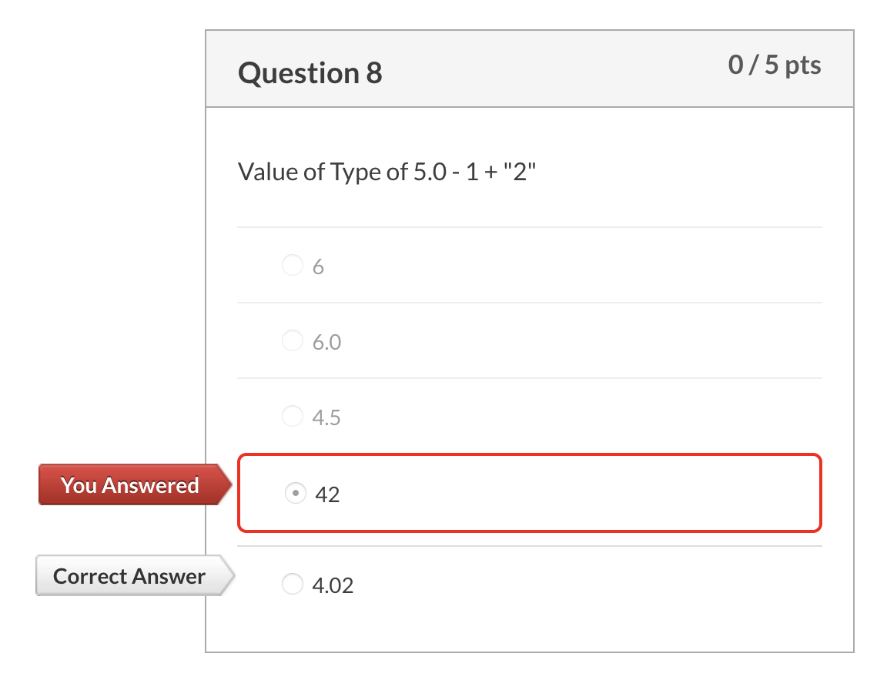

#### Operations

- Division using the **/** operator
- Returns an **int**, so no fractional values are allowed
- The value returned is as if the digits past the decimal point were dropped
- We are not allowed to divide by 0
- **%** remainder

## 错题

- [x] 

  5/2是int/int所以只能得到int

- [x] 

  int/int依旧是int，和python不同

- [ ] 

  5.0有一位小数，是double，所以-1之后还是double，是4.0

  

- [ ] ****

  **不管左边是否强制转型，右边都是int在进行计算，所以得到的也是int，最后再强制转型成double，加上小数点**

